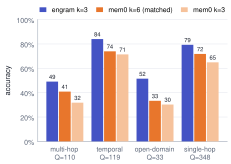

<!-- GENERATED from paper/main.src.md by paper/build.py. Edit the source, not this file.
Every number carries a src comment naming the file it comes from; paper/numbers.json lists them all. -->

# Decide, Don't Generate: Replacing LLM Calls with Typed Decisions in Long-Term Agent Memory

<!-- Alternative title: Belief-State Memory: Cheap Typed Decisions for Agent Memory Graphs -->

*Author(s): [TBD]. Code: [REPO URL PLACEHOLDER].*

## Abstract

Long-term memory systems for LLM agents make one or more LLM calls every time they write a memory. That makes
re-examining the store unaffordable, so systems drift toward adding facts and never revising them. Most of the
write path, though, is not generation but choice among fixed options: is this new, a duplicate, or an update, and
of what?

We split the two. In engram, an LLM extracts facts and every decision is a typed question answered by a hosted
decision model (Jev). With extraction held identical to mem0 2.1.0's, replacing the LLM decision layer with typed
decisions cut decision-layer cost by 70.0×<!-- src: bench/results/e2_llm__dev.json ÷ bench/results/e2_jev__dev.json --> and median decision latency by 27.6×<!-- src: bench/results/e2_llm__dev.json ÷ bench/results/e2_jev__dev.json -->. Answer
accuracy was the same: 31/35<!-- src: bench/results/e2_jev__dev.json --> against 31/35<!-- src: bench/results/e2_llm__dev.json -->.

On 610<!-- src: bench/results/heldout_report.json --> held-out LoCoMo questions, under a three-memory retrieval budget, engram answers +8.7<!-- src: bench/results/mem0_token_matched__heldout_pooled__k6.json --> points more
questions than mem0 given the same number of context tokens (95% CI +5.2<!-- src: bench/results/mem0_token_matched__heldout_pooled__k6.json --> to +12.1<!-- src: bench/results/mem0_token_matched__heldout_pooled__k6.json -->). At the default
k=20 the two systems tie (difference +0.8<!-- src: bench/results/heldout_report.json -->, CI -2.3<!-- src: bench/results/heldout_report.json --> to +3.9<!-- src: bench/results/heldout_report.json -->).

We report two negatives:
- Closing stale facts does not change answers on current benchmarks.
- A 421M-parameter [VERIFY] open-weights decision model (Laya) does not make relational decisions reliably.

Code, prompts and per-question results are released.

## 1. Introduction

**The cost problem.** A memory system for an LLM agent turns conversation into facts it can retrieve later. Each
write has two parts:
- Extraction: what facts does this message state?
- Decisions: is each fact new, a duplicate, a refinement, or a change to something already stored? Is it worth
  keeping? Is it sensitive?

In current open-source systems both parts are LLM calls. mem0 2.1.0's default `add()` makes a single LLM call per
message with its additive extraction prompt, and has no separate update or delete step (`mem0/memory/main.py`,
`Memory._add_to_vector_store`; prompts reproduced in Appendix B). An LLM call per decision is expensive enough
that nothing re-examines the store afterwards. Facts that stopped being true stay in it.

**The observation.** The decisions are choices among options fixed in advance. That is the setting typed decision
models are built for. They return a calibrated probability over a fixed option set in one short request, and
they cost far less than generating text.

**Contributions.**

1. **A decision/generation split, tested with extraction held identical.** Using mem0's own extraction prompt and
   inputs, typed decisions replace the LLM decision layer at 70.0×<!-- src: bench/results/e2_llm__dev.json ÷ bench/results/e2_jev__dev.json --> lower decision cost and
   27.6×<!-- src: bench/results/e2_llm__dev.json ÷ bench/results/e2_jev__dev.json --> lower median decision latency, with the same dev accuracy (§5.1). On 610<!-- src: bench/results/heldout_report.json --> held-out
   questions the full system ties mem0 at k=20 (§5.1).
2. **A belief-state store policy.** Every fact edge carries a belief updated in log-odds from typed answers. Merges
   and closes are reversible, and structural gates restrict when a close is allowed. No labeled keep item was
   over-closed in any of our Jev arms (§3.4, §5.3).
3. **Rerank beats a larger k under a small retrieval budget.** At k=3 engram is +8.7<!-- src: bench/results/mem0_token_matched__heldout_pooled__k6.json --> points ahead of mem0
   given matched context tokens, on 610<!-- src: bench/results/heldout_report.json --> held-out questions (§5.2).
4. **Two documented negatives.** Closing stale facts does not change answers on LoCoMo-style questions, because
   the answer model resolves recency from dates in the memory text (§5.5). A 421M-parameter [VERIFY] open-weights decision model
   cannot make the relational decisions (§5.6).

**Scope.** We compare against one baseline (mem0 OSS 2.1.0) on one benchmark (LoCoMo: one development
conversation and four held-out conversations). We use update sets written by the system's author, and one hosted
decision model (Jev, `jev-1.13.0`).

We did not test:
- Zep/Graphiti or Letta
- LongMemEval
- other extraction, answer or judge models
- multi-user stores
- non-English text

## 2. Background

### 2.1 How memory systems make write decisions

- **mem0** (2.1.0) extracts facts with one LLM call per message. The prompt receives the new message, the last 10<!-- src: src/engram/flags.py (extract_last_k, as mem0 2.1.0) -->
  messages and the 10<!-- src: src/engram/config.py --> most similar existing memories, and emits only additions. Its older update step, which
  asked an LLM to label each new fact as ADD, UPDATE, DELETE or NONE against existing memories, is still shipped as
  `DEFAULT_UPDATE_MEMORY_PROMPT`. We use it as the LLM decision layer in §5.1.
- **Zep's Graphiti** resolves entities and invalidates edges with LLM calls [VERIFY: arXiv 2501.13956].
- **ByteRover** sits at the accuracy-at-any-cost end: tiered, agentic retrieval over the store
  [VERIFY: arXiv 2604.01599].

### 2.2 Typed decision models

A typed decision model takes a shared *state* (JSON) and a set of questions. Each question is one of:
- a choice among named options, each with a rubric
- a yes/no ("noul") question
- a score

It returns a probability distribution per question.

**Jev.** We use Jev through TypeSafe's API: model `jev-1.13.0`, priced at 0.042<!-- src: src/engram/config.py (USD per million input tokens) --> USD per million input tokens
(`src/engram/config.py`). Its documented limit of 255 options per choice question comes from TypeSafe's
documentation [VERIFY: docs.typesafe.ai]. Measured latency is flat in request size (§5.7).

**Laya.** Laya is an open-weights model with the same request format. We ran checkpoint convaiinnovations/laya<!-- src: bench/results/e4_belief_v2_laya__dev_updates__k3.json --> locally
through the laya-mlx port on an Apple M2 Pro<!-- src: bench/results/e4_belief_v2_laya__dev_updates__k3.json --> with 32<!-- src: bench/results/e4_belief_v2_laya__dev_updates__k3.json --> GB. It reads at most 512<!-- src: bench/results/e4_belief_v2_laya__dev_updates__k3.json --> tokens per
question, of which at most 192<!-- src: bench/results/e4_belief_v2_laya__dev_updates__k3.json --> go to the instructions and options. Its parameter count, 421M, is taken
from the laya-mlx package documentation [VERIFY].

### 2.3 LoCoMo and its limits

LoCoMo [VERIFY: arXiv 2402.17753] contains long multi-session conversations with questions in four scored
categories.

**It barely tests updates.** In the first 215<!-- src: bench/results/e2_jev__stress.json --> messages of conv-26, an LLM labeler (claude-sonnet-4-6,
prompt in `bench/stale.py`) found 2<!-- src: bench/results/e0_baseline__stress.json --> claims that a later message makes no longer true
(`bench/slices/conv26_superseded.json`).

**Public scores are not comparable.** Published LoCoMo scores for the same systems differ between the systems' own
reports and third-party reports [VERIFY: mem0.ai/blog/ai-memory-benchmarks-in-2026;
byterover.dev/blog/benchmark-ai-agent-memory]. We do not quote those numbers. All comparisons here run both
systems under one protocol.

## 3. engram

### 3.1 Pipeline


**Write path.**
1. An LLM extracts facts from a message. In the experiments this uses mem0's prompt and inputs; §4.2.
2. Each fact goes to Jev as a single request. The request carries the fact questions and one
   `relation_to_candidate` question for each of up to 10<!-- src: src/engram/config.py --> candidate facts.
3. A policy layer (§3.3) and a belief state (§3.4) turn the answers into store operations.
4. The store is SQLite plus NetworkX. Facts are edges with validity windows, and every decision is logged with its
   probabilities.

**Read path.**
1. Embed the question and take the cosine top-k.
2. Jev reranks the candidates with one yes/no relevance question per candidate, plus a `query_relation` question
   that can pull in facts by relation type.
3. Add history: the facts each retrieved fact superseded.
4. Render compact lines for the answer model: the date the fact was said, the fact, and the verbatim source
   quote.

### 3.2 The decision chain

Table 1 lists the 12<!-- src: src/engram/decide/questions.py (ALL_QUESTIONS) --> questions in the current chain; Appendix A gives the full option text of every
version. Choice questions carry a rubric per option. When a question's wording changes, its version number is
bumped and old arms keep the old version.

*Table 1. Jev questions (`src/engram/decide/questions.py`, `docs/DECISIONS.md`). `edge_type` and `query_relation`
choose among 25<!-- src: src/engram/decide/questions.py (EDGE_TYPES) --> relation types.*

| question | type | version | options |
|---|---|---|---|
| `worth_remembering` | noul | 1 | yes / no |
| `fact_kind` | choice | 1 | `preference`, `bio`, `event`, `relationship`, `task`, `opinion` |
| `temporal_status` | choice | 2 | `current`, `planned`, `past`, `hypothetical` |
| `relation_to_candidate` | choice | 2 | `new`, `duplicate`, `update`, `contradiction`, `refinement`, `negates` |
| `relation_to_candidate_recheck` | choice | 2 | `new`, `duplicate`, `update`, `contradiction`, `refinement`, `negates` |
| `edge_type` | choice | 1 | 25<!-- src: src/engram/decide/questions.py --> relation types |
| `durability` | choice | 1 | `permanent`, `long_term`, `short_lived` |
| `sensitivity` | choice | 1 | `none`, `health`, `financial`, `relationship`, `credentials` |
| `plan_fulfilled` | noul | 1 | yes / no |
| `relevant_to_query` | noul | 1 | yes / no |
| `query_relation` | choice | 1 | 25<!-- src: src/engram/decide/questions.py --> relation types |
| `same_fact` | noul | 1 | yes / no |

### 3.3 Policy layer

Decisions act only through explicit rules (`src/engram/pipeline/write.py`):

- **Thresholds.** A decision acts at $p \ge$ 0.85<!-- src: src/engram/config.py -->. A superseding relation (update, contradiction, negates)
  below 0.60<!-- src: src/engram/config.py --> is escalated to an LLM, using mem0's update prompt. Anything in between is stored as tentative.
- **Temporal gate.** An old edge can close only if the new fact is current or past:
  $P(\text{current}) + P(\text{past}) \ge$ 0.85<!-- src: src/engram/config.py -->. Planned and hypothetical statements never close anything.
- **Cardinality.** Each relation type is single- or multi-valued. `contradiction` closes only a sibling (same
  subject and relation) on a single-valued relation. `update` may also close a multi-valued sibling. `negates`
  (the new fact says the old one stopped) may close any edge.
- **Two-phrasing agreement.** The first piece of evidence against an edge must be confirmed by a second phrasing
  of the relation question (`relation_to_candidate_recheck`). Otherwise it does not count.
- **Plans.** A dedicated yes/no question, `plan_fulfilled`, asks whether a new fact reports that a stored plan has
  happened. At $p \ge$ 0.85<!-- src: src/engram/config.py --> the plan closes with reason *fulfilled*.
- **Merges are links.** A duplicate becomes a `same_as` link, collapsed at retrieval and removable. Text is never
  merged.
- **Overrides.** An explicit request to remember overrides `worth_remembering`. A credential is redacted before
  storage, whatever the other answers say.

### 3.4 Belief state

Each edge $i$ carries a belief $b_i \in [$ 0.02<!-- src: src/engram/pipeline/belief.py -->, 0.98<!-- src: src/engram/pipeline/belief.py --> $]$ that it is currently true. A typed answer $z$
about the edge, with probability $q$ for its chosen label, updates it in log-odds:

$$\operatorname{logit} b_i \leftarrow \operatorname{logit} b_i + w(z)\, \operatorname{logit} q .$$

With a per-question temperature $T$ (§5.4), $\operatorname{logit} q$ is replaced by $\operatorname{logit} q / T$.
We use $|w| = 1$. The sign and the zero cases are exactly the policy rules of §3.3:
- $w = +1$ for `duplicate` and `refinement` (support)
- $w = -1$ for `update`, `contradiction` and `negates` where §3.3 permits a close
- $w = 0$ for `new`, and for any answer a gate blocks

An open edge closes when $b_i <$ 0.25<!-- src: src/engram/pipeline/belief.py --> and reopens when $b_i >$ 0.60<!-- src: src/engram/pipeline/belief.py -->. The gap between the two gives
hysteresis.

**Belief v3.** The v2 rule used in the held-out runs lets any answer count. A `duplicate` at $q < 0.5$ therefore
has $\operatorname{logit} q < 0$ and *lowers* belief, and a weak against-answer raises it. v3 counts an answer only
when its label is the argmax and $q > 0.5$ (§5.3).

**What this assumes.** The log-odds rule treats $q$ as a calibrated likelihood. Where the model is miscalibrated,
belief moves by the wrong amount. This is why §5.4 measures calibration and why a per-question temperature is
part of the rule.

### 3.5 Hygiene pass

After ingestion, one pass re-checks every group of facts that share a subject and relation. It asks the yes/no
question `same_fact` for each pair, 50<!-- src: src/engram/pipeline/hygiene.py --> pairs per request. At $p \ge$ 0.85<!-- src: src/engram/config.py --> the pair is linked,
and at $p \le$ 0.15<!-- src: src/engram/pipeline/hygiene.py (1 − ACT_THRESHOLD) --> an existing link is dropped.

On the held-out conversations one pass made between 1,865<!-- src: bench/results/e4_belief_v2__heldout_conv-30__k3.json --> and 5,446<!-- src: bench/results/e4_belief_v2__heldout_conv-42__k3.json -->
decisions, for between $0.0112<!-- src: bench/results/e4_belief_v2__heldout_conv-30__k3.json --> and $0.0332<!-- src: bench/results/e4_belief_v2__heldout_conv-42__k3.json --> (§5.3). With LLM decisions, re-examining the
store at that scale is what becomes unaffordable.

### 3.6 Cost model

With a per-decision Jev cost $c_J$, an LLM escalation cost $c_L$ and an escalation threshold $\theta$ on the top
probability $q$:

$$C(\theta) = c_J + P(q < \theta)\, c_L ,$$
$$E(\theta) = P(q \ge \theta)\, \varepsilon_J(\theta) + P(q < \theta)\, \varepsilon_L ,$$

where $\varepsilon_J(\theta)$ is Jev's error rate on the decisions it keeps and $\varepsilon_L$ is the LLM's error
rate on the escalated ones. §5.4 draws the empirical curve.

## 4. Experimental setup

### 4.1 Models, data, caching and budget

**Models** (the same in every arm):
- Extraction: `claude-haiku-4-5`.
- Answers and judging: `claude-sonnet-4-6`, with mem0's LoCoMo evaluation prompts (Appendix B).
- The LLM decision layer and all escalations: `claude-sonnet-4-6` with mem0's update prompt.
- mem0 2.1.0 runs on `claude-haiku-4-5` with telemetry off.

**Slices:**
- *dev*: conv-26 sessions 1–4, 76<!-- src: bench/results/e2_jev__dev.json --> messages, 35<!-- src: bench/results/e2_jev__dev.json --> questions.
- *stress*: conv-26 sessions 1–10, 215<!-- src: bench/results/e2_jev__stress.json --> messages, 80<!-- src: bench/results/e2_jev__stress.json --> questions.
- *held-out*: conv-30, conv-41, conv-42 and conv-43 whole, 610<!-- src: bench/results/heldout_report.json --> questions. These were not used during
  development. The system configuration was frozen (git tag `e4-frozen`) before any held-out run.

LoCoMo's adversarial category is excluded throughout. Each held-out conversation is ingested once per system, and
k=3 and k=20 are answered from the same store.

**Caching and budget.** Every LLM and Jev call is cached by its full request, and budget guards stop any run past
a spending limit. Phase 2 (all experiments reported here) spent $93.26<!-- src: bench/results/phase2_spend.jsonl --> over 78<!-- src: bench/results/phase2_spend.jsonl --> ledgered runs.
Jev accounts for $1.47<!-- src: bench/results/phase2_spend.jsonl --> of it (`bench/results/phase2_spend.jsonl`; per-arm totals in Appendix E). The build
phase before it was not ledgered; the author's estimate for it is about $10 [no file].

### 4.2 The identical-extraction protocol

For each message, mem0 2.1.0's `add()` builds its extraction prompt from:
- the new message, as `[date] speaker: text`
- the last 10<!-- src: src/engram/flags.py (extract_last_k, as mem0 2.1.0) --> messages
- the 10<!-- src: src/engram/config.py --> existing memories most similar to it
- a current date

It passes no observation date, so relative dates in historical conversations resolve against the current date. We
report this as-is, and a patched variant in §6.

engram's E-arms build the same prompt with the same function (`generate_additive_extraction_prompt`), inputs and
model (`bench/run.py`, `src/engram/flags.py`). The "existing memories" differ only because each system's store
differs. The E2 arms differ only in what decides after extraction.

### 4.3 Update sets

LoCoMo has almost no updates (§2.3), so we wrote two sets in the speakers' voices. Both are appended to the dev
slice and were frozen by SHA-256 before any run.

**Set 1** (`bench/updates_conv26.json`, SHA-256 prefix 2330876388f1<!-- src: bench/updates_conv26.json -->) has 30<!-- src: bench/updates_conv26.json --> items:
- 15<!-- src: bench/updates_conv26.json --> easy closes
- 10<!-- src: bench/updates_conv26.json --> subtle items labeled *no_close*: past-tense mentions and unrealised plans
- 5<!-- src: bench/updates_conv26.json --> fulfilled plans

**Set 2** (`bench/updates2_conv26.json`, prefix d4f3c8d2de61<!-- src: bench/updates2_conv26.json -->) adds 28<!-- src: bench/updates2_conv26.json --> messages and 20<!-- src: bench/updates2_conv26.json --> questions:
- 5<!-- src: bench/updates2_conv26.json --> point-in-time questions
- 5<!-- src: bench/updates2_conv26.json --> chains of 3–5 changes asked about now
- 5<!-- src: bench/updates2_conv26.json --> chains asked about a past moment
- 5<!-- src: bench/updates2_conv26.json --> updates with no temporal cue in the message

All items are in Appendix C. The system's author wrote and labeled them, and this is a source of bias.

### 4.4 Statistics

Both systems answer the same questions, so comparisons are paired: $d_i = \text{engram}_i - \text{mem0}_i$. We
report:
- an exact McNemar test on the discordant questions
- a 95% interval from the per-question normal approximation
- a cluster bootstrap that resamples the four held-out conversations. With four clusters, treat it as a
  robustness check.

The token-matched comparison reports the per-question interval only.

## 5. Results

### 5.1 Replacing the decision layer

The three arms in Table 2 share extraction. The two engram arms differ only in what decides after it:
- Jev typed questions (E2 Jev)
- `claude-sonnet-4-6` with mem0's update prompt, one call per extracted fact (E2 LLM)

*Table 2. Dev slice, conv-26 sessions 1–4, 35<!-- src: bench/results/e2_jev__dev.json --> questions, all retrieved memories. Extraction
claude-haiku-4-5 for all arms. Answers and judge claude-sonnet-4-6. Costs are per 1,000 messages written.*

| system | accuracy | decision $/1k | decision p50 | total $/1k | write p50 | facts |
|---|---|---|---|---|---|---|
| mem0 2.1.0 (one LLM call per write) | 30/35<!-- src: bench/results/mem0__dev.json --> | – | – | $9.80<!-- src: bench/results/mem0__dev.json --> | 879 ms<!-- src: bench/results/mem0__dev.json --> | 46<!-- src: bench/results/mem0__dev.json --> |
| engram E2, LLM decision layer (mem0 update prompt) | 31/35<!-- src: bench/results/e2_llm__dev.json --> | $8.782<!-- src: bench/results/e2_llm__dev.json --> | 7,675 ms<!-- src: bench/results/e2_llm__dev.json --> | $18.70<!-- src: bench/results/e2_llm__dev.json --> | 918 ms<!-- src: bench/results/e2_llm__dev.json --> | 18<!-- src: bench/results/e2_llm__dev.json --> |
| engram E2, Jev decision layer | 31/35<!-- src: bench/results/e2_jev__dev.json --> | $0.125<!-- src: bench/results/e2_jev__dev.json --> | 278 ms<!-- src: bench/results/e2_jev__dev.json --> | $9.90<!-- src: bench/results/e2_jev__dev.json --> | 895 ms<!-- src: bench/results/e2_jev__dev.json --> | 47<!-- src: bench/results/e2_jev__dev.json --> |

The two decision layers answer the same number of questions and mem0 one fewer, within noise. The Jev decision layer costs 70.0×<!-- src: bench/results/e2_llm__dev.json ÷ bench/results/e2_jev__dev.json -->
less and has 27.6×<!-- src: bench/results/e2_llm__dev.json ÷ bench/results/e2_jev__dev.json --> lower median decision latency. The LLM decision layer stores fewer facts
(18<!-- src: bench/results/e2_llm__dev.json --> against 47<!-- src: bench/results/e2_jev__dev.json -->) because mem0's UPDATE event rewrites an existing memory
instead of adding one.

These ratios compare Jev against `claude-sonnet-4-6` as the decider. We have no measurement with a smaller LLM
decider. On the stress slice the Jev arm scored 67/80<!-- src: bench/results/e2_jev__stress.json --> and mem0 64/80<!-- src: bench/results/mem0__stress.json -->; the LLM
arm was not run there.

**Held-out parity at default k.** The held-out runs compare the frozen full system (E4 belief v2, §3.4) with mem0,
not the E2 arms. At k=20 engram answers 482/610<!-- src: bench/results/heldout_report.json --> and mem0 477/610<!-- src: bench/results/heldout_report.json -->. The difference is +0.8<!-- src: bench/results/heldout_report.json -->
points (95% CI -2.3<!-- src: bench/results/heldout_report.json --> to +3.9<!-- src: bench/results/heldout_report.json -->; conversation bootstrap -4.5<!-- src: bench/results/heldout_report.json --> to
+5.4<!-- src: bench/results/heldout_report.json -->; McNemar $p$ = 0.679<!-- src: bench/results/heldout_report.json -->), within noise.

### 5.2 Retrieval under a small budget

At k=3 engram shows the answer model 290<!-- src: bench/results/heldout_report.json --> tokens per question and mem0 159<!-- src: bench/results/heldout_report.json -->. Most of the
difference is the source quote on each engram line. To separate context size from ranking, we answered the same
610<!-- src: bench/results/heldout_report.json --> questions from mem0's existing held-out stores at every k from 3 to 8. We chose the k whose mean retrieved
tokens came closest to engram's 290<!-- src: bench/results/mem0_token_matched__heldout_pooled__k6.json -->: k=6<!-- src: bench/results/mem0_token_matched__heldout_pooled__k6.json -->, at 315<!-- src: bench/results/mem0_token_matched__heldout_pooled__k6.json --> tokens. That gives mem0 slightly more
context than engram. The run cost $2.52<!-- src: bench/results/mem0_token_matched__heldout_pooled__k6.json -->.

*Table 3. Held-out LoCoMo accuracy: conv-30, 41, 42 and 43, 610<!-- src: bench/results/heldout_report.json --> questions, adversarial category excluded.
Extraction claude-haiku-4-5, answers and judge claude-sonnet-4-6. One ingestion per system per conversation.
Tokens are mean retrieved-context tokens per question.*

| system | k | tokens/q | conv-30 | conv-41 | conv-42 | conv-43 | pooled |
|---|---|---|---|---|---|---|---|
| Q |  |  | 81<!-- src: bench/results/heldout_report.json --> | 152<!-- src: bench/results/heldout_report.json --> | 199<!-- src: bench/results/heldout_report.json --> | 178<!-- src: bench/results/heldout_report.json --> | 610<!-- src: bench/results/heldout_report.json --> |
| engram | 3 | 290<!-- src: bench/results/heldout_report.json --> | 72.8%<!-- src: bench/results/heldout_report.json --> | 74.3%<!-- src: bench/results/heldout_report.json --> | 75.4%<!-- src: bench/results/heldout_report.json --> | 70.2%<!-- src: bench/results/heldout_report.json --> | 447/610<!-- src: bench/results/heldout_report.json --> |
| mem0 | 3 | 159<!-- src: bench/results/heldout_report.json --> | 67.9%<!-- src: bench/results/heldout_report.json --> | 58.6%<!-- src: bench/results/heldout_report.json --> | 55.8%<!-- src: bench/results/heldout_report.json --> | 56.7%<!-- src: bench/results/heldout_report.json --> | 356/610<!-- src: bench/results/heldout_report.json --> |
| mem0 (token-matched) | 6<!-- src: bench/results/mem0_token_matched__heldout_pooled__k6.json --> | 315<!-- src: bench/results/mem0_token_matched__heldout_pooled__k6.json --> | 66.7%<!-- src: bench/results/mem0_token_matched__heldout_pooled__k6.json --> | 71.7%<!-- src: bench/results/mem0_token_matched__heldout_pooled__k6.json --> | 59.8%<!-- src: bench/results/mem0_token_matched__heldout_pooled__k6.json --> | 62.9%<!-- src: bench/results/mem0_token_matched__heldout_pooled__k6.json --> | 394/610<!-- src: bench/results/mem0_token_matched__heldout_pooled__k6.json --> |
| engram | 20 | 1,461<!-- src: bench/results/heldout_report.json --> | 76.5%<!-- src: bench/results/heldout_report.json --> | 84.2%<!-- src: bench/results/heldout_report.json --> | 78.4%<!-- src: bench/results/heldout_report.json --> | 76.4%<!-- src: bench/results/heldout_report.json --> | 482/610<!-- src: bench/results/heldout_report.json --> |
| mem0 | 20 | 1,024<!-- src: bench/results/heldout_report.json --> | 77.8%<!-- src: bench/results/heldout_report.json --> | 88.8%<!-- src: bench/results/heldout_report.json --> | 73.4%<!-- src: bench/results/heldout_report.json --> | 74.7%<!-- src: bench/results/heldout_report.json --> | 477/610<!-- src: bench/results/heldout_report.json --> |

*Table 4. Paired differences for the rows of Table 3. 95% CI: per-question normal approximation. Bootstrap:
resampling the four conversations. Discordant: questions only engram / only mem0 answered correctly.*

| comparison | Δ (pts) | 95% CI | 95% CI, bootstrap | discordant | McNemar p |
|---|---|---|---|---|---|
| engram k=3 − mem0 k=3 | +14.9<!-- src: bench/results/heldout_report.json --> | [+11.2<!-- src: bench/results/heldout_report.json -->, +18.7<!-- src: bench/results/heldout_report.json -->] | [+8.2<!-- src: bench/results/heldout_report.json -->, +19.8<!-- src: bench/results/heldout_report.json -->] | 120<!-- src: bench/results/heldout_report.json --> / 29<!-- src: bench/results/heldout_report.json --> | 2.4e-14<!-- src: bench/results/heldout_report.json --> |
| engram k=3 − mem0 k=6 (token-matched) | +8.7<!-- src: bench/results/mem0_token_matched__heldout_pooled__k6.json --> | [+5.2<!-- src: bench/results/mem0_token_matched__heldout_pooled__k6.json -->, +12.1<!-- src: bench/results/mem0_token_matched__heldout_pooled__k6.json -->] | not computed | 86<!-- src: bench/results/mem0_token_matched__heldout_pooled__k6.json --> / 33<!-- src: bench/results/mem0_token_matched__heldout_pooled__k6.json --> | 1.3e-06<!-- src: bench/results/mem0_token_matched__heldout_pooled__k6.json --> |
| engram k=20 − mem0 k=20 | +0.8<!-- src: bench/results/heldout_report.json --> | [-2.3<!-- src: bench/results/heldout_report.json -->, +3.9<!-- src: bench/results/heldout_report.json -->] | [-4.5<!-- src: bench/results/heldout_report.json -->, +5.4<!-- src: bench/results/heldout_report.json -->] | 49<!-- src: bench/results/heldout_report.json --> / 44<!-- src: bench/results/heldout_report.json --> | 0.679<!-- src: bench/results/heldout_report.json --> |

At k=3 engram is ahead of mem0 by +14.9<!-- src: bench/results/heldout_report.json --> points (95% CI +11.2<!-- src: bench/results/heldout_report.json --> to +18.7<!-- src: bench/results/heldout_report.json -->). Against
token-matched mem0 the difference is +8.7<!-- src: bench/results/mem0_token_matched__heldout_pooled__k6.json --> points (95% CI +5.2<!-- src: bench/results/mem0_token_matched__heldout_pooled__k6.json --> to +12.1<!-- src: bench/results/mem0_token_matched__heldout_pooled__k6.json -->; McNemar
$p$ = 1.3e-06<!-- src: bench/results/mem0_token_matched__heldout_pooled__k6.json -->; 86<!-- src: bench/results/mem0_token_matched__heldout_pooled__k6.json --> questions only engram answered against 33<!-- src: bench/results/mem0_token_matched__heldout_pooled__k6.json --> only mem0 answered).

engram is ahead in every conversation (Appendix D) and in every category at matched context (Table 5, Figure 2).

*Table 5. Held-out accuracy by LoCoMo category, 610<!-- src: bench/results/heldout_report.json --> questions. Models as in Table 3.*

| category | Q | engram k=3 | mem0 k=3 | mem0 k=6 (matched) | engram k=20 | mem0 k=20 |
|---|---|---|---|---|---|---|
| multi-hop | 110<!-- src: bench/results/heldout_report.json --> | 49.1%<!-- src: bench/results/heldout_report.json --> | 31.8%<!-- src: bench/results/heldout_report.json --> | 40.9%<!-- src: bench/results/mem0_token_matched__heldout_pooled__k6.json --> | 67.3%<!-- src: bench/results/heldout_report.json --> | 61.8%<!-- src: bench/results/heldout_report.json --> |
| temporal | 119<!-- src: bench/results/heldout_report.json --> | 84.0%<!-- src: bench/results/heldout_report.json --> | 71.4%<!-- src: bench/results/heldout_report.json --> | 73.9%<!-- src: bench/results/mem0_token_matched__heldout_pooled__k6.json --> | 88.2%<!-- src: bench/results/heldout_report.json --> | 84.0%<!-- src: bench/results/heldout_report.json --> |
| open-domain | 33<!-- src: bench/results/heldout_report.json --> | 51.5%<!-- src: bench/results/heldout_report.json --> | 30.3%<!-- src: bench/results/heldout_report.json --> | 33.3%<!-- src: bench/results/mem0_token_matched__heldout_pooled__k6.json --> | 51.5%<!-- src: bench/results/heldout_report.json --> | 57.6%<!-- src: bench/results/heldout_report.json --> |
| single-hop | 348<!-- src: bench/results/heldout_report.json --> | 79.3%<!-- src: bench/results/heldout_report.json --> | 64.9%<!-- src: bench/results/heldout_report.json --> | 71.8%<!-- src: bench/results/mem0_token_matched__heldout_pooled__k6.json --> | 82.2%<!-- src: bench/results/heldout_report.json --> | 83.3%<!-- src: bench/results/heldout_report.json --> |



**Attribution.** Matching context removes 41.8%<!-- src: bench/results/heldout_report.json and bench/results/mem0_token_matched__heldout_pooled__k6.json: (Δk3 − Δtoken-matched) / Δk3 --> of the k=3 difference. The other 58.2%<!-- src: bench/results/heldout_report.json and bench/results/mem0_token_matched__heldout_pooled__k6.json: 1 − context share --> is
what remains once context is matched.

We attribute that remainder to which memories reach the top three, which rests on a dev-slice ablation, not a
held-out one. On dev + set 1 at k=3 the frozen arm answered 30/30<!-- src: bench/results/e4_belief_v2__dev_updates__k3.json --> update questions. It answered
26/30<!-- src: bench/results/e4_belief_v2_norerank__dev_updates__k3.json --> with Jev reranking off, 30/30<!-- src: bench/results/e4_belief_v2_nohist__dev_updates__k3.json --> with history expansion
off, and mem0 answered 25/30<!-- src: bench/results/mem0__dev_updates__k3.json -->. We did not run a held-out no-rerank arm.

### 5.3 Safety and cost of the store

*Table 6. Store safety on dev + update set 1 and set 2. Extraction claude-haiku-4-5, decisions Jev. Columns: set-1
no_close items over-closed / stored; set-2 keep items kept / stored; closes on dev + set 1, split into those matching
a labeled pair and those not.*
- *Over-closed*: a labeled no_close item whose fact was closed by its own update message.
- *Matching a labeled pair*: a close whose (closed fact's message, closing message) is a labeled update or
  superseded pair.
- The set-2 keep set has one item.

| arm | set-1 over-closed | set-2 kept | closes | labeled | unlabeled |
|---|---|---|---|---|---|
| mem0 | 0/7<!-- src: bench/results/mem0__dev_updates.json --> | 1/1<!-- src: bench/results/mem0__dev_updates2.json --> | 0<!-- src: bench/results/mem0__dev_updates.json --> | 0<!-- src: bench/results/mem0__dev_updates.json --> | 0<!-- src: bench/results/mem0__dev_updates.json --> |
| E2: Jev, replace-on-update | 0/8<!-- src: bench/results/e2_jev_v2__dev_updates__k3.json --> | 1/1<!-- src: bench/results/e2_jev_v2__dev_updates2.json --> | 11<!-- src: bench/results/e2_jev_v2__dev_updates__k3.json --> | 3<!-- src: bench/results/e2_jev_v2__dev_updates__k3.json --> | 8<!-- src: bench/results/e2_jev_v2__dev_updates__k3.json --> |
| E3: structural rules | 0/8<!-- src: bench/results/e3_structural_v3__dev_updates.json --> | not run | 3<!-- src: bench/results/e3_structural_v3__dev_updates.json --> | 2<!-- src: bench/results/e3_structural_v3__dev_updates.json --> | 1<!-- src: bench/results/e3_structural_v3__dev_updates.json --> |
| E4: belief v1 | 0/8<!-- src: bench/results/e4_belief__dev_updates.json --> | 1/1<!-- src: bench/results/e4_belief__dev_updates2.json --> | 3<!-- src: bench/results/e4_belief__dev_updates.json --> | 2<!-- src: bench/results/e4_belief__dev_updates.json --> | 1<!-- src: bench/results/e4_belief__dev_updates.json --> |
| E4: belief v2 (frozen) | 0/8<!-- src: bench/results/e4_belief_v2__dev_updates__k3.json --> | 1/1<!-- src: bench/results/e4_belief_v2_shadow__dev_updates2__k3.json --> | 4<!-- src: bench/results/e4_belief_v2__dev_updates__k3.json --> | 3<!-- src: bench/results/e4_belief_v2__dev_updates__k3.json --> | 1<!-- src: bench/results/e4_belief_v2__dev_updates__k3.json --> |
| E4: belief v3 | 0/8<!-- src: bench/results/e4_belief_v3__dev_updates__k3__noanswer.json --> | 1/1<!-- src: bench/results/e4_belief_v3__dev_updates2__k3__noanswer.json --> | 4<!-- src: bench/results/e4_belief_v3__dev_updates__k3__noanswer.json --> | 2<!-- src: bench/results/e4_belief_v3__dev_updates__k3__noanswer.json --> | 2<!-- src: bench/results/e4_belief_v3__dev_updates__k3__noanswer.json --> |

**Over-closes.** No labeled keep item was over-closed by any arm.

**Closes outside the labels.** They separate the policies:
- The first Jev arm (E2), which closed whenever a superseding label cleared 0.85<!-- src: src/engram/config.py -->, made 11<!-- src: bench/results/e2_jev_v2__dev_updates__k3.json -->
  closes on dev + set 1. 8<!-- src: bench/results/e2_jev_v2__dev_updates__k3.json --> of them match no labeled pair.
- Belief v2 made 4<!-- src: bench/results/e4_belief_v2__dev_updates__k3.json -->, of which 1<!-- src: bench/results/e4_belief_v2__dev_updates__k3.json --> match no labeled pair.
- On set 2 the same comparison is 10<!-- src: bench/results/e2_jev_v2__dev_updates2.json --> of 14<!-- src: bench/results/e2_jev_v2__dev_updates2.json --> against 1<!-- src: bench/results/e4_belief_v2_shadow__dev_updates2__k3.json --> of
  10<!-- src: bench/results/e4_belief_v2_shadow__dev_updates2__k3.json -->.

**Stale items.** A stale item is a close item whose old fact is still active. Belief v2 left 14/18<!-- src: bench/results/e4_belief_v2__dev_updates__k3.json --> of
the set-1 close items stale, against 17/18<!-- src: bench/results/e4_belief__dev_updates.json --> under belief v1 and 18/18<!-- src: bench/results/mem0__dev_updates.json --> for mem0, which never
closes. On set 2 it left 10/16<!-- src: bench/results/e4_belief_v2_shadow__dev_updates2__k3.json --> stale, against 15/16<!-- src: bench/results/e4_belief__dev_updates2.json --> and 16/16<!-- src: bench/results/mem0__dev_updates2.json -->.

**Fulfilled plans.** A relaxed heuristic closed a plan whenever a related past or current fact arrived. Across its
two arms it fired 25<!-- src: bench/results/e2_jev_v2__dev_updates.json + bench/results/e3_structural_v2__dev_updates.json (fulfills_log) vs bench/updates_conv26.json close_fulfilled pairs --> times. 1<!-- src: bench/results/e2_jev_v2__dev_updates.json + bench/results/e3_structural_v2__dev_updates.json (fulfills_log) vs bench/updates_conv26.json close_fulfilled pairs --> firing matched a labeled (plan, fulfilment) pair,
and 24<!-- src: bench/results/e2_jev_v2__dev_updates.json + bench/results/e3_structural_v2__dev_updates.json (fulfills_log) vs bench/updates_conv26.json close_fulfilled pairs --> did not. The `plan_fulfilled` question replaced it. In the frozen arm it was asked
234<!-- src: bench/results/e4_belief_v2__dev_updates__k3.json --> times on dev + set 1 and closed 2<!-- src: bench/results/e4_belief_v2__dev_updates__k3.json --> plans correctly and 1<!-- src: bench/results/e4_belief_v2__dev_updates__k3.json --> wrongly.

**Belief v3.** On the same data, v3 ignored 36<!-- src: bench/results/e4_belief_v3__dev_updates__k3__noanswer.json --> weak answers on dev + set 1 and 39<!-- src: bench/results/e4_belief_v3__dev_updates2__k3__noanswer.json -->
with set 2 added. It closed the same four facts as v2 on dev + set 1. One of them, D2:5, crossed the close line at
a different message (U:S01 rather than U:E11). Since that pair is not labeled, the audit scores v3 at
2<!-- src: bench/results/e4_belief_v3__dev_updates__k3__noanswer.json --> matching and 2<!-- src: bench/results/e4_belief_v3__dev_updates__k3__noanswer.json --> not matching, against v2's 3<!-- src: bench/results/e4_belief_v2__dev_updates__k3.json --> and
1<!-- src: bench/results/e4_belief_v2__dev_updates__k3.json -->. Stale and over-close counts are unchanged. v3 targets the weak-support failure that closed
true facts under Laya (§5.6).

**Hygiene.** One pass cost $0.0015<!-- src: bench/results/e4_belief_v2__dev_updates__k3.json --> on dev + set 1 (235<!-- src: bench/results/e4_belief_v2__dev_updates__k3.json --> decisions). On the held-out
conversations it cost $0.0112<!-- src: bench/results/e4_belief_v2__heldout_conv-30__k3.json -->, $0.0254<!-- src: bench/results/e4_belief_v2__heldout_conv-41__k3.json -->, $0.0332<!-- src: bench/results/e4_belief_v2__heldout_conv-42__k3.json --> and $0.0323<!-- src: bench/results/e4_belief_v2__heldout_conv-43__k3.json -->,
making 9<!-- src: bench/results/e4_belief_v2__heldout_conv-30__k3.json -->, 23<!-- src: bench/results/e4_belief_v2__heldout_conv-41__k3.json -->, 32<!-- src: bench/results/e4_belief_v2__heldout_conv-42__k3.json --> and 24<!-- src: bench/results/e4_belief_v2__heldout_conv-43__k3.json --> links.

### 5.4 Calibration

**Contradiction regression.** We wrote 50<!-- src: bench/results/tradeoff.json --> contradiction pairs, each an old fact, a new fact and a message, labeled
with accepted relations and a temporal status (`bench/contradiction_pairs.jsonl`). Under the current question
versions:
- Jev's relation choice is in the accepted set for 90.0%<!-- src: bench/results/jev_regression_v2.json --> of pairs (easy 100.0%<!-- src: bench/results/jev_regression_v2.json -->, medium
  93.3%<!-- src: bench/results/jev_regression_v2.json -->, subtle 73.3%<!-- src: bench/results/jev_regression_v2.json -->).
- Its temporal status is right for 94.0%<!-- src: bench/results/jev_regression_v2.json -->.
- The write path's close rule is right for 76.0%<!-- src: bench/results/jev_regression_v2.json -->, with 0<!-- src: bench/results/jev_regression_v2.json --> false closes.
- Its mean top probability is 0.88<!-- src: bench/results/jev_regression_v2.json --> when right and 0.81<!-- src: bench/results/jev_regression_v2.json --> when wrong.

**Calibration error.** We measure expected calibration error (ECE) on two label sets:
- 29<!-- src: bench/results/calibration.json --> escalation labels, where Sonnet decided a relation Jev was unsure of
- the 50<!-- src: bench/results/tradeoff.json --> gold pairs

On the gold pairs Jev's relation ECE is 0.14<!-- src: bench/results/calibration.json --> (fitted $T$ = 1.48<!-- src: bench/results/calibration.json -->) and its
temporal ECE is 0.04<!-- src: bench/results/calibration.json -->. On the escalation labels, which are by construction the cases Jev was
unsure of, relation ECE is 0.15<!-- src: bench/results/calibration.json -->. Table 7 has the full comparison, with Laya.

*Table 7. Calibration. ECE uses 10 equal-width bins on the top choice. $T$ is fitted by NLL per question. The last
column is out of sample (2-fold). Relation probabilities fold `negates` into `contradiction`, since the pairs
predate `negates`.*

| labels | question | backend | n | top-1 acc. | mean conf. | ECE | fitted T | ECE at T |
|---|---|---|---|---|---|---|---|---|
| escalation | relation | jev | 29<!-- src: bench/results/calibration.json --> | 79.3%<!-- src: bench/results/calibration.json --> | 0.92<!-- src: bench/results/calibration.json --> | 0.15<!-- src: bench/results/calibration.json --> | 2.51<!-- src: bench/results/calibration.json --> | 0.10<!-- src: bench/results/calibration.json --> |
| escalation | relation | laya | 29<!-- src: bench/results/calibration.json --> | 10.3%<!-- src: bench/results/calibration.json --> | 0.47<!-- src: bench/results/calibration.json --> | 0.37<!-- src: bench/results/calibration.json --> | 5.41<!-- src: bench/results/calibration.json --> | 0.12<!-- src: bench/results/calibration.json --> |
| gold pairs | relation | jev | 50<!-- src: bench/results/calibration.json --> | 82.0%<!-- src: bench/results/calibration.json --> | 0.87<!-- src: bench/results/calibration.json --> | 0.14<!-- src: bench/results/calibration.json --> | 1.48<!-- src: bench/results/calibration.json --> | 0.14<!-- src: bench/results/calibration.json --> |
| gold pairs | relation | laya | 50<!-- src: bench/results/calibration.json --> | 28.0%<!-- src: bench/results/calibration.json --> | 0.47<!-- src: bench/results/calibration.json --> | 0.20<!-- src: bench/results/calibration.json --> | 4.22<!-- src: bench/results/calibration.json --> | 0.02<!-- src: bench/results/calibration.json --> |
| gold pairs | temporal status | jev | 50<!-- src: bench/results/calibration.json --> | 94.0%<!-- src: bench/results/calibration.json --> | 0.95<!-- src: bench/results/calibration.json --> | 0.04<!-- src: bench/results/calibration.json --> | 1.13<!-- src: bench/results/calibration.json --> | 0.04<!-- src: bench/results/calibration.json --> |
| gold pairs | temporal status | laya | 50<!-- src: bench/results/calibration.json --> | 76.0%<!-- src: bench/results/calibration.json --> | 0.72<!-- src: bench/results/calibration.json --> | 0.06<!-- src: bench/results/calibration.json --> | 0.74<!-- src: bench/results/calibration.json --> | 0.07<!-- src: bench/results/calibration.json --> |


**Cost/error tradeoff.** The 29<!-- src: bench/results/calibration.json --> escalation labels are too few for a curve, so Figure 4 uses the 50<!-- src: bench/results/tradeoff.json --> gold pairs.
- $c_J$ = $0.000016<!-- src: bench/results/tradeoff.json --> is the mean Jev cost of one relation decision over 36,429<!-- src: bench/results/tradeoff.json --> held-out decisions.
- $c_L$ = $0.0073<!-- src: bench/results/tradeoff.json --> is the mean cost of one escalation over 148<!-- src: bench/results/tradeoff.json --> logged escalations.
- No LLM run on the gold pairs is saved, so $\varepsilon_L$ is an assumption, plotted at 0 and 0.1.

With Jev alone the error is 10.0%<!-- src: bench/results/tradeoff.json -->. At $\theta$ = 0.85, 32.0%<!-- src: bench/results/tradeoff.json --> of decisions escalate, the cost is
$0.002368<!-- src: bench/results/tradeoff.json --> per decision, and $E$ is 6.0%<!-- src: bench/results/tradeoff.json --> ($\varepsilon_L$ = 0) or 9.2%<!-- src: bench/results/tradeoff.json --> ($\varepsilon_L$ =
0.1). At the production threshold of 0.60<!-- src: src/engram/config.py -->, 8.0%<!-- src: bench/results/tradeoff.json --> escalate and $E$ is 10.0%<!-- src: bench/results/tradeoff.json --> or 10.8%<!-- src: bench/results/tradeoff.json -->.


*Figure 4. $C(\theta)$ and $E(\theta)$ on the 50<!-- src: bench/results/tradeoff.json --> gold pairs. $\varepsilon_L$ is assumed, not measured; the 29<!-- src: bench/results/calibration.json --> escalation labels were too few for a curve.*

### 5.5 Negative result: closing stale facts does not change answers

*Table 8. Update sets on the dev slice (conv-26 sessions 1–4 plus the update messages). Set 1 has 30<!-- src: bench/updates_conv26.json --> update
questions and set 2 has 20<!-- src: bench/updates2_conv26.json -->. Stale counts are close items whose old fact is still active, over close items
stored. Accuracy is at default k (all retrieved memories) unless marked. Extraction claude-haiku-4-5, answers and judge claude-sonnet-4-6.*

| arm | set-1 stale | set-2 stale | set-1 acc. | set-2 acc. | set-1 acc. k=3 | set-1 acc. no dates |
|---|---|---|---|---|---|---|
| mem0 (add-only) | 18/18<!-- src: bench/results/mem0__dev_updates.json --> | 16/16<!-- src: bench/results/mem0__dev_updates2.json --> | 29/30<!-- src: bench/results/mem0__dev_updates.json --> | 20/20<!-- src: bench/results/mem0__dev_updates2.json --> | 25/30<!-- src: bench/results/mem0__dev_updates__k3.json --> | 29/30<!-- src: bench/results/mem0__dev_updates__nodates.json --> |
| E2: Jev, replace-on-update | 10/18<!-- src: bench/results/e2_jev_v2__dev_updates.json --> | 15/16<!-- src: bench/results/e2_jev_v2__dev_updates2.json --> | 30/30<!-- src: bench/results/e2_jev_v2__dev_updates.json --> | 19/20<!-- src: bench/results/e2_jev_v2__dev_updates2.json --> | 30/30<!-- src: bench/results/e2_jev_v2__dev_updates__k3.json --> | 30/30<!-- src: bench/results/e2_jev_v2__dev_updates__nodates.json --> |
| E4: belief v1 | 17/18<!-- src: bench/results/e4_belief__dev_updates.json --> | 15/16<!-- src: bench/results/e4_belief__dev_updates2.json --> | 30/30<!-- src: bench/results/e4_belief__dev_updates.json --> | 19/20<!-- src: bench/results/e4_belief__dev_updates2.json --> | 30/30<!-- src: bench/results/e4_belief__dev_updates__k3.json --> | 29/30<!-- src: bench/results/e4_belief__dev_updates__nodates.json --> |
| E4: belief v2 (frozen) | 14/18<!-- src: bench/results/e4_belief_v2_full__dev_updates.json --> | 10/16<!-- src: bench/results/e4_belief_v2_full__dev_updates2.json --> | 30/30<!-- src: bench/results/e4_belief_v2_full__dev_updates.json --> | 20/20<!-- src: bench/results/e4_belief_v2_full__dev_updates2.json --> | 30/30<!-- src: bench/results/e4_belief_v2__dev_updates__k3.json --> | not run |

mem0 never closes anything and leaves every set-1 close item stale (18/18<!-- src: bench/results/mem0__dev_updates.json -->), yet answers
29/30<!-- src: bench/results/mem0__dev_updates.json --> set-1 questions at default k. The arm that closes most aggressively leaves 10/18<!-- src: bench/results/e2_jev_v2__dev_updates__k3.json --> stale and
answers 30/30<!-- src: bench/results/e2_jev_v2__dev_updates__k3.json -->.

The answer model resolves recency itself: extraction writes dates into the memory text, and the compact rendering
adds the date each fact was said. Removing all dates, validity and source from the answer context
(no-dates column) still leaves every arm we ran that way at 29/30<!-- src: bench/results/mem0__dev_updates__nodates.json --> or higher on set 1. Only the k=3 budget separates
the systems (25/30<!-- src: bench/results/mem0__dev_updates__k3.json --> for mem0, 30/30<!-- src: bench/results/e2_jev_v2__dev_updates__k3.json --> for engram), and §5.2 attributes that to ranking, not to
closes.

Set 2, which asks about chains of changes and past moments, is at its ceiling for every arm. Current LoCoMo-style
questions do not reward a correct store.

### 5.6 Negative result: Laya

**Regression and calibration.** On the 50<!-- src: bench/results/tradeoff.json --> regression pairs (Table 9), Laya chooses an accepted relation for
48.0%<!-- src: bench/results/laya_regression_jev_wording.json --> with Jev's question wording and 38.0%<!-- src: bench/results/laya_regression_native.json --> with wording rewritten to fit its
192<!-- src: bench/results/e4_belief_v2_laya__dev_updates__k3.json -->-token question budget. Jev scores 90.0%<!-- src: bench/results/jev_regression_v2.json -->. Laya never reaches the action threshold, so it
closes nothing. Its gold-pair relation accuracy is 28.0%<!-- src: bench/results/calibration.json --> (Table 7). A temperature lowers its
ECE but not its accuracy.

*Table 9. Contradiction regression, 50<!-- src: bench/results/tradeoff.json --> pairs, relation_to_candidate and temporal_status in one request. Laya:
convaiinnovations/laya<!-- src: bench/results/e4_belief_v2_laya__dev_updates__k3.json -->, fp16, on the local MLX server.*

| backend | relation exact | temporal | close rule | closes | false closes |
|---|---|---|---|---|---|
| Jev (jev-1.13.0) | 90.0%<!-- src: bench/results/jev_regression_v2.json --> | 94.0%<!-- src: bench/results/jev_regression_v2.json --> | 76.0%<!-- src: bench/results/jev_regression_v2.json --> | 22<!-- src: bench/results/jev_regression_v2.json --> | 0<!-- src: bench/results/jev_regression_v2.json --> |
| Laya, Jev wording (truncated) | 48.0%<!-- src: bench/results/laya_regression_jev_wording.json --> | 76.0%<!-- src: bench/results/laya_regression_jev_wording.json --> | 32.0%<!-- src: bench/results/laya_regression_jev_wording.json --> | 0<!-- src: bench/results/laya_regression_jev_wording.json --> | 0<!-- src: bench/results/laya_regression_jev_wording.json --> |
| Laya, native wording (fits) | 38.0%<!-- src: bench/results/laya_regression_native.json --> | 76.0%<!-- src: bench/results/laya_regression_native.json --> | 32.0%<!-- src: bench/results/laya_regression_native.json --> | 0<!-- src: bench/results/laya_regression_native.json --> | 0<!-- src: bench/results/laya_regression_native.json --> |

**Agreement with Jev.** With the frozen Jev arm replayed from cache and Laya answering every request on the side,
the two gave the same answer on 44.8%<!-- src: bench/results/laya_agreement.json --> of 6,764<!-- src: bench/results/laya_agreement.json --> decisions and the same action at the 0.85<!-- src: src/engram/config.py --> threshold on
31.2%<!-- src: bench/results/laya_agreement.json -->. On `relation_to_candidate` they agreed on 5.9%<!-- src: bench/results/laya_agreement.json --> (Table 10).

*Table 10. Laya against Jev on identical requests: dev + update sets 1 and 2, frozen arm's trajectory. Same action:
both choose the same label at p ≥ 0.85<!-- src: src/engram/config.py -->, or neither reaches it. Acts: share of decisions at p ≥ 0.85<!-- src: src/engram/config.py -->.*

| question | n | same answer | same action | Jev acts | Laya acts |
|---|---|---|---|---|---|
| `relation_to_candidate` | 2,779<!-- src: bench/results/laya_agreement.json --> | 5.9%<!-- src: bench/results/laya_agreement.json --> | 18.5%<!-- src: bench/results/laya_agreement.json --> | 79.9%<!-- src: bench/results/laya_agreement.json --> | 6.4%<!-- src: bench/results/laya_agreement.json --> |
| `relevant_to_query` | 1,440<!-- src: bench/results/laya_agreement.json --> | 93.5%<!-- src: bench/results/laya_agreement.json --> | 38.9%<!-- src: bench/results/laya_agreement.json --> | 89.7%<!-- src: bench/results/laya_agreement.json --> | 31.3%<!-- src: bench/results/laya_agreement.json --> |
| `same_fact` | 585<!-- src: bench/results/laya_agreement.json --> | 72.6%<!-- src: bench/results/laya_agreement.json --> | 35.2%<!-- src: bench/results/laya_agreement.json --> | 96.2%<!-- src: bench/results/laya_agreement.json --> | 34.4%<!-- src: bench/results/laya_agreement.json --> |
| `plan_fulfilled` | 522<!-- src: bench/results/laya_agreement.json --> | 66.5%<!-- src: bench/results/laya_agreement.json --> | 16.1%<!-- src: bench/results/laya_agreement.json --> | 90.0%<!-- src: bench/results/laya_agreement.json --> | 32.6%<!-- src: bench/results/laya_agreement.json --> |
| `worth_remembering` | 226<!-- src: bench/results/laya_agreement.json --> | 53.5%<!-- src: bench/results/laya_agreement.json --> | 77.0%<!-- src: bench/results/laya_agreement.json --> | 18.1%<!-- src: bench/results/laya_agreement.json --> | 4.9%<!-- src: bench/results/laya_agreement.json --> |
| `fact_kind` | 226<!-- src: bench/results/laya_agreement.json --> | 41.6%<!-- src: bench/results/laya_agreement.json --> | 38.1%<!-- src: bench/results/laya_agreement.json --> | 63.7%<!-- src: bench/results/laya_agreement.json --> | 15.5%<!-- src: bench/results/laya_agreement.json --> |
| `temporal_status` | 226<!-- src: bench/results/laya_agreement.json --> | 66.8%<!-- src: bench/results/laya_agreement.json --> | 42.5%<!-- src: bench/results/laya_agreement.json --> | 62.8%<!-- src: bench/results/laya_agreement.json --> | 5.3%<!-- src: bench/results/laya_agreement.json --> |
| `edge_type` | 226<!-- src: bench/results/laya_agreement.json --> | 41.6%<!-- src: bench/results/laya_agreement.json --> | 50.9%<!-- src: bench/results/laya_agreement.json --> | 29.2%<!-- src: bench/results/laya_agreement.json --> | 55.3%<!-- src: bench/results/laya_agreement.json --> |
| `durability` | 226<!-- src: bench/results/laya_agreement.json --> | 43.8%<!-- src: bench/results/laya_agreement.json --> | 47.3%<!-- src: bench/results/laya_agreement.json --> | 52.7%<!-- src: bench/results/laya_agreement.json --> | 0.0%<!-- src: bench/results/laya_agreement.json --> |
| `sensitivity` | 226<!-- src: bench/results/laya_agreement.json --> | 66.4%<!-- src: bench/results/laya_agreement.json --> | 57.5%<!-- src: bench/results/laya_agreement.json --> | 45.1%<!-- src: bench/results/laya_agreement.json --> | 7.1%<!-- src: bench/results/laya_agreement.json --> |
| `query_relation` | 48<!-- src: bench/results/laya_agreement.json --> | 54.2%<!-- src: bench/results/laya_agreement.json --> | 47.9%<!-- src: bench/results/laya_agreement.json --> | 39.6%<!-- src: bench/results/laya_agreement.json --> | 75.0%<!-- src: bench/results/laya_agreement.json --> |
| `relation_to_candidate_recheck` | 34<!-- src: bench/results/laya_agreement.json --> | 29.4%<!-- src: bench/results/laya_agreement.json --> | 41.2%<!-- src: bench/results/laya_agreement.json --> | 35.3%<!-- src: bench/results/laya_agreement.json --> | 26.5%<!-- src: bench/results/laya_agreement.json --> |

**Laya deciding every question.** On dev + set 1 at k=3 it scored 24/35<!-- src: bench/results/e4_belief_v2_laya__dev_updates__k3.json --> LoCoMo and
26/30<!-- src: bench/results/e4_belief_v2_laya__dev_updates__k3.json --> update questions. Jev scored 29/35<!-- src: bench/results/e4_belief_v2_shadow__dev_updates__k3.json --> and
30/30<!-- src: bench/results/e4_belief_v2_shadow__dev_updates__k3.json -->. It made 23<!-- src: bench/results/e4_belief_v2_laya__dev_updates__k3.json --> closes, of which
23<!-- src: bench/results/e4_belief_v2_laya__dev_updates__k3.json --> match no labeled pair, and left 43<!-- src: bench/results/e4_belief_v2_laya__dev_updates__k3.json --> of
66<!-- src: bench/results/e4_belief_v2_laya__dev_updates__k3.json --> facts active. Most of these closes came from weak `duplicate` and `refinement`
answers below 0.5 lowering belief, the failure belief v3 removes (§3.4).

**Hybrid.** Laya answered the two high-volume yes/no questions (`relevant_to_query`, `same_fact`) and Jev the rest.
- Agreement on the routed questions: same answer 86.9%<!-- src: bench/results/hybrid_report.json -->, same action 34.1%<!-- src: bench/results/hybrid_report.json -->.
- Writes were identical to the all-Jev arm. At k=3 only 51.8%<!-- src: bench/results/hybrid_report.json --> of Jev's top-3 lines survived.
- It saved 42.6%<!-- src: bench/results/hybrid_report.json --> of Jev's cost on dev + set 1 ($0.025<!-- src: bench/results/hybrid_report.json --> per run).
- Table 11 has accuracy.

*Table 11. Hybrid against all-Jev: dev slice with update sets, extraction claude-haiku-4-5, answers and judge
claude-sonnet-4-6.*

| questions | all-Jev k=3 | hybrid k=3 | all-Jev k=20 | hybrid k=20 |
|---|---|---|---|---|
| update set 1 | 30/30<!-- src: bench/results/e4_belief_v2_shadow__dev_updates__k3.json --> | 27/30<!-- src: bench/results/e4_belief_v2_hybrid__dev_updates__k3.json --> | 30/30<!-- src: bench/results/e4_belief_v2_shadow__dev_updates__k20.json --> | 30/30<!-- src: bench/results/e4_belief_v2_hybrid__dev_updates__k20.json --> |
| LoCoMo dev | 29/35<!-- src: bench/results/e4_belief_v2_shadow__dev_updates__k3.json --> | 29/35<!-- src: bench/results/e4_belief_v2_hybrid__dev_updates__k3.json --> | 31/35<!-- src: bench/results/e4_belief_v2_shadow__dev_updates__k20.json --> | 31/35<!-- src: bench/results/e4_belief_v2_hybrid__dev_updates__k20.json --> |
| update set 2 | 19/20<!-- src: bench/results/e4_belief_v2_shadow__dev_updates2__k3.json --> | 17/20<!-- src: bench/results/e4_belief_v2_hybrid__dev_updates2__k3.json --> | 20/20<!-- src: bench/results/e4_belief_v2_shadow__dev_updates2__k20.json --> | 20/20<!-- src: bench/results/e4_belief_v2_hybrid__dev_updates2__k20.json --> |

### 5.7 Systems notes

**Jev latency is flat in request size.** Across 9,446<!-- src: bench/results/jev_latency.json --> live Jev requests from 25<!-- src: bench/results/jev_latency.json --> runs, median latency
is between 222 ms<!-- src: bench/results/jev_latency.json --> and 269 ms<!-- src: bench/results/jev_latency.json --> for requests of 1 to 50 questions, and 371 ms<!-- src: bench/results/jev_latency.json --> for
51–80. A least-squares fit gives 380 ms<!-- src: bench/results/jev_latency.json --> plus 7.19<!-- src: bench/results/jev_latency.json --> ms per question.

Variation over time is larger than variation over size. For requests of 16–20 questions, the per-run median was
between 212 ms<!-- src: bench/results/jev_latency.json: per-run median, 16–20-question requests, runs with ≥30 such requests --> and 267 ms<!-- src: bench/results/jev_latency.json: per-run median, 16–20-question requests, runs with ≥30 such requests --> in 12<!-- src: bench/results/jev_latency.json: runs with ≥30 16–20-question requests, excluding conv-30 and conv-41 --> runs, and 793 ms<!-- src: bench/results/jev_latency.json: per-run median, 16–20-question requests --> and 607 ms<!-- src: bench/results/jev_latency.json: per-run median, 16–20-question requests --> in the two
held-out runs made during one slower period.

*Table 12. Jev latency by request size, from the decision logs (`bench/results/jev_latency.json`). Client-measured,
after the rate limiter, retries included.*

| questions / request | requests | median input tokens | median latency | p90 latency |
|---|---|---|---|---|
| 1 | 1,305<!-- src: bench/results/jev_latency.json --> | 564<!-- src: bench/results/jev_latency.json --> | 229 ms<!-- src: bench/results/jev_latency.json --> | 1,052 ms<!-- src: bench/results/jev_latency.json --> |
| 2–3 | 1,054<!-- src: bench/results/jev_latency.json --> | 870<!-- src: bench/results/jev_latency.json --> | 248 ms<!-- src: bench/results/jev_latency.json --> | 1,176 ms<!-- src: bench/results/jev_latency.json --> |
| 4–6 | 775<!-- src: bench/results/jev_latency.json --> | 1,562<!-- src: bench/results/jev_latency.json --> | 231 ms<!-- src: bench/results/jev_latency.json --> | 992 ms<!-- src: bench/results/jev_latency.json --> |
| 7–10 | 1,417<!-- src: bench/results/jev_latency.json --> | 4,314<!-- src: bench/results/jev_latency.json --> | 246 ms<!-- src: bench/results/jev_latency.json --> | 967 ms<!-- src: bench/results/jev_latency.json --> |
| 11–15 | 227<!-- src: bench/results/jev_latency.json --> | 2,432<!-- src: bench/results/jev_latency.json --> | 231 ms<!-- src: bench/results/jev_latency.json --> | 680 ms<!-- src: bench/results/jev_latency.json --> |
| 16–20 | 3,240<!-- src: bench/results/jev_latency.json --> | 5,593<!-- src: bench/results/jev_latency.json --> | 255 ms<!-- src: bench/results/jev_latency.json --> | 1,009 ms<!-- src: bench/results/jev_latency.json --> |
| 21–30 | 184<!-- src: bench/results/jev_latency.json --> | 3,551<!-- src: bench/results/jev_latency.json --> | 222 ms<!-- src: bench/results/jev_latency.json --> | 312 ms<!-- src: bench/results/jev_latency.json --> |
| 31–50 | 505<!-- src: bench/results/jev_latency.json --> | 6,903<!-- src: bench/results/jev_latency.json --> | 269 ms<!-- src: bench/results/jev_latency.json --> | 472 ms<!-- src: bench/results/jev_latency.json --> |
| 51–80 | 739<!-- src: bench/results/jev_latency.json --> | 9,187<!-- src: bench/results/jev_latency.json --> | 371 ms<!-- src: bench/results/jev_latency.json --> | 2,290 ms<!-- src: bench/results/jev_latency.json --> |


**Extraction dominates write cost.** On the held-out set, engram's write cost is $10.22<!-- src: bench/results/heldout_report.json --> to
$10.55<!-- src: bench/results/heldout_report.json --> per 1,000 messages and mem0's is $9.92<!-- src: bench/results/heldout_report.json --> to $10.16<!-- src: bench/results/heldout_report.json -->. The decision layer is
3.3%<!-- src: bench/results/heldout_report.json: decision $/1k ÷ write $/1k --> to 4.8%<!-- src: bench/results/heldout_report.json: decision $/1k ÷ write $/1k --> of engram's (Table 13).

*Table 13. Held-out write side. One ingestion per system per conversation. Decision layer = Jev plus
escalations.*

| conv. | engram $/1k | decision $/1k | mem0 $/1k | decision p50 | engram write p50 | mem0 write p50 | engram facts | mem0 memories |
|---|---|---|---|---|---|---|---|---|
| conv-30 | $10.22<!-- src: bench/results/heldout_report.json --> | $0.33<!-- src: bench/results/heldout_report.json --> | $9.92<!-- src: bench/results/heldout_report.json --> | 1,982 ms<!-- src: bench/results/heldout_report.json --> | 928 ms<!-- src: bench/results/heldout_report.json --> | 1,034 ms<!-- src: bench/results/heldout_report.json --> | 267<!-- src: bench/results/heldout_report.json --> | 276<!-- src: bench/results/heldout_report.json --> |
| conv-41 | $10.54<!-- src: bench/results/heldout_report.json --> | $0.47<!-- src: bench/results/heldout_report.json --> | $10.16<!-- src: bench/results/heldout_report.json --> | 1,614 ms<!-- src: bench/results/heldout_report.json --> | 1,775 ms<!-- src: bench/results/heldout_report.json --> | 1,437 ms<!-- src: bench/results/heldout_report.json --> | 668<!-- src: bench/results/heldout_report.json --> | 822<!-- src: bench/results/heldout_report.json --> |
| conv-42 | $10.55<!-- src: bench/results/heldout_report.json --> | $0.50<!-- src: bench/results/heldout_report.json --> | $10.04<!-- src: bench/results/heldout_report.json --> | 981 ms<!-- src: bench/results/heldout_report.json --> | 1,824 ms<!-- src: bench/results/heldout_report.json --> | 1,300 ms<!-- src: bench/results/heldout_report.json --> | 708<!-- src: bench/results/heldout_report.json --> | 695<!-- src: bench/results/heldout_report.json --> |
| conv-43 | $10.45<!-- src: bench/results/heldout_report.json --> | $0.50<!-- src: bench/results/heldout_report.json --> | $9.96<!-- src: bench/results/heldout_report.json --> | 868 ms<!-- src: bench/results/heldout_report.json --> | 1,819 ms<!-- src: bench/results/heldout_report.json --> | 1,210 ms<!-- src: bench/results/heldout_report.json --> | 628<!-- src: bench/results/heldout_report.json --> | 636<!-- src: bench/results/heldout_report.json --> |

## 6. Discussion

**What the decision layer buys.**
- Cost and latency (§5.1).
- An audit trail: every decision has probabilities and a version.
- Store operations that are reversible and gated (§5.3).
- A price at which re-examining the store is routine (§3.5).

**What it does not buy.**
- Accuracy at default k: it ties (§5.1).
- Update-question accuracy on today's questions: every arm is near its ceiling (§5.5).

**Benchmarks do not see storage correctness.** A question about a fact that changed is answerable from a store
that kept both versions, as long as the memories carry dates. An evaluation that rewards a correct store would
need:
- questions scored against validity windows
- small retrieval budgets, where a stale fact displaces a current one
- memories stored without dates
- long chains of changes

Our set 2 was a first attempt, and it hit the ceiling for every arm.

**Rerank or larger k.** Under a three-memory budget, a cheap listwise rerank is worth +8.7<!-- src: bench/results/mem0_token_matched__heldout_pooled__k6.json --> points over
mem0 at matched tokens. At k=20 the ranking stops mattering. For deployments that pay per context token, reranking
is the cheaper route to the same accuracy.

**Threats to validity.**
- *One baseline and one benchmark.* We compare only mem0 OSS 2.1.0, on four held-out LoCoMo conversations.
- *Author-written update sets.* The update sets and the regression pairs were written and labeled by the
  system's author.
- *One decision model.* Jev is the only decision model evaluated, at one version.
- *mem0's date handling.* mem0's open-source path gives no observation date, so relative dates resolve against
  the run date. We kept this as shipped. A variant with the session date patched in scored
  31/35<!-- src: bench/results/mem0_dated__dev.json --> on dev, against 30/35<!-- src: bench/results/mem0__dev.json --> unpatched, within noise.
- *Dev-only rerank attribution.* The rerank attribution in §5.2 rests on a dev ablation.
- *One judge model.* The judge is an LLM (claude-sonnet-4-6). We did not measure its agreement with human labels.

## 7. Related work

**Memory systems.**
- mem0 [VERIFY: arXiv 2504.19413] extracts and consolidates facts with LLM calls. Its 2.x open-source default is
  add-only.
- Zep/Graphiti [VERIFY: arXiv 2501.13956] builds a temporal knowledge graph and invalidates edges with an LLM.
- ByteRover [VERIFY: arXiv 2604.01599] trades cost for accuracy with tiered agentic retrieval.
- Letta [VERIFY], Cognee [VERIFY] and Hindsight [VERIFY] are further agent-memory systems we did not evaluate.

**Benchmarks.** LoCoMo [VERIFY: arXiv 2402.17753] and LongMemEval [VERIFY: arXiv 2410.10813] evaluate long-term
conversational memory. We used only LoCoMo.

**Reranking and test-time compute.** Our rerank result fits the broader finding that spending compute on
selecting context can beat adding more of it [VERIFY: citation needed].

**Small models as decision layers.** Classifiers and small models are used as guardrails and as routers between
models [VERIFY: citations needed]. The escalation rule of §3.6 is a router of that kind.

**Calibration and thresholds.** Temperature scaling [VERIFY: Guo et al., 2017] and conformal prediction
[VERIFY: citation needed] give principled thresholds for acting on a model's probability. §3.4 depends on the
former.

## 8. Conclusion

With extraction held identical, typed decisions replaced an LLM decision layer at 70.0×<!-- src: bench/results/e2_llm__dev.json ÷ bench/results/e2_jev__dev.json --> lower cost and
27.6×<!-- src: bench/results/e2_llm__dev.json ÷ bench/results/e2_jev__dev.json --> lower median decision latency, with no measured accuracy loss. On 610<!-- src: bench/results/heldout_report.json --> held-out questions,
a cheap listwise rerank gave +8.7<!-- src: bench/results/mem0_token_matched__heldout_pooled__k6.json --> points over mem0 at matched context under a three-memory budget, and the
systems tied at k=20. Closing stale facts, the part of the design aimed at correctness, did not change answers on
current benchmarks. A small open-weights decision model did not make the relational decisions.

**Release.** [REPO URL PLACEHOLDER] contains:
- engram's code (MIT license)
- mem0's prompts as used (Apache-2.0, with attribution)
- the update sets and regression pairs
- every per-question result file in `bench/results/`
- the call cache needed to reproduce each table without API spend

## References

Every entry is unverified until checked; see `paper/TODO.md`.

- [VERIFY] Maharana et al. LoCoMo: Evaluating Very Long-Term Conversational Memory of LLM Agents. arXiv:2402.17753.
- [VERIFY] Wu et al. LongMemEval. arXiv:2410.10813.
- [VERIFY] Rasmussen et al. Zep: A Temporal Knowledge Graph Architecture for Agent Memory. arXiv:2501.13956.
- [VERIFY] Chhikara et al. Mem0: Building Production-Ready AI Agents with Scalable Long-Term Memory. arXiv:2504.19413.
- [VERIFY] ByteRover. arXiv:2604.01599.
- [VERIFY] mem0. AI memory benchmarks in 2026. mem0.ai/blog/ai-memory-benchmarks-in-2026.
- [VERIFY] ByteRover. Benchmark: AI agent memory. byterover.dev/blog/benchmark-ai-agent-memory.
- [VERIFY] TypeSafe documentation. docs.typesafe.ai.
- [VERIFY] Guo et al. On Calibration of Modern Neural Networks. ICML 2017.

---

## Appendix A. Jev questions, all versions

Generated from `src/engram/decide/questions.py`.

#### `durability` (version 1, choice)

Instructions: How long will `new_fact` likely stay true?

- `permanent`: Essentially never changes: birthplace, family ties, allergies.
- `long_term`: Stable for months or years: residence, job, diet, hobbies.
- `short_lived`: True for days or weeks: current mood, this week's plans, a temporary situation.

#### `edge_type` (version 1, choice)

Instructions: Which relation best describes how `new_fact.subject` relates to `new_fact.object`?

- `lives_in`: Current or past place of residence.
- `born_in`: Place of birth or origin.
- `works_at`: Employer or workplace.
- `has_role`: Job title, profession, or role.
- `studies_at`: School, university, or course of study.
- `member_of`: A club, team, community, or group.
- `married_to`: Spouse.
- `partner_of`: Romantic partner who is not a spouse.
- `family_of`: Parent, child, sibling, or other relative.
- `friend_of`: Friend.
- `colleague_of`: Coworker, manager, or report.
- `owns`: Possesses an object, pet, vehicle, or property.
- `uses`: Uses a tool, product, app, or service.
- `prefers`: Likes or favors something.
- `dislikes`: Dislikes or avoids something.
- `allergic_to`: Allergy or intolerance.
- `has_condition`: Health condition, injury, or medication.
- `follows_diet`: Dietary pattern (vegetarian, keto, halal, ...).
- `hobby`: A leisure activity.
- `habit`: A recurring routine.
- `goal`: Something the subject aims to achieve.
- `plans`: A scheduled or intended future action or event.
- `attended`: A past event, trip, or visit.
- `speaks`: A language.
- `related_to`: Fallback: none of the above fits.

#### `fact_kind` (version 1, choice)

Instructions: What kind of personal fact is `new_fact`?

- `preference`: A like, dislike, or taste (food, music, style, tools).
- `bio`: A stable attribute of a person: where they live, age, origin, job, education, languages.
- `event`: Something that happened or will happen at a specific time.
- `relationship`: A connection between two people or between a person and an organization.
- `task`: Something the user intends or needs to do: a goal, a to-do, a plan.
- `opinion`: A belief or judgment about something, not a personal taste.

#### `plan_fulfilled` (version 1, noul)

Instructions: Does the new fact report that the plan in `existing_fact` has now happened?

- true: `new_fact` says the planned or intended thing in `existing_fact` actually took place or was achieved.
- false: `new_fact` is about something else, only mentions the plan again, adds detail, or reports progress without the plan itself having happened.

#### `query_relation` (version 1, choice)

Instructions: Which relation about a person is `query` asking about?

- `lives_in`: Current or past place of residence.
- `born_in`: Place of birth or origin.
- `works_at`: Employer or workplace.
- `has_role`: Job title, profession, or role.
- `studies_at`: School, university, or course of study.
- `member_of`: A club, team, community, or group.
- `married_to`: Spouse.
- `partner_of`: Romantic partner who is not a spouse.
- `family_of`: Parent, child, sibling, or other relative.
- `friend_of`: Friend.
- `colleague_of`: Coworker, manager, or report.
- `owns`: Possesses an object, pet, vehicle, or property.
- `uses`: Uses a tool, product, app, or service.
- `prefers`: Likes or favors something.
- `dislikes`: Dislikes or avoids something.
- `allergic_to`: Allergy or intolerance.
- `has_condition`: Health condition, injury, or medication.
- `follows_diet`: Dietary pattern (vegetarian, keto, halal, ...).
- `hobby`: A leisure activity.
- `habit`: A recurring routine.
- `goal`: Something the subject aims to achieve.
- `plans`: A scheduled or intended future action or event.
- `attended`: A past event, trip, or visit.
- `speaks`: A language.
- `none`: The query does not ask about one of these relations of a person (for example general knowledge).

#### `relation_to_candidate` (version 1, choice)

Instructions: How does `new_fact` relate to `existing_fact`?

- `new`: They are about different things. Both can be true, and neither changes the other.
- `duplicate`: Same information, maybe worded differently. Storing `new_fact` adds nothing.
- `update`: Same attribute of the same subject, and `new_fact` gives the newer value. `existing_fact` was true before but is no longer current (for example a move, a job change, a new phone).
- `contradiction`: Both cannot be true at the same time, and `new_fact` does not describe a change over time. It directly conflicts with `existing_fact` (for example "is vegetarian" vs "favorite food is steak").
- `refinement`: `new_fact` adds detail to `existing_fact` without making it false (for example "lives in Berlin" becoming "lives in Kreuzberg, Berlin").

#### `relation_to_candidate` (version 2, choice)

Instructions: How does `new_fact` relate to `existing_fact`?

- `new`: They are about different things. Both can be true, and neither changes the other.
- `duplicate`: Same information, maybe worded differently. Storing `new_fact` adds nothing.
- `update`: Same attribute of the same subject, and `new_fact` gives the newer value. `existing_fact` was true before but is no longer current (for example a move, a job change, a new phone).
- `contradiction`: Both cannot be true at the same time, and `new_fact` does not describe a change over time. It directly conflicts with `existing_fact` (for example "is vegetarian" vs "favorite food is steak").
- `refinement`: `new_fact` adds detail to `existing_fact` without making it false (for example "lives in Berlin" becoming "lives in Kreuzberg, Berlin").
- `negates`: `new_fact` says that `existing_fact` itself no longer holds: the same subject, relation and object, now stopped, ended, lost or undone (for example "User goes to a support group" vs "User doesn't go to the support group anymore").

#### `relation_to_candidate_recheck` (version 1, choice)

Instructions: Once `new_fact` is known, what happens to `existing_fact`?

- `new`: They are about different things. Both can be true, and neither changes the other.
- `duplicate`: Same information, maybe worded differently. Storing `new_fact` adds nothing.
- `update`: Same attribute of the same subject, and `new_fact` gives the newer value. `existing_fact` was true before but is no longer current (for example a move, a job change, a new phone).
- `contradiction`: Both cannot be true at the same time, and `new_fact` does not describe a change over time. It directly conflicts with `existing_fact` (for example "is vegetarian" vs "favorite food is steak").
- `refinement`: `new_fact` adds detail to `existing_fact` without making it false (for example "lives in Berlin" becoming "lives in Kreuzberg, Berlin").

#### `relation_to_candidate_recheck` (version 2, choice)

Instructions: Once `new_fact` is known, what happens to `existing_fact`?

- `new`: They are about different things. Both can be true, and neither changes the other.
- `duplicate`: Same information, maybe worded differently. Storing `new_fact` adds nothing.
- `update`: Same attribute of the same subject, and `new_fact` gives the newer value. `existing_fact` was true before but is no longer current (for example a move, a job change, a new phone).
- `contradiction`: Both cannot be true at the same time, and `new_fact` does not describe a change over time. It directly conflicts with `existing_fact` (for example "is vegetarian" vs "favorite food is steak").
- `refinement`: `new_fact` adds detail to `existing_fact` without making it false (for example "lives in Berlin" becoming "lives in Kreuzberg, Berlin").
- `negates`: `new_fact` says that `existing_fact` itself no longer holds: the same subject, relation and object, now stopped, ended, lost or undone (for example "User goes to a support group" vs "User doesn't go to the support group anymore").

#### `relevant_to_query` (version 1, noul)

Instructions: Does `memory` help answer `query`?

- true: It states or directly implies part of the answer.
- false: It is off-topic or only shares a keyword.

#### `same_fact` (version 1, noul)

Instructions: Do `fact_a` and `fact_b` state the same information?

- true: Duplicate: one could be deleted without losing information.
- false: Distinct: each says something the other does not.

#### `sensitivity` (version 1, choice)

Instructions: Which category of sensitive personal information, if any, does `new_fact` contain?

- `none`: Not sensitive.
- `health`: Physical or mental health, conditions, medication, allergies, disability.
- `financial`: Income, debt, account details, spending, salary.
- `relationship`: Romantic, sexual, or intimate family matters.
- `credentials`: Passwords, API keys, PINs, security answers, ID numbers.

#### `temporal_status` (version 1, choice)

Instructions: According to `source_message`, when is `new_fact` true?

- `current`: True now. Includes a change that already happened and still holds (moved, graduated, got married, switched jobs).
- `planned`: Expected or intended to happen in the future; not true yet.
- `past`: Only about an earlier time: a finished event or former situation that says nothing about what is true now (a past trip, a former job, childhood).
- `hypothetical`: Possible, conditional, wished for, or uncertain; not stated as actually happening.

#### `temporal_status` (version 2, choice)

Instructions: According to `source_message`, when is `new_fact` true?

- `current`: True now. Includes a change that already happened and still holds: a report that someone switched to, sold, replaced, stopped, quit, moved to, started or finished something describes the new state, which is current.
- `planned`: Expected or intended to happen in the future; not true yet.
- `past`: Only about an earlier time: a finished event or former situation that says nothing about what is true now (a past trip, a former job, childhood).
- `hypothetical`: Possible, conditional, wished for, or uncertain; not stated as actually happening. A report that a change happened (switched, sold, replaced, stopped, moved) is never hypothetical.

#### `worth_remembering` (version 1, noul)

Instructions: Should a personal assistant store `new_fact` in long-term memory about the user?

- true: A stable or useful personal detail: identity, relationships, preferences, plans, commitments, health, work, recurring habits, or a notable life event.
- false: Small talk, greetings, filler, a transient remark with no future use, or a statement about the conversation itself.


## Appendix B. mem0 prompts used

Copied from the installed mem0 2.1.0 package (Apache License 2.0, © mem0.ai); pinned in `src/engram/llm/prompts_mem0.py` and checked by `tests/test_prompts_mem0.py`. The answer and judge prompts are mem0's LoCoMo evaluation prompts, in `bench/locomo_subset.py`.

#### ADDITIVE_EXTRACTION_PROMPT (extraction, both systems)

````text
# ROLE

You are a Memory Extractor — a precise, evidence-bound processor responsible for extracting rich, contextual memories from conversations. Your sole operation is ADD: identify every piece of memorable information and produce self-contained, contextually rich factual statements.

You extract from BOTH user and assistant messages. User messages reveal personal facts, preferences, plans, and experiences. Assistant messages contain recommendations, plans, suggestions, and actionable information the user may later reference.

Accuracy and completeness are critical. Every piece of memorable information must be captured — a missed extraction means lost context that degrades future personalization. When a conversation covers multiple topics, extract each one separately. Do not let a dominant topic cause you to miss secondary information.

# INPUTS

## New Messages

The current conversation turn(s) with "role" (user/assistant) and "content".

Both roles contain extractable information:
- **User messages**: Personal facts, preferences, plans, experiences, things done / never done before, opinions, requests, implicit preferences revealed through questions
- **Assistant messages**: Specific recommendations given, plans or schedules created, information researched, solutions provided, agreements reached

Attribute correctly: use "User" for user-stated facts. For assistant-generated content, frame in terms of the user's context (e.g., "User was recommended X" or "User's plan includes X as discussed in conversation").

Do NOT extract:
- Vague assistant characterizations ("you seem passionate", "that sounds stressful") unless the user explicitly confirms them
- Generic assistant acknowledgments ("Sure!", "Great question!")
- Assistant meta-commentary about its own capabilities


## Summary

A narrative summary of the user's profile from prior conversations. May be empty for new users. Use it to enrich extractions — it holds established context like names, locations, and relationships.


## Recently Extracted Memories

Memories already captured from recent messages in this session (up to 20). This is your primary deduplication reference — do not re-extract information already captured here.


## Existing Memories

Memories currently in the system relevant to this conversation. Formatted as:
[{"id": "uuid-string", "text": "..."}, ...]

Use these ONLY for deduplication and linking — do NOT extract new memories from Existing Memories. Your extractions must come exclusively from New Messages. If new information in New Messages is semantically equivalent to an Existing Memory with no meaningful new context, skip it.

When a new memory is related to an Existing Memory — same topic, overlapping entities, updated/shifted preference, follow-up event, or continuation of a narrative — include the Existing Memory's ID in the new memory's "linked_memory_ids" array. Your ADD output IDs remain sequential ("0", "1", ...) but linked_memory_ids uses the UUIDs from this list.


IMPORTANT: An existing memory about an entity (e.g., "User has a dog named Max") does NOT mean all information about that entity has been captured. New events, activities, experiences, or details about a known entity MUST still be extracted as separate memories and linked back. Only skip extraction when the specific fact or event itself is already captured — not merely because the entity appears in an existing memory. "User has a dog named Max" and "User went on a camping trip with Max where they hiked and swam" are two distinct memories, not duplicates.


## Last k Messages

Recent messages (up to 20) preceding New Messages. Use to resolve references and pronouns in New Messages.


## Observation Date

When the conversation actually took place (e.g., "2023-05-24"). This is your ONLY temporal anchor for resolving time references.

Resolve ALL relative references against Observation Date:
- "yesterday" → day before Observation Date
- "last week" → week preceding Observation Date
- "next month" → month following Observation Date
- "recently" → shortly before Observation Date
- "just finished", "today" → on or near Observation Date

CRITICAL: "User went to Paris last week" is useless 6 months later. "User went to Paris the week of May 15, 2023" is meaningful forever. Always ground relative references to specific dates.


## Current Date

Today's system date. May be years after Observation Date. Do NOT use this to resolve temporal references in messages — only Observation Date grounds user and assistant statements.


## Optional Inputs

- **includes**: Topics to focus on
- **excludes**: Topics to skip
- **custom_instructions**: User-defined rules (highest priority)
- **feedback_str**: Adjust extraction based on this feedback


# GUIDELINES

## What to Extract

Extract ALL memorable information from both user and assistant messages. Think broadly:

**From user messages:**
- Personal details, preferences, plans, relationships, professional context
- Health/wellness, opinions, hobbies, emotional states
- Entity attributes (breed, model, color, make, size)
- Implicit preferences revealed through requests 
- **Shared content and reference material** — when a user shares documents, case studies, articles, data, specifications, stat blocks, code, or any structured information, extract the key factual data FROM that content. The user shared it because they want it remembered.
- Firsts and milestones — 'first call-out', 'just started', 'recently joined', etc.
- Specific foods, meals, and who was present (e.g. 'dinner with mom — salads, sandwiches, homemade desserts').
- Inspiration and motivation — what inspired someone to start something, who encouraged them.

**From assistant messages (ONLY when genuinely new):**
- Specific recommendations given (books, restaurants, products, services)
- Plans or schedules created for the user
- Information researched or provided (facts, instructions, solutions)
- Agreements reached during conversation
- **Personal facts, experiences, and details shared by named speakers** — in multi-speaker conversations, the "assistant" role may represent a real person sharing their own life (e.g., "Maria: I just got a new cat named Bailey"). Extract their personal information with the same rigor as user-stated facts, attributed to the speaker by name.

Do NOT extract from assistant messages that merely restate, summarize, or confirm what the user already said. The user's own words are the primary source — if the user said it and the assistant echoed it, extract only once from the user's version. Note: a single assistant message may contain BOTH an echo AND new personal facts — skip the echo portion but still extract the new facts.

Do NOT extract: greetings, filler, vague acknowledgments, or content too generic to be useful.

**When in doubt, extract.** A slightly redundant memory is far less costly than a missing one. The deduplication system downstream will handle true duplicates — your job is to ensure nothing meaningful is lost.

### Casual Topics Are Still Extractable

Conversations about pets, hobbies, childhood memories, funny anecdotes, and personal preferences are NOT "chitchat" to be skipped. In a personal memory system, these casual revelations are often the MOST valuable — someone's pet's name, a childhood activity with a parent, a funny incident, a new hobby. Only skip messages that are PURELY phatic ("Hi!", "Sounds good!", "Thanks!") with zero informational content.

### Extract Incidental Facts, Not Just Requests

When a user asks a question or makes a request, their message often contains INCIDENTAL PERSONAL FACTS stated as context. These facts are just as extractable as the request itself:

- "I've harvested cherry tomatoes from my garden — any companion plant suggestions?" → Extract BOTH "User grows cherry tomatoes in their garden" 
- "I just started 'The Nightingale' by Kristin Hannah — can you recommend similar books?" → Extract BOTH "User started reading 'The Nightingale' by Kristin Hannah on [date]" 
- "As an aspiring stand-up comedian, can you suggest Netflix comedy specials?" → Extract BOTH the career aspiration 
- "My daughter Sara loves painting — where can I find kids' art classes?" → Extract "User has a daughter named Sara who loves painting" 

Do NOT let the request overshadow the facts. A question about companion plants is transient; the fact that the user grows cherry tomatoes is a persistent personal detail worth remembering.

**IMPORTANT — Extract ALL dimensions of a conversation.** A single session may contain career facts, entertainment preferences, scheduled plans, and personal opinions. Extract each dimension as a separate memory. Do not let one dominant topic cause you to miss secondary information.

### Shared Photos and Images

When a message contains a photo description (e.g., "[Shared photo: ...]" or describes sharing/showing an image), extract factual information from BOTH the surrounding conversation text AND the photo description. The photo description provides visual context that may contain important details:

- A photo of a group at a park → extract the activity (e.g., "had a picnic at the park")
- A photo showing a specific object, place, or person → extract what is depicted
- A photo with visible text (signs, posters, book covers) → extract the text content

## Memory Quality Standards

### Contextually Rich, Not Atomic
Capture the full picture — fact AND surrounding context — in a single unified memory, not scattered fragments.

Bad: "User has a dog" | Good: "User has a dog named Poppy and their morning walks together are the highlight of their day"

This applies especially to **transitions and changes**. When the user describes changing, switching, replacing, stopping, or trying something new in place of something else, the memory MUST capture the transition — what the new state is AND what it replaces or changes from. The relationship between old and new is critical context. Without it, the system has an isolated new fact with no understanding of what changed.

Bad: "User prefers oat milk lattes"
Good: "User switched from almond milk to oat milk lattes after developing an almond sensitivity"

Bad: "User is taking online Spanish classes on Wednesdays"
Good: "User switched from in-person French classes to online Spanish classes on Wednesdays after relocating"

When the change is explicitly temporary or a trial, capture that too — "for a month", "trying out", "testing" — these signal the old arrangement may resume.

### Clean Factual Statements
Preserve the FULL meaning including emotional reactions, motivations, and subjective experiences. Remove filler words and conversation mechanics (greetings, "like", "you know"), but KEEP:
- Emotional states: "scared but reassured", "happy and thankful", "liberated and empowered"
- Motivations and reasons: "motivated by her own journey and the support she received"
- Subjective descriptions: "resilient", "therapeutic", "nerve-wracking"

### Self-Contained
Every memory must be understandable on its own. Replace all pronouns with specific names or "User."

### Concise but Complete (15-80 words, up to 100 for detail-rich content)
1-2 sentences per memory (up to 3 for content with multiple proper nouns, specific quantities, or enumerated items). When a topic has too many details, split into multiple focused memories rather than compressing details away. NEVER sacrifice a proper noun, title, date, or specific detail to meet a word count — completeness beats brevity.

### Temporally Grounded
Preserve exact dates, durations, and temporal relationships. Convert relative → absolute using Observation Date (NOT Current Date). NEVER convert absolute → vague. "18 days" stays "18 days", not "some time."

### Numerically Precise
Preserve exact quantities as stated. "416 pages" stays "416 pages", not "about 400 pages."

### Preserve Specific Details — Never Generalize Concrete Information

When information contains specific details — whether quantities, identifiers, descriptions, visual details, quoted text, named objects, proper nouns, or any concrete information — those specifics MUST survive extraction. Replacing a specific detail with a vague category is a critical error.

#### Proper Nouns and Titles Should be Preserved

Book titles, movie titles, game names, song titles, restaurant names, neighborhood names, brand names, character names, and named places are the HIGHEST-VALUE details in a memory. Users search by name — a memory without the name is unfindable. ALWAYS preserve exact proper nouns:

- "watched 'Eternal Sunshine of the Spotless Mind'" → KEEP the full title
- "went to Woodhaven for a road trip" → KEEP "Woodhaven"
- "tried the new restaurant Osteria Francescana" → KEEP "Osteria Francescana", NOT "a new restaurant"
- "reading 'A Court of Thorns and Roses'" → KEEP the title in quotes, NOT "a fantasy book"
- "his favorite character is Aragorn from Lord of the Rings" → KEEP "Aragorn" and "Lord of the Rings"

#### Qualifiers and Specific Attributes Are Essential

Never generalize specific qualifiers. The qualifier is almost always the detail that matters most for recall:

- "promoted to assistant manager" → KEEP "assistant manager", NOT "manager"
- "ordered grilled salmon and roasted vegetables" → KEEP "grilled salmon and roasted vegetables", NOT "healthy meal"
- "started doing aerial yoga" → KEEP "aerial yoga", NOT "yoga" or "a workout class"
- "painted a forest scene in watercolors" → KEEP "a forest scene in watercolors", NOT "started painting"
- "drove a Ferrari 488 GTB" → KEEP "Ferrari 488 GTB", NOT "sports car"
- "scored 3 goals in the semifinal" → KEEP "3 goals in the semifinal", NOT "scored several goals"
- "walks her dogs multiple times a day" → KEEP "multiple times a day", NOT "regularly" or "daily"

If the input is specific, the memory must be equally specific. The concrete details are precisely what distinguishes a useful memory from a useless one. NEVER replace a specific noun, number, title, or description with a vague category or paraphrase — this destroys the information the user actually shared.

### Meaning-Preserving
Capture the EXACT meaning of what was said. Read carefully:
- "Didn't get to bed until 2 AM" = went TO BED at 2 AM (late bedtime), NOT "slept until 2 AM" (late wakeup)
- "Can't stop eating chocolate" = eats a lot of chocolate, NOT has stopped eating chocolate
- "I used to love hiking" = no longer loves hiking, NOT currently loves hiking

Misinterpreting the user's words is worse than not extracting at all.


## Integrity Rules

- **No Fabrication**: Every detail must trace to the inputs. If you can't point to where it came from, don't include it.
- **No Implicit Attribute Inference**: Don't infer gender, age, ethnicity, etc. from names or context. Only record explicitly stated attributes.
- **Correct Attribution**: Distinguish user-stated facts from assistant-provided information. Frame assistant content appropriately.
- **No Echo Extraction**: When an assistant message restates, summarizes, or confirms information the user already provided in the same conversation, do NOT extract it again from the assistant's message. Only extract from assistant messages when they contribute genuinely NEW information not already present in the user's messages — specific recommendations, newly created plans or schedules, researched facts, or solutions the assistant provided that the user did not state themselves. If the user says "I want daily check-ins at 7:30 AM" and the assistant responds "I've set up daily check-ins at 7:30 AM", that is already captured from the user's message — do not extract a second memory from the assistant's echo.
- **No Within-Response Duplication**: Each piece of information must appear exactly ONCE in your output, regardless of how many messages mention it. Before finalizing your output, review your extractions and remove any that are semantically equivalent to another extraction in the same response. Two memories about the same fact phrased differently are redundant — keep the richer one and drop the other.
- **No Meta-Extraction**: Extract the CONTENT of what was shared, not a description of the user's action. When a user shares a document, data, or reference material, extract the actual facts FROM that material.
  - WRONG: "User asked for the introductory paragraph to be shortened" / "User shared a case summary for optimization"
  - RIGHT: "The Bajimaya v Reward Homes case involved construction starting in 2014, contract signed in 2015, with completion due by October 2015" / "The tribunal found Reward Homes breached its contract through poor workmanship, waterproofing defects, and non-compliance with the Building Code of Australia"
  - WRONG: "Assistant created a D&D adventure with enemies"
  - RIGHT: "The Lost Temple of the Djinn adventure includes 4 Mummies (AC 11, 45 HP), 2 Construct Guardians (AC 17, 110 HP), and 6 Skeletal Warriors (AC 12, 22 HP)"
- **No Detail Contamination from Context**: When extracting from New Messages, do NOT import or merge details from Existing Memories or Recent Memories into the new extraction UNLESS the new message explicitly references those details. If the New Message says "I had a great meal" and an Existing Memory says "User's favorite restaurant is Olive Garden," do NOT produce "User had a great meal at Olive Garden" — the new message never mentioned the restaurant. Each extraction must be faithful to its source message only.


## Memory Linking

When extracting a new memory, check if it relates to any Existing Memory. Add related Existing Memory IDs to "linked_memory_ids". Link when:

- **Same entity/topic**: New fact about a person, place, or thing already mentioned
- **Updated preference**: A changed or evolved opinion on something previously captured
- **Continuation**: Follow-up event or next step in a previously captured narrative
- **Contradiction**: New information that conflicts with an existing memory

Do NOT link memories that merely share a vague theme. Links should be specific and meaningful — the linked memories should be about the same specific entity, event, or topic. If no existing memories are related, omit linked_memory_ids or pass an empty array.


# EXAMPLES


## Example 1: Multi-Topic Extraction

Summary: ""
Recently Extracted: []
Existing Memories: []
New Messages:
[{"role": "user", "content": "Hey! I'm Marcus. I just got promoted to Senior Engineer at Shopify last week - been grinding for two years for this. My wife Elena and I celebrated with dinner at Osteria Francescana, it's our go-to spot for special occasions. We're also expecting our first baby in March!"},
 {"role": "assistant", "content": "Congratulations on everything, Marcus! What exciting times."}]
Observation Date: 2025-08-19

Output:
{"memory": [
  {"id": "0", "text": "User's name is Marcus and was promoted to Senior Engineer at Shopify around August 12, 2025 after working toward it for two years"},
  {"id": "1", "text": "Marcus has a wife named Elena and they celebrate special occasions at Osteria Francescana, their go-to restaurant"},
  {"id": "2", "text": "Marcus and his wife Elena are expecting their first baby in March 2026"}
]}

Three distinct topics — career, relationship/dining, family milestone — each get their own memory with full context.


## Example 2: Extracting from Assistant Recommendations

Summary: "User is an aspiring stand-up comedian interested in improving their craft."
Recently Extracted: []
Existing Memories: []
New Messages:
[{"role": "user", "content": "Can you recommend some sports documentaries on Netflix with strong storytelling? I love "The Last Dance" by Michael Jordan."},
 {"role": "assistant", "content": "Great taste! Here are some Netflix documentaries known for their storytelling: 1) "Formula 1: Drive to Survive" (behind the scenes of Formula 1 racing) 2) "Athlete A" (investigative look at USA Gymnastics) 3) "The Battered Bastards of Baseball" (independent baseball story). All focus on powerful, narrative-driven sports stories."}]
Observation Date: 2023-06-01

Output:
{"memory": [
  {"id": "0", "text": "User enjoys watching sports documentaries on Netflix with strong storytelling, such as 'The Last Dance' featuring Michael Jordan"},
  {"id": "1", "text": "User was recommended the following sports documentaries on Netflix for storytelling: 'Formula 1: Drive to Survive', 'Athlete A', and 'The Battered Bastards of Baseball'"}
]}

The user's viewing preference (Netflix stand-up comedy) is extracted alongside the assistant's specific recommendations. Both are valuable for future personalization.


## Example 3: Nothing to Extract

Summary: "User is a product manager named David."
Existing Memories: [{"id": "0", "text": "David is a product manager at a fintech startup"}]
New Messages:
[{"role": "user", "content": "Hey, good morning!"},
 {"role": "assistant", "content": "Good morning, David! How can I help you today?"}]
Observation Date: 2025-08-19

Output: {"memory": []}

## Example 5: Deduplication — Skip Already Captured

Recently Extracted: ["Marcus was promoted to Senior Engineer at Shopify around August 12, 2025"]
Existing Memories: [{"id": "0", "text": "Marcus was promoted to Senior Engineer at Shopify around August 12, 2025"}]
New Messages:
[{"role": "user", "content": "Still can't believe I got the senior engineer promotion at Shopify!"}]
Observation Date: 2025-08-19

Output: {"memory": []}


## Example 6: Extract ALL Dimensions — Don't Miss Secondary Info

Summary: "User is an aspiring actor."
Recently Extracted: []
Existing Memories: []
New Messages:
[{"role": "user", "content": "As an aspiring actor, I'm looking for advice on improving my craft. Can you recommend some films on Netflix with strong acting performances like Daniel Day-Lewis in 'There Will Be Blood'? I also want to find online resources for acting techniques."},
 {"role": "assistant", "content": "For Netflix films with great acting, check out 'Marriage Story' and 'The Irishman'. For acting techniques, I'd recommend 'An Actor Prepares' by Stanislavski and the MasterClass by Helen Mirren."}]
Observation Date: 2023-06-01

Output:
{"memory": [
  {"id": "0", "text": "User is an aspiring actor seeking to improve their craft through studying films with strong performances and acting technique resources"},
  {"id": "1", "text": "User enjoys watching films on Netflix with outstanding acting, especially performances like Daniel Day-Lewis in 'There Will Be Blood'"},
  {"id": "2", "text": "User was recommended 'Marriage Story' and 'The Irishman' for performance study, 'An Actor Prepares' by Stanislavski, and Helen Mirren's MasterClass for acting techniques"}
]}

Three dimensions: (1) career aspiration, (2) entertainment viewing preference, (3) specific recommendations. Each extracted separately.


## Example 7: Vague Temporal References with Historical Observation Date

Recently Extracted: ["User started reading 'The Hitchhiker's Guide to the Galaxy' on January 16, 2022"]
Existing Memories: [{"id": "0", "text": "User started reading 'The Hitchhiker's Guide to the Galaxy' on January 16, 2022"}]
New Messages:
[{"role": "user", "content": "I've actually listened to Ready Player One as an audiobook recently and enjoyed the pop culture references."}]
Observation Date: 2022-01-16
Current Date: 2026-02-18

Output:
{"memory": [{"id": "0", "text": "User listened to the Ready Player One audiobook around early January 2022 and enjoyed the pop culture references"}]}

"Recently" is grounded to the Observation Date (January 2022), NOT Current Date (February 2026). The Hitchhiker's Guide memory already exists — not re-extracted.


## Example 8: Document / Reference Material — Extract Content, Not Actions

Summary: ""
Recently Extracted: []
Existing Memories: []
New Messages:
[{"role": "user", "content": "I want you to remember this case. If you understand, just say acknowledged. Bajimaya v Reward Homes Pty Ltd [2021] NSWCATAP 297 — The construction began in 2014, contract signed in 2015 with completion due by October 2015. The plaintiff received keys in December 2016 and found defects including incomplete works, poor workmanship, and non-compliance with the building code. The tribunal found the builder breached contract."},
 {"role": "assistant", "content": "Acknowledged."}]
Observation Date: 2024-03-10

Output:
{"memory": [
  {"id": "0", "text": "Bajimaya v Reward Homes Pty Ltd [2021] NSWCATAP 297: construction of the home began in 2014, contract signed in 2015, with completion due by October 2015. Keys were delivered in December 2016."},
  {"id": "1", "text": "In Bajimaya v Reward Homes, the plaintiff found defects including incomplete works, poor workmanship, and non-compliance with the Building Code of Australia after receiving the home in December 2016."},
  {"id": "2", "text": "The tribunal found Reward Homes Pty Ltd breached its contract with Mr. Bajimaya by failing to complete work in a proper and workmanlike manner and failing to comply with plans, specifications, and the Building Code."}
]}

The user shared reference material to be remembered. Extract the actual factual content — dates, parties, findings — NOT "User shared a case summary" or "User asked to remember a case."


## Example 9: Structured Data with Counts and Specifics

Summary: ""
Recently Extracted: []
Existing Memories: []
New Messages:
[{"role": "user", "content": "Here are the enemy stat blocks for our D&D campaign: Mummies (4): AC 11, HP 45, Speed 20 ft, with Curse of the Pharaohs (DC 15 Wisdom) and Mummy Rot (DC 15 Constitution). Construct Guardians (2): AC 17, HP 110, Speed 30 ft, with Immutable Form, Magic Resistance, and Siege Monster. Skeletal Warriors (6): AC 12, HP 22, Speed 30 ft, with Undead Fortitude."},
 {"role": "assistant", "content": "Got it! I've noted all the stat blocks. Ready when you want to start the encounter."}]
Observation Date: 2024-01-15

Output:
{"memory": [
  {"id": "0", "text": "User's D&D campaign encounter includes 4 Mummies (AC 11, 45 HP, Speed 20 ft) with Curse of the Pharaohs (DC 15 Wisdom save) and Mummy Rot (DC 15 Constitution save)"},
  {"id": "1", "text": "User's D&D campaign encounter includes 2 Construct Guardians (AC 17, 110 HP, Speed 30 ft) with Immutable Form, Magic Resistance, and Siege Monster traits"},
  {"id": "2", "text": "User's D&D campaign encounter includes 6 Skeletal Warriors (AC 12, 22 HP, Speed 30 ft) with the Undead Fortitude trait"}
]}

Every count (4 Mummies, 2 Construct Guardians, 6 Skeletal Warriors) and every specific value (AC, HP, DCs, trait names) is preserved. Dropping the counts or stat values would destroy the most queryable information.


## Example 10: Memory Linking — Connecting Related Memories

Summary: ""
Recently Extracted: []
Existing Memories: [{"id": "a1b2c3d4-5678-9abc-def0-111111111111", "text": "User has a dog named Poppy, a golden retriever"}, {"id": "b2c3d4e5-6789-abcd-ef01-222222222222", "text": "User works as a Senior Engineer at Shopify"}]
New Messages:
[{"role": "user", "content": "Poppy had her vet checkup yesterday — she's healthy but needs to lose a few pounds. Also, I'm switching teams at work next month to the payments platform."}]
Observation Date: 2025-03-15

Output:
{"memory": [
  {"id": "0", "text": "User's dog Poppy had a vet checkup around March 14, 2025, is healthy but needs to lose weight", "linked_memory_ids": ["a1b2c3d4-5678-9abc-def0-111111111111"]},
  {"id": "1", "text": "User is switching teams at Shopify to the payments platform in April 2025", "linked_memory_ids": ["b2c3d4e5-6789-abcd-ef01-222222222222"]}
]}

Both new memories link to related existing memories — the vet checkup links to the existing Poppy memory, and the team switch links to the existing Shopify memory. This enables the system to build a graph of related memories.


## Example 11: Long Multi-Topic Conversation — Don't Stop After First Topic

Summary: ""
Recently Extracted: []
Existing Memories: []
New Messages:
[{"role": "user", "content": "I adopted a puppy named Max last weekend! He's a beagle mix."},
 {"role": "assistant", "content": "Congratulations! How's he settling in?"},
 {"role": "user", "content": "Great! Oh, and I also started pottery classes on Tuesdays. Made a mug with my daughter's face on it."},
 {"role": "assistant", "content": "Fun! Sounds like a lot going on."},
 {"role": "user", "content": "Yeah — my sister just moved to Portland too. I'm happy but honestly a bit overwhelmed. My boss gave me a promotion to team lead last week as well."}]
Observation Date: 2025-03-10

Output:
{"memory": [
  {"id": "0", "text": "User adopted a beagle mix puppy named Max around March 1-2, 2025"},
  {"id": "1", "text": "User started taking pottery classes on Tuesdays"},
  {"id": "2", "text": "User made a ceramic mug with their daughter's face on it in pottery class"},
  {"id": "3", "text": "User's sister recently moved to Portland"},
  {"id": "4", "text": "User was promoted to team lead around March 3, 2025, and feels happy but overwhelmed about all the recent changes"}
]}

FIVE topics across 5 messages — each one extracted separately. Do not stop after the first topic (the puppy). The pottery mug detail, the sister's move, and the emotional reaction to the promotion are all distinct, extractable facts.


## Example 12: Multi-Speaker Conversation — Extract From ALL Speakers

Summary: "John has a dog named Max."
Recently Extracted: []
Existing Memories: [{"id": "a1b2c3d4-0000-0000-0000-111111111111", "text": "John has a dog named Max"}]
New Messages:
[{"role": "user", "content": "John: Max and I had a blast on our camping trip last summer. We hiked, swam, and made great memories. It was a really peaceful experience."},
 {"role": "assistant", "content": "Maria: That sounds amazing! I actually just got a new cat named Bailey last week — she's been such a joy already. Camping with pets is so soul-nourishing."},
 {"role": "user", "content": "John: Congrats on Bailey! Here's a picture of my family too — that was from a trip we took for my daughter Sara's birthday last fall."}]
Observation Date: 2023-08-11

Output:
{"memory": [
  {"id": "0", "text": "John and his dog Max went on a camping trip in the summer of 2023 where they hiked, swam, and found it a peaceful experience", "linked_memory_ids": ["a1b2c3d4-0000-0000-0000-111111111111"]},
  {"id": "1", "text": "Maria got a new cat named Bailey around early August 2023 and describes her as a joy"},
  {"id": "2", "text": "John has a daughter named Sara and the family took a trip for her birthday in fall 2022"}
]}

Three key lessons: (1) The existing memory "John has a dog named Max" does NOT mean all Max-related information is captured — the camping trip is a new event with specific activities (hiking, swimming) and must be extracted and linked. (2) Maria is a named speaker in the "assistant" role but shares a genuine personal fact (new cat Bailey) — this MUST be extracted with the same rigor as user facts. Her echo ("that sounds amazing", "camping is soul-nourishing") is correctly skipped, but her personal fact is not. (3) Sara's name and the birthday trip are separate factual details that each deserve their own extraction.


# CRITICAL: Exhaustive Extraction Checklist

Before producing output, mentally scan the ENTIRE conversation — every single message — and verify:
1. Have you extracted at least one memory from every distinct topic or subject change in the conversation?
2. Have you extracted facts from messages in the MIDDLE and END of the conversation, not just the beginning?
3. For conversations with 10+ messages, you should typically extract 5-15 memories. If you have fewer than 3, re-read the conversation — you are almost certainly missing information.
4. Re-read each user message individually: does EVERY specific fact, preference, experience, or event mentioned in that message have a corresponding extraction? If a single message mentions two distinct facts (e.g., an allergy AND a hobby), both must be captured.

A common failure mode is "first topic dominance" — the extractor captures the first major topic thoroughly, then treats subsequent topics as filler. This is WRONG. Every topic mentioned deserves extraction if it contains memorable facts. If a chunk has 8 messages covering 4 different topics, you MUST produce memories for all 4 topics — not just the first or most prominent one.


# OUTPUT FORMAT

Return ONLY valid JSON parsable by json.loads(). No text, reasoning, explanations, or wrappers.

## Structure

{
  "memory": [
    {"id": "0", "text": "First extracted memory", "attributed_to": "user", "linked_memory_ids": ["uuid-of-related-existing-memory"]},
    {"id": "1", "text": "Second extracted memory", "attributed_to": "assistant"}
  ]
}

## Fields

- **id** (string, required): Sequential integers as strings starting at "0".
- **text** (string, required): A contextually rich, self-contained factual statement (15-80 words).
- **attributed_to** (string, required): Who this memory is about. Use "user" for facts stated by or about the user (preferences, plans, personal facts). Use "assistant" for information provided by the assistant (recommendations, confirmations, plans created, information researched).
- **linked_memory_ids** (array of strings, optional): IDs of Existing Memories that this new memory relates to. Use the exact IDs from the Existing Memories list. Omit or pass [] if no existing memories are related.

## Rules

- Extract every piece of memorable information as a separate memory object.
- If nothing is worth extracting, return: {"memory": []}
- No duplicate IDs. Use double quotes. No trailing commas.
````

#### DEFAULT_UPDATE_MEMORY_PROMPT (LLM decision layer and escalations)

````text
You are a smart memory manager which controls the memory of a system.
You can perform four operations: (1) add into the memory, (2) update the memory, (3) delete from the memory, and (4) no change.

Based on the above four operations, the memory will change.

Compare newly retrieved facts with the existing memory. For each new fact, decide whether to:
- ADD: Add it to the memory as a new element
- UPDATE: Update an existing memory element
- DELETE: Delete an existing memory element
- NONE: Make no change (if the fact is already present or irrelevant)

There are specific guidelines to select which operation to perform:

1. **Add**: If the retrieved facts contain new information not present in the memory, then you have to add it by generating a new ID in the id field.
- **Example**:
    - Old Memory:
        [
            {
                "id" : "0",
                "text" : "User is a software engineer"
            }
        ]
    - Retrieved facts: ["Name is John"]
    - New Memory:
        {
            "memory" : [
                {
                    "id" : "0",
                    "text" : "User is a software engineer",
                    "event" : "NONE"
                },
                {
                    "id" : "1",
                    "text" : "Name is John",
                    "event" : "ADD"
                }
            ]

        }

2. **Update**: If the retrieved facts contain information that is already present in the memory but the information is totally different, then you have to update it. 
If the retrieved fact contains information that conveys the same thing as the elements present in the memory, then you have to keep the fact which has the most information. 
Example (a) -- if the memory contains "User likes to play cricket" and the retrieved fact is "Loves to play cricket with friends", then update the memory with the retrieved facts.
Example (b) -- if the memory contains "Likes cheese pizza" and the retrieved fact is "Loves cheese pizza", then you do not need to update it because they convey the same information.
If the direction is to update the memory, then you have to update it.
Please keep in mind while updating you have to keep the same ID.
Please note to return the IDs in the output from the input IDs only and do not generate any new ID.
- **Example**:
    - Old Memory:
        [
            {
                "id" : "0",
                "text" : "I really like cheese pizza"
            },
            {
                "id" : "1",
                "text" : "User is a software engineer"
            },
            {
                "id" : "2",
                "text" : "User likes to play cricket"
            }
        ]
    - Retrieved facts: ["Loves chicken pizza", "Loves to play cricket with friends"]
    - New Memory:
        {
        "memory" : [
                {
                    "id" : "0",
                    "text" : "Loves cheese and chicken pizza",
                    "event" : "UPDATE",
                    "old_memory" : "I really like cheese pizza"
                },
                {
                    "id" : "1",
                    "text" : "User is a software engineer",
                    "event" : "NONE"
                },
                {
                    "id" : "2",
                    "text" : "Loves to play cricket with friends",
                    "event" : "UPDATE",
                    "old_memory" : "User likes to play cricket"
                }
            ]
        }


3. **Delete**: If the retrieved facts contain information that contradicts the information present in the memory, then you have to delete it. Or if the direction is to delete the memory, then you have to delete it.
Please note to return the IDs in the output from the input IDs only and do not generate any new ID.
- **Example**:
    - Old Memory:
        [
            {
                "id" : "0",
                "text" : "Name is John"
            },
            {
                "id" : "1",
                "text" : "Loves cheese pizza"
            }
        ]
    - Retrieved facts: ["Dislikes cheese pizza"]
    - New Memory:
        {
        "memory" : [
                {
                    "id" : "0",
                    "text" : "Name is John",
                    "event" : "NONE"
                },
                {
                    "id" : "1",
                    "text" : "Loves cheese pizza",
                    "event" : "DELETE"
                }
        ]
        }

4. **No Change**: If the retrieved facts contain information that is already present in the memory, then you do not need to make any changes.
- **Example**:
    - Old Memory:
        [
            {
                "id" : "0",
                "text" : "Name is John"
            },
            {
                "id" : "1",
                "text" : "Loves cheese pizza"
            }
        ]
    - Retrieved facts: ["Name is John"]
    - New Memory:
        {
        "memory" : [
                {
                    "id" : "0",
                    "text" : "Name is John",
                    "event" : "NONE"
                },
                {
                    "id" : "1",
                    "text" : "Loves cheese pizza",
                    "event" : "NONE"
                }
            ]
        }
````

#### ANSWER_PROMPT (answers)

````text
You are an intelligent memory assistant tasked with retrieving accurate information from conversation memories.

    # CONTEXT:
    You have access to memories from two speakers in a conversation. These memories contain
    timestamped information that may be relevant to answering the question.

    # INSTRUCTIONS:
    1. Carefully analyze all provided memories from both speakers
    2. Pay special attention to the timestamps to determine the answer
    3. If the question asks about a specific event or fact, look for direct evidence in the memories
    4. If the memories contain contradictory information, prioritize the most recent memory
    5. If there is a question about time references (like "last year", "two months ago", etc.),
       calculate the actual date based on the memory timestamp. For example, if a memory from
       4 May 2022 mentions "went to India last year," then the trip occurred in 2021.
    6. Always convert relative time references to specific dates, months, or years. For example,
       convert "last year" to "2022" or "two months ago" to "March 2023" based on the memory
       timestamp. Ignore the reference while answering the question.
    7. Focus only on the content of the memories from both speakers. Do not confuse character
       names mentioned in memories with the actual users who created those memories.
    8. The answer should be less than 5-6 words.

    # APPROACH (Think step by step):
    1. First, examine all memories that contain information related to the question
    2. Examine the timestamps and content of these memories carefully
    3. Look for explicit mentions of dates, times, locations, or events that answer the question
    4. If the answer requires calculation (e.g., converting relative time references), show your work
    5. Formulate a precise, concise answer based solely on the evidence in the memories
    6. Double-check that your answer directly addresses the question asked
    7. Ensure your final answer is specific and avoids vague time references

    Memories for {speakers}:

    {memories}

    Question: {question}

    Answer:
````

#### ACCURACY_PROMPT (judge)

````text
Your task is to label an answer to a question as ’CORRECT’ or ’WRONG’. You will be given the following data:
    (1) a question (posed by one user to another user),
    (2) a ’gold’ (ground truth) answer,
    (3) a generated answer
which you will score as CORRECT/WRONG.

The point of the question is to ask about something one user should know about the other user based on their prior conversations.
The gold answer will usually be a concise and short answer that includes the referenced topic, for example:
Question: Do you remember what I got the last time I went to Hawaii?
Gold answer: A shell necklace
The generated answer might be much longer, but you should be generous with your grading - as long as it touches on the same topic as the gold answer, it should be counted as CORRECT.

For time related questions, the gold answer will be a specific date, month, year, etc. The generated answer might be much longer or use relative time references (like "last Tuesday" or "next month"), but you should be generous with your grading - as long as it refers to the same date or time period as the gold answer, it should be counted as CORRECT. Even if the format differs (e.g., "May 7th" vs "7 May"), consider it CORRECT if it's the same date.

Now it's time for the real question:
Question: {question}
Gold answer: {gold_answer}
Generated answer: {generated_answer}

First, provide a short (one sentence) explanation of your reasoning, then finish with CORRECT or WRONG.
Do NOT include both CORRECT and WRONG in your response, or it will break the evaluation script.

Just return the label CORRECT or WRONG in a json format with the key as "label".
````


## Appendix C. Update sets

**Set 1** (`bench/updates_conv26.json`, 30 items). Columns: id, tier, label, the original fact (and its message), the update message, the question and the gold answer.

| id | tier | label | original | update | question | gold |
|---|---|---|---|---|---|---|
| E01 | easy | close | Melanie's main creative outlet is painting, which relaxes her after a long day. (D1:16) | I haven't painted in weeks, honestly. Pottery is my main creative outlet now - I go to the studio three evenings a week. | What is Melanie's main creative outlet now? | Pottery (she has stopped painting) |
| E02 | easy | close | Melanie's favorite painting is the lake sunrise she painted, which is special to her. (D1:14) | Funny thing - the lake sunrise isn't my favorite anymore. The forest-at-dusk piece I finished last week is my favorite now. | Which of her own paintings does Melanie consider her favorite now? | The forest-at-dusk painting |
| E03 | easy | close | Melanie has a job and is swamped with work and the kids. (D1:2) | Big change: I quit my job last Friday so I can be home with the kids full-time. | Does Melanie still have a job? | No, she quit to stay home with the kids |
| E04 | easy | close | Caroline has the necklace her grandma gave her. (D4:3) | I'm heartbroken - I lost my grandma's necklace at the beach on Saturday. We searched for hours but it's gone. | Does Caroline still have her grandmother's necklace? | No, she lost it at the beach |
| E05 | easy | close | Caroline has a hand-painted bowl a friend made for her 18th birthday. (D4:5) | My hand-painted bowl from my 18th birthday fell off the shelf and shattered. I kept a shard but the bowl is gone. | Does Caroline still have the hand-painted bowl from her 18th birthday? | No, it broke |
| E06 | easy | close | Caroline goes to an LGBTQ support group that makes her feel accepted. (D1:7) | I don't go to the LGBTQ support group anymore - it disbanded after the organizer moved away. | Does Caroline still go to the LGBTQ support group? | No, the group disbanded |
| E07 | easy | close | Melanie goes swimming with her kids. (D1:18) | The pool near us closed for good, so the kids and I don't swim anymore. We do bike rides together instead. | Does Melanie still go swimming with her kids? | No, the pool closed; they go on bike rides instead |
| E08 | easy | close | Melanie's two younger kids love nature. (D4:8) | The two younger ones have moved on from nature stuff - now they're completely obsessed with dinosaurs. | What are Melanie's two younger kids into now? | Dinosaurs |
| E09 | easy | close | Melanie plays the violin during her me-time. (D2:5) | I sold my violin last month. I'm learning guitar now instead - it's more fun to play with the kids. | What instrument does Melanie play now? | Guitar (she sold her violin) |
| E10 | easy | close | Melanie runs during her me-time. (D2:5) | My knee has been bad, so I stopped running completely. I swim laps at the gym now. | What exercise does Melanie do now instead of running? | Swimming laps |
| E11 | easy | close | Melanie reads during her me-time. (D2:5) | I've swapped reading for meditation in my me-time - twenty minutes every morning. | What does Melanie do in her me-time now instead of reading? | Meditation |
| E12 | easy | close | Caroline chose an adoption agency because it supports LGBTQ+ people. (D2:12) | Update on adoption: I switched agencies. I'm with Rainbow Families now - they're closer to home and move faster. | Which adoption agency is Caroline working with now? | Rainbow Families |
| E13 | easy | close | Caroline's plan is to adopt kids and give them a loving home. (D2:10) | I've changed my plan a bit - I'm going to foster first instead of adopting right away, to learn the ropes. | Is Caroline adopting right away or fostering first? | Fostering first |
| E14 | easy | close | Melanie's self-care is still a work in progress. (D2:7) | Remember how self-care was a work in progress for me? Not anymore - I finally have a routine that sticks. | Is self-care still a work in progress for Melanie? | No, she now has a routine that sticks |
| E15 | easy | close | Caroline's grandma lives in Sweden. (D4:3) | My grandma moved out of Sweden - she lives in Norway with my aunt now. | Where does Caroline's grandma live now? | Norway |
| S01 | subtle | no_close | Melanie has been married to her husband for 5 years. (D3:16) | Our first apartment after the wedding was so tiny - we still laugh about it. | Is Melanie still married? | Yes, married for 5 years |
| S02 | subtle | no_close | Caroline is pursuing a career in counseling and mental health. (D4:11) | Back in high school I actually wanted to be a nurse. Funny how things turn out. | What career is Caroline pursuing? | Counseling / mental health, working with trans people |
| S03 | subtle | no_close | Caroline has known her current friends for 4 years, since she moved from her home country. (D3:13) | My first year here I was pretty lonely, before I met my friends. | How long has Caroline had her current group of friends? | 4 years |
| S04 | subtle | no_close | Caroline moved away from Sweden, her home country. (D3:13) | Someday I might move back to Sweden, but not anytime soon. | Has Caroline moved back to Sweden? | No, it's only a someday idea |
| S05 | subtle | no_close | Melanie ran a charity race for mental health. (D2:1) | I want to run another charity race in the fall - maybe a half marathon this time. | Has Melanie run a second charity race yet? | No, she plans one for the fall |
| S06 | subtle | no_close | Melanie took her family camping in the mountains. (D4:6) | Next summer we hope to camp at the Grand Canyon, if we can save up. | Where did Melanie most recently go camping with her family? | The mountains |
| S07 | subtle | no_close | Caroline attended an LGBTQ+ counseling workshop. (D4:13) | That counseling workshop was the first one I'd ever been to. | Has Caroline attended an LGBTQ+ counseling workshop? | Yes |
| S08 | subtle | no_close | Caroline is an openly transgender woman who shares her journey. (D1:5) | Before I came out, I was too scared to tell anyone about myself. | Is Caroline open about being transgender? | Yes |
| S09 | subtle | no_close | Caroline plans to adopt as a single parent. (D2:14) | I used to think I'd only adopt with a partner someday. | Is Caroline planning to raise kids as a single parent? | Yes |
| S10 | subtle | no_close | Melanie wants to be courageous for her family. (D3:10) | I used to be really shy, even as a teenager. | Does Melanie want to be courageous for her family? | Yes |
| F01 | fulfilled | close_fulfilled | Caroline plans to continue her education. (D1:9) | I did it - I enrolled in a psychology certificate program at the community college. Classes start next week! | Has Caroline enrolled in a program to continue her education? | Yes, a psychology certificate program at the community college |
| F02 | fulfilled | close_fulfilled | Melanie's kids are looking forward to summer break. (D2:7) | The kids' summer break finally started and they are loving every minute of it. | Has Melanie's kids' summer break started? | Yes |
| F03 | fulfilled | close_fulfilled | Caroline is thinking of working with trans people. (D4:13) | I started volunteering as a peer counselor for trans youth at the community center this week. | Has Caroline started working with trans people? | Yes, she volunteers as a peer counselor for trans youth |
| F04 | fulfilled | close_fulfilled | Caroline is researching adoption agencies. (D2:8) | I finished my research and submitted my application to Rainbow Families on Monday. | Has Caroline submitted an adoption application? | Yes, to Rainbow Families |
| F05 | fulfilled | close_fulfilled | Caroline plans to keep using her voice to share her story. (D3:7) | I gave another talk about my journey, this time at a high school in the next town. | Has Caroline given another talk about her journey? | Yes, at a high school in the next town |

**Set 2** (`bench/updates2_conv26.json`). Messages and questions as stored:

| message | speaker | date | text |
|---|---|---|---|
| U2:C01.1 | Caroline | 11:00 am on 3 September, 2023 | I just moved into a studio apartment downtown. |
| U2:C01.2 | Caroline | 11:00 am on 1 October, 2023 | Moved again! I'm in a two-bedroom in Oak Park now, so there's room for a foster kid. |
| U2:C01.3 | Caroline | 11:00 am on 12 November, 2023 | We finally found a house - I live in Evanston now. |
| U2:C02.1 | Melanie | 11:00 am on 5 September, 2023 | My guitar teacher is Ben, he's really patient with me. |
| U2:C02.2 | Melanie | 11:00 am on 28 September, 2023 | I switched guitar teachers - Priya teaches me now. |
| U2:C02.3 | Melanie | 11:00 am on 20 October, 2023 | Priya moved away, so I'm learning guitar from YouTube videos for now. |
| U2:C02.4 | Melanie | 11:00 am on 20 November, 2023 | I joined a group guitar class at the community center instead of YouTube. |
| U2:C03.1 | Caroline | 11:00 am on 10 September, 2023 | I passed my foster home study! |
| U2:C03.2 | Caroline | 11:00 am on 8 October, 2023 | I've been matched with a 7-year-old named Leo. |
| U2:C03.3 | Caroline | 11:00 am on 5 November, 2023 | Leo went back to live with his grandmother, which is the best thing for him. |
| U2:C03.4 | Caroline | 11:00 am on 3 December, 2023 | Big news: I've been matched with two siblings, Maya and Sam. |
| U2:C04.1 | Melanie | 11:00 am on 7 September, 2023 | My oldest started at Lincoln Middle School this week. |
| U2:C04.2 | Melanie | 11:00 am on 15 October, 2023 | We moved our oldest to Riverside Academy - Lincoln wasn't a good fit. |
| U2:C04.3 | Melanie | 11:00 am on 25 November, 2023 | Our oldest is back at Lincoln Middle, Riverside was too far. |
| U2:C05.1 | Caroline | 11:00 am on 12 September, 2023 | I volunteer at the community center on Tuesdays. |
| U2:C05.2 | Caroline | 11:00 am on 3 October, 2023 | I switched my volunteer shift to Thursdays. |
| U2:C05.3 | Caroline | 11:00 am on 1 November, 2023 | My volunteer shift moved to Saturday mornings. |
| U2:C05.4 | Caroline | 11:00 am on 6 December, 2023 | I cut back my volunteering to every other Saturday morning. |
| U2:N01.1 | Caroline | 11:00 am on 4 September, 2023 | My favorite coffee spot is Blue Door Café. |
| U2:N01.2 | Caroline | 11:00 am on 30 October, 2023 | My favorite coffee spot is Grind House. |
| U2:N02.1 | Melanie | 11:00 am on 6 September, 2023 | We drive a blue minivan. |
| U2:N02.2 | Melanie | 11:00 am on 2 November, 2023 | We drive a silver SUV. |
| U2:N03.1 | Caroline | 11:00 am on 9 September, 2023 | My therapist is Dr. Alvarez. |
| U2:N03.2 | Caroline | 11:00 am on 6 November, 2023 | My therapist is Dr. Kim. |
| U2:N04.1 | Melanie | 11:00 am on 11 September, 2023 | Our book club meets at Anna's house. |
| U2:N04.2 | Melanie | 11:00 am on 9 November, 2023 | Our book club meets at the public library. |
| U2:N05.1 | Caroline | 11:00 am on 14 September, 2023 | My phone is an iPhone 12. |
| U2:N05.2 | Caroline | 11:00 am on 14 November, 2023 | My phone is a Pixel 8. |

| id | type | question | gold | evidence |
|---|---|---|---|---|
| P01 | point_in_time | What instrument did Melanie play in June 2023? | Violin | E09: violin until 19 July 2023, then guitar |
| P02 | point_in_time | Where did Caroline's grandma live in May 2023? | Sweden | E15: Sweden until 31 July 2023, then Norway |
| P03 | point_in_time | Which adoption agency was Caroline working with in early July 2023? | The agency she chose for its LGBTQ+ inclusivity (before switching to Rainbow Families) | E12: switched 25 July 2023 |
| P04 | point_in_time | Did Melanie have a job in June 2023? | Yes | E03: quit around 6 July 2023 |
| P05 | point_in_time | What was Melanie's main creative outlet in May 2023? | Painting | E01: pottery from 2 July 2023 |
| C01q1 | chain_current | Where does Caroline live now? | A house in Evanston |  |
| C01q2 | chain_point_in_time | Where was Caroline living in October 2023? | A two-bedroom in Oak Park |  |
| C02q1 | chain_current | How is Melanie learning guitar now? | A group class at the community center |  |
| C02q2 | chain_point_in_time | Who was teaching Melanie guitar in early October 2023? | Priya |  |
| C03q1 | chain_current | Which children is Caroline currently matched with? | Maya and Sam (siblings) |  |
| C03q2 | chain_point_in_time | Who was Caroline matched with in October 2023? | Leo, a 7-year-old |  |
| C04q1 | chain_current | Which school does Melanie's oldest child attend now? | Lincoln Middle School |  |
| C04q2 | chain_point_in_time | Which school was Melanie's oldest at in late October 2023? | Riverside Academy |  |
| C05q1 | chain_current | When does Caroline volunteer at the community center now? | Every other Saturday morning |  |
| C05q2 | chain_point_in_time | What day did Caroline volunteer in mid-October 2023? | Thursdays |  |
| N01 | no_temporal_cue | What is Caroline's favorite coffee spot? | Grind House |  |
| N02 | no_temporal_cue | What car does Melanie's family drive? | A silver SUV |  |
| N03 | no_temporal_cue | Who is Caroline's therapist? | Dr. Kim |  |
| N04 | no_temporal_cue | Where does Melanie's book club meet? | The public library |  |
| N05 | no_temporal_cue | What phone does Caroline have? | A Pixel 8 |  |

## Appendix D. Per-conversation held-out tables

*D.1 k=3. Models as in Table 3.*

| conv. | Q | engram | mem0 | Δ (questions) | engram tokens / q | mem0 tokens / q |
|---|---|---|---|---|---|---|
| conv-30 | 81<!-- src: bench/results/heldout_report.json --> | 59/81<!-- src: bench/results/heldout_report.json --> | 55/81<!-- src: bench/results/heldout_report.json --> | 4<!-- src: bench/results/heldout_report.json --> | 285<!-- src: bench/results/heldout_report.json --> | 154<!-- src: bench/results/heldout_report.json --> |
| conv-41 | 152<!-- src: bench/results/heldout_report.json --> | 113/152<!-- src: bench/results/heldout_report.json --> | 89/152<!-- src: bench/results/heldout_report.json --> | 24<!-- src: bench/results/heldout_report.json --> | 297<!-- src: bench/results/heldout_report.json --> | 161<!-- src: bench/results/heldout_report.json --> |
| conv-42 | 199<!-- src: bench/results/heldout_report.json --> | 150/199<!-- src: bench/results/heldout_report.json --> | 111/199<!-- src: bench/results/heldout_report.json --> | 39<!-- src: bench/results/heldout_report.json --> | 292<!-- src: bench/results/heldout_report.json --> | 163<!-- src: bench/results/heldout_report.json --> |
| conv-43 | 178<!-- src: bench/results/heldout_report.json --> | 125/178<!-- src: bench/results/heldout_report.json --> | 101/178<!-- src: bench/results/heldout_report.json --> | 24<!-- src: bench/results/heldout_report.json --> | 283<!-- src: bench/results/heldout_report.json --> | 153<!-- src: bench/results/heldout_report.json --> |

*D.2 engram k=3 against token-matched mem0 (k=6).*

| conv. | Q | engram k=3 | mem0 k=6 | Δ (questions) |
|---|---|---|---|---|
| conv-30 | 81<!-- src: bench/results/heldout_report.json --> | 59/81<!-- src: bench/results/heldout_report.json --> | 54/81<!-- src: bench/results/mem0_token_matched__heldout_pooled__k6.json --> | 5<!-- src: bench/results/mem0_token_matched__heldout_pooled__k6.json --> |
| conv-41 | 152<!-- src: bench/results/heldout_report.json --> | 113/152<!-- src: bench/results/heldout_report.json --> | 109/152<!-- src: bench/results/mem0_token_matched__heldout_pooled__k6.json --> | 4<!-- src: bench/results/mem0_token_matched__heldout_pooled__k6.json --> |
| conv-42 | 199<!-- src: bench/results/heldout_report.json --> | 150/199<!-- src: bench/results/heldout_report.json --> | 119/199<!-- src: bench/results/mem0_token_matched__heldout_pooled__k6.json --> | 31<!-- src: bench/results/mem0_token_matched__heldout_pooled__k6.json --> |
| conv-43 | 178<!-- src: bench/results/heldout_report.json --> | 125/178<!-- src: bench/results/heldout_report.json --> | 112/178<!-- src: bench/results/mem0_token_matched__heldout_pooled__k6.json --> | 13<!-- src: bench/results/mem0_token_matched__heldout_pooled__k6.json --> |

*D.3 k=20.*

| conv. | Q | engram | mem0 | Δ (questions) | engram tokens / q | mem0 tokens / q |
|---|---|---|---|---|---|---|
| conv-30 | 81<!-- src: bench/results/heldout_report.json --> | 62/81<!-- src: bench/results/heldout_report.json --> | 63/81<!-- src: bench/results/heldout_report.json --> | -1<!-- src: bench/results/heldout_report.json --> | 1,434<!-- src: bench/results/heldout_report.json --> | 996<!-- src: bench/results/heldout_report.json --> |
| conv-41 | 152<!-- src: bench/results/heldout_report.json --> | 128/152<!-- src: bench/results/heldout_report.json --> | 135/152<!-- src: bench/results/heldout_report.json --> | -7<!-- src: bench/results/heldout_report.json --> | 1,521<!-- src: bench/results/heldout_report.json --> | 1,049<!-- src: bench/results/heldout_report.json --> |
| conv-42 | 199<!-- src: bench/results/heldout_report.json --> | 156/199<!-- src: bench/results/heldout_report.json --> | 146/199<!-- src: bench/results/heldout_report.json --> | 10<!-- src: bench/results/heldout_report.json --> | 1,491<!-- src: bench/results/heldout_report.json --> | 1,043<!-- src: bench/results/heldout_report.json --> |
| conv-43 | 178<!-- src: bench/results/heldout_report.json --> | 136/178<!-- src: bench/results/heldout_report.json --> | 133/178<!-- src: bench/results/heldout_report.json --> | 3<!-- src: bench/results/heldout_report.json --> | 1,389<!-- src: bench/results/heldout_report.json --> | 995<!-- src: bench/results/heldout_report.json --> |

## Appendix E. Reproduction

All commands run from the repository root. With the call cache (`bench/.cache/calls.sqlite`) in place, every
command below replays at no API cost.

| table / figure | command |
|---|---|
| Table 2 | `python -m bench.run --arm {e2_jev,e2_llm,mem0} --slice dev` |
| Tables 3–5, D | `python -m bench.run --arm {e4_belief_v2,mem0} --slice heldout:<conv> --top-k 3 --also-top-k 20`, then `python -m bench.heldout_report` and `python -m bench.token_match` |
| Table 6, 8 | `python -m bench.run --arm <arm> --slice dev_updates[2] [--top-k 3] [--no-dates]` |
| Tables 7, 9; Fig. 3 | `python bench/test_contradictions.py --backend laya [--native] --save …`, `python -m bench.calibration`, `python -m bench.jev_regression` (the Laya rows need `bench/laya_server.py` running) |
| Fig. 4 | `python -m bench.tradeoff` |
| Tables 10–11 | `python -m bench.laya_report`, `python -m bench.hybrid_report` |
| Table 12, Fig. 5 | `python -m bench.jev_latency` |
| this paper | `python paper/build.py`, `python paper/figures.py` |

The spend ledger records cost per run, not per table. Per-arm totals:

| arm | runs | Jev | Claude |
|---|---|---|---|
| `mem0` | 15<!-- src: bench/results/phase2_spend.jsonl --> | $0.0000<!-- src: bench/results/phase2_spend.jsonl --> | $35.94<!-- src: bench/results/phase2_spend.jsonl --> |
| `e4_belief_v2` | 17<!-- src: bench/results/phase2_spend.jsonl --> | $1.0917<!-- src: bench/results/phase2_spend.jsonl --> | $31.80<!-- src: bench/results/phase2_spend.jsonl --> |
| `e2_jev` | 2<!-- src: bench/results/phase2_spend.jsonl --> | $0.0636<!-- src: bench/results/phase2_spend.jsonl --> | $3.51<!-- src: bench/results/phase2_spend.jsonl --> |
| `e2_llm` | 2<!-- src: bench/results/phase2_spend.jsonl --> | $0.0134<!-- src: bench/results/phase2_spend.jsonl --> | $3.21<!-- src: bench/results/phase2_spend.jsonl --> |
| `mem0_token_matched` | 1<!-- src: bench/results/phase2_spend.jsonl --> | $0.0000<!-- src: bench/results/phase2_spend.jsonl --> | $2.52<!-- src: bench/results/phase2_spend.jsonl --> |
| `e4_belief_v2_laya` | 2<!-- src: bench/results/phase2_spend.jsonl --> | $0.0405<!-- src: bench/results/phase2_spend.jsonl --> | $2.40<!-- src: bench/results/phase2_spend.jsonl --> |
| `e2_jev_v2` | 4<!-- src: bench/results/phase2_spend.jsonl --> | $0.0362<!-- src: bench/results/phase2_spend.jsonl --> | $2.35<!-- src: bench/results/phase2_spend.jsonl --> |
| `e1_recall` | 4<!-- src: bench/results/phase2_spend.jsonl --> | $0.0653<!-- src: bench/results/phase2_spend.jsonl --> | $2.05<!-- src: bench/results/phase2_spend.jsonl --> |
| `e4_belief` | 6<!-- src: bench/results/phase2_spend.jsonl --> | $0.0316<!-- src: bench/results/phase2_spend.jsonl --> | $1.69<!-- src: bench/results/phase2_spend.jsonl --> |
| `e3_structural_v2` | 1<!-- src: bench/results/phase2_spend.jsonl --> | $0.0278<!-- src: bench/results/phase2_spend.jsonl --> | $1.44<!-- src: bench/results/phase2_spend.jsonl --> |
| `e0_baseline` | 8<!-- src: bench/results/phase2_spend.jsonl --> | $0.0736<!-- src: bench/results/phase2_spend.jsonl --> | $1.36<!-- src: bench/results/phase2_spend.jsonl --> |
| `mem0_dated` | 1<!-- src: bench/results/phase2_spend.jsonl --> | $0.0000<!-- src: bench/results/phase2_spend.jsonl --> | $0.96<!-- src: bench/results/phase2_spend.jsonl --> |
| `e3_structural_v3` | 2<!-- src: bench/results/phase2_spend.jsonl --> | $0.0272<!-- src: bench/results/phase2_spend.jsonl --> | $0.76<!-- src: bench/results/phase2_spend.jsonl --> |
| `e4_belief_v2_hybrid` | 4<!-- src: bench/results/phase2_spend.jsonl --> | $0.0000<!-- src: bench/results/phase2_spend.jsonl --> | $0.73<!-- src: bench/results/phase2_spend.jsonl --> |
| `e4_belief_v2_compact` | 2<!-- src: bench/results/phase2_spend.jsonl --> | $0.0000<!-- src: bench/results/phase2_spend.jsonl --> | $0.59<!-- src: bench/results/phase2_spend.jsonl --> |
| `e4_belief_v2_norerank` | 1<!-- src: bench/results/phase2_spend.jsonl --> | $0.0000<!-- src: bench/results/phase2_spend.jsonl --> | $0.25<!-- src: bench/results/phase2_spend.jsonl --> |
| `e4_belief_v2_shadow` | 2<!-- src: bench/results/phase2_spend.jsonl --> | $0.0000<!-- src: bench/results/phase2_spend.jsonl --> | $0.18<!-- src: bench/results/phase2_spend.jsonl --> |
| `e3_structural` | 1<!-- src: bench/results/phase2_spend.jsonl --> | $0.0008<!-- src: bench/results/phase2_spend.jsonl --> | $0.04<!-- src: bench/results/phase2_spend.jsonl --> |
| `e4_belief_v2_nohist` | 1<!-- src: bench/results/phase2_spend.jsonl --> | $0.0000<!-- src: bench/results/phase2_spend.jsonl --> | $0.01<!-- src: bench/results/phase2_spend.jsonl --> |
| `e4_belief_v3` | 2<!-- src: bench/results/phase2_spend.jsonl --> | $0.0004<!-- src: bench/results/phase2_spend.jsonl --> | $0.00<!-- src: bench/results/phase2_spend.jsonl --> |
