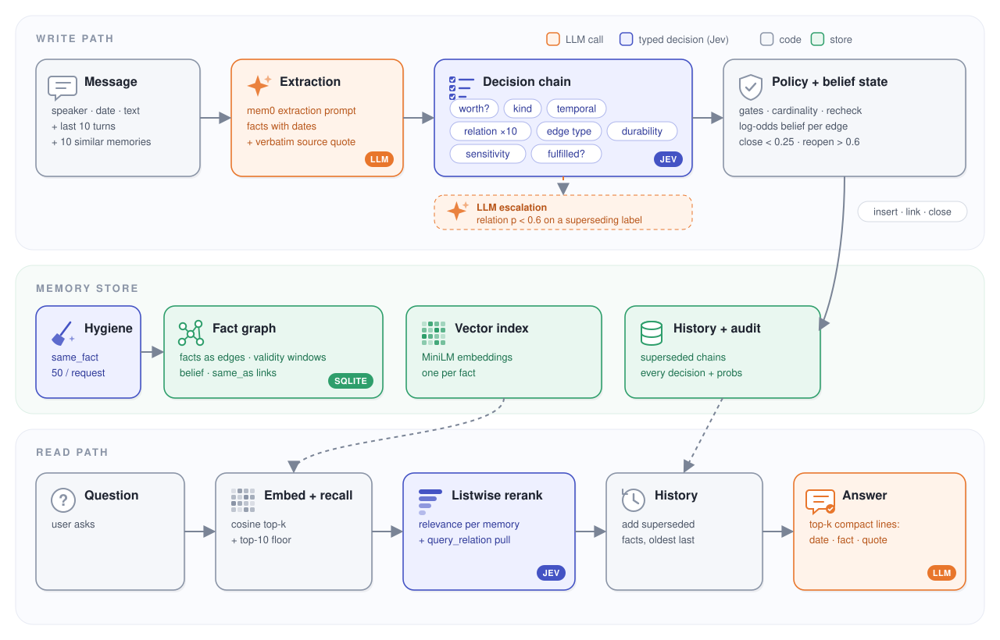
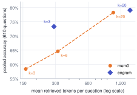
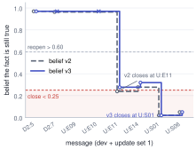
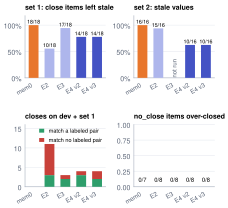
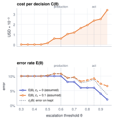
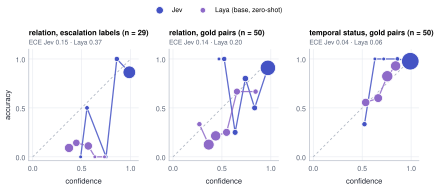
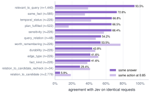
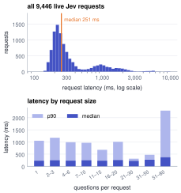

<!-- GENERATED from paper/main.src.md by paper/build.py. Edit the source, not this file.
Every number carries a src comment naming the file it comes from; paper/numbers.json lists them all. -->

# Typed Decisions in Agent Memory: Where They Help, Where They Don't, and What It Costs

<!-- Repo tagline: Decide, Don't Generate. -->

*Author: Rishabh Sharma, independent researcher.*

## Abstract

Typed decisions cut an agent memory system's decision cost and latency and improve retrieval under a small budget;
they do not change answers after facts change, and a small model used zero-shot cannot make them. Memory
systems make an LLM call for every write decision, which makes revisiting the store unaffordable, yet most of that
work is choice among fixed options. In engram, an LLM extracts facts and every decision is a typed question answered
by a hosted decision model (Jev). With extraction held identical to mem0 2.1.0's, typed decisions cut decision-layer
cost by 70.0×<!-- src: bench/results/e2_llm__dev.json ÷ bench/results/e2_jev__dev.json --> and median decision latency by 27.6×<!-- src: bench/results/e2_llm__dev.json ÷ bench/results/e2_jev__dev.json -->, with equal dev accuracy
(31/35<!-- src: bench/results/e2_jev__dev.json --> against 31/35<!-- src: bench/results/e2_llm__dev.json -->). On 610<!-- src: bench/results/heldout_report.json --> held-out LoCoMo questions under a three-memory
retrieval budget, engram answers +8.7<!-- src: bench/results/mem0_token_matched__heldout_pooled__k6.json --> points more than mem0 at matched context tokens (95% CI +5.2<!-- src: bench/results/mem0_token_matched__heldout_pooled__k6.json --> to
+12.1<!-- src: bench/results/mem0_token_matched__heldout_pooled__k6.json -->); at k=20 the systems tie (+0.8<!-- src: bench/results/heldout_report.json -->, CI -2.3<!-- src: bench/results/heldout_report.json --> to +3.9<!-- src: bench/results/heldout_report.json -->). A belief-state
store policy over-closed no labeled keep item. Two results are negative: closing stale facts does not change answers
on current benchmarks, and the 421M<!-- src: convai2026laya (model card) --> base checkpoint of the open-weights decision model Laya, used
zero-shot as its documentation advises against, does not make the relational decisions.

## 1. Introduction

**The cost problem.** A memory system for an LLM agent turns conversation into facts it can retrieve later. Each
write has two parts. Extraction asks what facts a message states. Decisions ask, for each fact, whether it is new, a
duplicate, a refinement or a change to something already stored, whether it is worth keeping, and whether it is
sensitive. In current open-source systems both parts are LLM calls. mem0 2.1.0's default `add()` makes a single LLM call per
message with its additive extraction prompt, and has no separate update or delete step (`mem0/memory/main.py`,
`Memory._add_to_vector_store`). An LLM call per decision is expensive enough that nothing re-examines the store
afterwards. Facts that stopped being true stay in it.

**The observation.** The decisions are choices among options fixed in advance. That is the setting typed decision
models are built for. They return a probability over a fixed option set in one short request, and
they cost far less than generating text. engram is built on that observation: an LLM extracts facts, and every
decision after extraction is a typed question (Figure 1).




**Concurrent work.** The architectural idea of routing memory decisions to a typed decision model was reached
independently by Jev-Mem [jiang2026jevmem], which uses Jev for typing, relation construction, query routing,
budget allocation, traversal, candidate scoring and stopping. It reports a LoCoMo judge score of
0.777<!-- src: jiang2026jevmem (reported LoCoMo judge score) --> with a 158<!-- src: jiang2026jevmem (reported build time, s) --> s build and 0.93<!-- src: jiang2026jevmem (reported query time, s) --> s query against A-MEM
[xu2025amem], MAGMA [jiang2026magma] and two further systems reported in that paper. It does not isolate the decision layer, evaluate
updates or closes, measure calibration, or use a held-out split or confidence intervals. Separately, a community
article reranked AtMem's top-10 with Jev on 1,986<!-- src: taghia2026atmem (LoCoMo questions) --> LoCoMo questions and measured the effect at the ranking
level: MRR@5 rose from 0.4259<!-- src: taghia2026atmem (MRR@5, AtMem) --> to 0.5868<!-- src: taghia2026atmem (MRR@5, AtMem + Jev) --> and Recall@1 from
0.3399<!-- src: taghia2026atmem (Recall@1, AtMem) --> to 0.5423<!-- src: taghia2026atmem (Recall@1, AtMem + Jev) --> [taghia2026atmem]. This paper's contribution is the controlled
measurement: an identical-extraction ablation of the decision layer, its calibration, the safety of the store it
drives, the rerank effect on answers with a matched-context control, and the negatives.

**Contributions.** The paper makes four. First, with extraction held identical, typed decisions replace an LLM
decision layer at 70.0×<!-- src: bench/results/e2_llm__dev.json ÷ bench/results/e2_jev__dev.json --> lower cost and 27.6×<!-- src: bench/results/e2_llm__dev.json ÷ bench/results/e2_jev__dev.json --> lower median latency with no measured accuracy
loss (§5.1). Second, a belief-state store policy with reversible, gated closes over-closes no labeled keep item, and
its v3 rule removes a weak-evidence failure that closes true facts (§3.3, §5.3). Third, under a three-memory budget
a listwise Jev rerank puts engram +8.7<!-- src: bench/results/mem0_token_matched__heldout_pooled__k6.json --> points ahead of mem0 at matched context on 610<!-- src: bench/results/heldout_report.json --> held-out
questions, while at k=20 the systems tie (§5.2). Fourth, two results are negative: closing stale facts does not
change answers on current benchmarks, and a zero-shot base checkpoint of an open-weights decision model does not
make the relational decisions (§5.4). Figure 2 plots the third against the context each system shows the answer model.



*Figure 2. Pooled held-out accuracy (610<!-- src: bench/results/heldout_report.json --> questions) against mean retrieved tokens per question. mem0
accuracy was measured at three settings, k=3<!-- src: bench/results/heldout_report.json (k=3 run) -->, 6<!-- src: bench/results/mem0_token_matched__heldout_pooled__k6.json --> and 20<!-- src: bench/results/heldout_report.json (k=20 run) -->; the token-matching sweep counted
tokens at the other k without answering. Models as in Table 3.*


**Scope.** We compare against one baseline (mem0 OSS 2.1.0) on one benchmark (LoCoMo: one development
conversation and four held-out conversations, scoring four of its five question categories; adversarial is
excluded, following mem0's evaluation protocol). We use update sets written by the system's author, and one hosted
decision model (Jev, `jev-1.13.0`). We did not test Zep/Graphiti or Letta, LongMemEval, other extraction,
answer or judge models, multi-user stores, or non-English text.

## 2. Background and Related Work

### 2.1 Write decisions in existing systems

mem0 [chhikara2025mem0] extracts and consolidates facts with LLM calls. Version 2.1.0 extracts with one LLM call
per message; the prompt receives the new message, the last 10<!-- src: src/engram/flags.py (extract_last_k, as mem0 2.1.0) --> messages and the 10<!-- src: src/engram/config.py --> most similar
existing memories, and emits only additions. Its older update step, which asked an LLM to label each new fact as
ADD, UPDATE, DELETE or NONE against existing memories, is still shipped as `DEFAULT_UPDATE_MEMORY_PROMPT`. We use it
as the LLM decision layer in §5.1.

Other systems also decide with an LLM. Zep's Graphiti builds a temporal knowledge graph and resolves entities and
invalidates edges with LLM calls [rasmussen2025zep]. MemGPT, now Letta, manages memory tiers through LLM function
calls [packer2023memgpt]. A-MEM links notes with LLM-written attributes [xu2025amem], and MAGMA organizes memory as
multiple graphs [jiang2026magma]. ByteRover curates a hierarchical context with an LLM; its retrieval is a five-tier
progressive strategy that answers most queries in under 100<!-- src: nguyen2026byterover (sub-100 ms tier resolution) --> ms without LLM calls and escalates to
agentic reasoning only for novel questions [nguyen2026byterover].

### 2.2 Typed decision models

A typed decision model takes a shared *state* (JSON) and a set of questions, and returns a probability
distribution for each question. A question is a choice among named options, each with a rubric; a yes/no ("noul")
question; or a score.

**Jev.** We use Jev through TypeSafe's API: model `jev-1.13.0`, priced at 0.042<!-- src: src/engram/config.py (USD per million input tokens) --> USD per million input tokens
as billed to our account (`src/engram/config.py`); the public documentation does not list a price. Its documentation gives a limit of 255<!-- src: typesafe2026jev (max options per Choice) --> options per choice question
[typesafe2026jev]. Measured latency is flat in request size (§5.5).

**Laya.** Laya is an open-weights model with the same request format. We ran checkpoint convaiinnovations/laya<!-- src: bench/results/e4_belief_v2_laya__dev_updates__k3.json --> locally
through the laya-mlx port on an Apple M2 Pro<!-- src: bench/results/e4_belief_v2_laya__dev_updates__k3.json --> with 32<!-- src: bench/results/e4_belief_v2_laya__dev_updates__k3.json --> GB. It reads at most 512<!-- src: bench/results/e4_belief_v2_laya__dev_updates__k3.json --> tokens per
question, of which at most 192<!-- src: bench/results/e4_belief_v2_laya__dev_updates__k3.json --> go to the instructions and options. This is the 421M<!-- src: convai2026laya (model card) --> base
checkpoint. Its model card reports zero-shot typed-decision accuracy of 0.362<!-- src: convai2026laya (base checkpoint, typed-decisions, zero-shot) --> against a 0.318<!-- src: convai2026laya (random baseline) -->
random baseline, calls it "a fast base to specialise, not a zero-shot decision engine," and offers a separate
checkpoint fine-tuned for typed decisions [convai2026laya]. We used the base checkpoint zero-shot.

### 2.3 LoCoMo and its limits

LoCoMo [maharana2024locomo] contains long multi-session conversations with questions in five categories, of which we score four
(adversarial is excluded, following mem0's evaluation protocol; §4.1). LongMemEval [wu2025longmemeval] also
evaluates long-term conversational memory; we used only LoCoMo.

**It barely tests updates.** In the first 215<!-- src: bench/results/e2_jev__stress.json --> messages of conv-26, an LLM labeler (claude-sonnet-4-6,
prompt in `bench/stale.py`) found 2<!-- src: bench/results/e0_baseline__stress.json --> claims that a later message makes no longer true
(`bench/slices/conv26_superseded.json`).

**Public scores are not comparable.** Published LoCoMo scores for the same systems differ between the systems' own
reports and third-party reports [mem0blog2026benchmarks; byteroverblog2026benchmark]. We do not quote those numbers. All comparisons here run both
systems under one protocol.

### 2.4 Closest work and adjacent ideas

**Jev-Mem and AtMem.** Jev-Mem [jiang2026jevmem] is the closest design: Jev controls typing, relation
construction, query routing, budget allocation, traversal, candidate scoring and stopping. The two designs differ
in the store and in retrieval. Jev-Mem runs with admission filtering off and preserves every observation, so its
store is never updated or closed; engram's store is governed by a close/belief policy with reversible closes and
merges (§3.2–3.3). Jev-Mem routes queries across multiple views; engram uses a single listwise rerank over cosine
candidates plus a query-relation pull (§3.1). The AtMem–Jev article [taghia2026atmem] measured the rerank at the
ranking level (Recall@10 unchanged; median batch latency 3.32<!-- src: taghia2026atmem (median batch latency, s) --> s) and reported no answer accuracy or
intervals.

**Reranking and context.** Long contexts are used poorly by language models [liu2024lost], and LLMs rerank
candidates well [sun2023rankgpt]; spending compute on selecting context rather than adding more of it follows from
both, and our rerank result is an instance.

**Routers.** Routers send queries to cheaper models [ong2025routellm; chen2024frugalgpt], and small classifiers act
as guardrails [inan2023llamaguard]. The escalation rule of §3.4 is a router of that kind.

**Calibration.** Temperature scaling [guo2017calibration] and conformal prediction [angelopoulos2021conformal]
give principled thresholds for acting on a model's probability. The belief update of §3.3 depends on the former.

## 3. engram

### 3.1 Pipeline

Figure 1 shows both paths.

**Write path.** An LLM extracts facts from a message; in the experiments it uses mem0's prompt and inputs (§4.2).
Each fact then goes to Jev as a single request that carries the fact questions and one `relation_to_candidate`
question for each of up to 10<!-- src: src/engram/config.py --> candidate facts. A policy layer and a belief state (§3.2–3.3) turn the answers
into store operations. The store is SQLite plus NetworkX: facts are edges with validity windows, and every decision
is logged with its probabilities.

**Read path.** The question is embedded and the cosine top-k taken. Jev reranks these candidates with one yes/no
relevance question per candidate, plus a `query_relation` question that can pull in facts by relation type. History
is added next, meaning the facts that each retrieved fact superseded. The answer model sees compact lines, each
with the date the fact was said, the fact, and the verbatim source quote.

### 3.2 Decision chain and policy layer

The current chain has 12<!-- src: src/engram/decide/questions.py (ALL_QUESTIONS) --> questions, listed in Appendix A. Choice questions carry a rubric per option. When a
question's wording changes, its version number is bumped and old arms keep the old version.

**Policy.** Decisions act only through explicit rules (`src/engram/pipeline/write.py`). A decision acts at
$p \ge$ 0.85<!-- src: src/engram/config.py -->. A superseding relation (update, contradiction, negates) below 0.60<!-- src: src/engram/config.py --> is escalated to an LLM
with mem0's update prompt, and anything in between is stored as tentative.

Closing an edge is gated three ways. The new fact must be current or past, with
$P(\text{current}) + P(\text{past}) \ge$ 0.85<!-- src: src/engram/config.py -->, so planned and hypothetical statements never close anything.
The relation type's cardinality must allow the close: `contradiction` closes only a sibling (same subject and
relation) on a single-valued relation, `update` may also close a multi-valued sibling, and `negates` (the new fact
says the old one stopped) may close any edge. And the first piece of evidence against an edge counts only if a
second phrasing of the relation question (`relation_to_candidate_recheck`) confirms it.

Three further rules cover plans, duplicates and overrides. A dedicated yes/no question, `plan_fulfilled`, asks
whether a new fact reports that a stored plan has happened; at $p \ge$ 0.85<!-- src: src/engram/config.py --> the plan closes with reason
*fulfilled*. A duplicate becomes a `same_as` link that is collapsed at retrieval and can be removed, so text is
never merged. An explicit request to remember overrides `worth_remembering`, and a credential is redacted before
storage whatever the other answers say.

**Hygiene.** After ingestion, one pass re-checks every group of facts that share a subject and relation. It asks
the yes/no question `same_fact` for each pair, 50<!-- src: src/engram/pipeline/hygiene.py --> pairs per request. At $p \ge$ 0.85<!-- src: src/engram/config.py --> the pair is
linked, and at $p \le$ 0.15<!-- src: src/engram/pipeline/hygiene.py (1 − ACT_THRESHOLD) --> an existing link is dropped. On the held-out conversations one pass made
between 1,865<!-- src: bench/results/e4_belief_v2__heldout_conv-30__k3.json --> and 5,446<!-- src: bench/results/e4_belief_v2__heldout_conv-42__k3.json --> decisions, for between $0.0112<!-- src: bench/results/e4_belief_v2__heldout_conv-30__k3.json --> and
$0.0332<!-- src: bench/results/e4_belief_v2__heldout_conv-42__k3.json --> (§5.3). With LLM decisions, re-examining the store at that scale is what becomes unaffordable.

### 3.3 Belief state

Each edge $i$ carries a belief $b_i \in [$ 0.02<!-- src: src/engram/pipeline/belief.py -->, 0.98<!-- src: src/engram/pipeline/belief.py --> $]$ that it is currently true. A typed answer $z$
about the edge, with probability $q$ for its chosen label, updates it in log-odds:

```math
\operatorname{logit} b_i &\leftarrow \operatorname{logit} b_i + w(z)\, \operatorname{logit} q , \label{eq:belief} \\
\operatorname{logit} q &\leftarrow \operatorname{logit} q \,/\, T . \label{eq:temper}
```

With a per-question temperature $T$ (§5.3), $\operatorname{logit} q$ is first rescaled as in (Eq. temper).
We use $|w| = 1$, and the sign follows the policy rules of §3.2: $w = +1$ for the supporting answers
`duplicate` and `refinement`, $w = -1$ for `update`, `contradiction` and `negates` where a close is permitted, and
$w = 0$ for `new` and for any answer a gate blocks.

An open edge closes when $b_i <$ 0.25<!-- src: src/engram/pipeline/belief.py --> and reopens when $b_i >$ 0.60<!-- src: src/engram/pipeline/belief.py -->. The gap between the two gives
hysteresis.

**Belief v3.** The v2 rule used in the held-out runs lets any answer count. A `duplicate` at $q < 0.5$ therefore
has $\operatorname{logit} q < 0$ and *lowers* belief, and a weak against-answer raises it. v3 counts an answer only
when its label is the argmax and $q > 0.5$ (§5.3). Figure 3 traces one fact from the dev run under both rules.



*Figure 3. Belief in the fact "Melanie carves out daily me-time through running, reading, or playing violin"
(message D2:5), dev + update set 1, under v2 and v3. Under v2 a weak refinement answer at D2:7 (p = 0.45<!-- src: bench/results/e4_belief_v2__dev_updates__k3__noanswer.json (belief_trace, D2:7) -->)
lowers belief slightly, so the update at U:E11 takes it below the close line; v3 ignores that answer (×) and the
fact closes one message later, at U:S01. Source: the belief trace in
`bench/results/e4_belief_v2__dev_updates__k3__noanswer.json` and its v3 counterpart.*

**What this assumes.** The log-odds rule (Eq. belief) treats $q$ as a calibrated likelihood. Where the model is miscalibrated,
belief moves by the wrong amount. This is why §5.3 measures calibration and why a per-question temperature is
part of the rule.

### 3.4 Cost model

With a per-decision Jev cost $c_J$, an LLM escalation cost $c_L$ and an escalation threshold $\theta$ on the top
probability $q$:

```math
C(\theta) &= c_J + P(q < \theta)\, c_L , \label{eq:cost} \\
E(\theta) &= P(q \ge \theta)\, \varepsilon_J(\theta) + P(q < \theta)\, \varepsilon_L , \label{eq:error}
```

where $\varepsilon_J(\theta)$ is Jev's error rate on the decisions it keeps and $\varepsilon_L$ is the LLM's error
rate on the escalated ones. §5.3 draws the empirical curves of (Eq. cost, Eq. error).

## 4. Experimental Setup

### 4.1 Models, data and protocol

**Models.** Every arm uses the same models. `claude-haiku-4-5` extracts facts, for engram and for mem0 2.1.0
(which runs with telemetry off). `claude-sonnet-4-6` answers and judges, with mem0's LoCoMo evaluation prompts
(§4.2), and is also the LLM decision layer and the escalation model, with mem0's update prompt.

**Data.** The *dev* slice is conv-26 sessions 1–4 (76<!-- src: bench/results/e2_jev__dev.json --> messages, 35<!-- src: bench/results/e2_jev__dev.json --> questions), and the *stress*
slice is conv-26 sessions 1–10 (215<!-- src: bench/results/e2_jev__stress.json --> messages, 80<!-- src: bench/results/e2_jev__stress.json --> questions). The *held-out* slice is conv-30,
conv-41, conv-42 and conv-43 whole (610<!-- src: bench/results/heldout_report.json --> questions); none of it was used during development, and the system
configuration was frozen (git tag `e4-frozen`) before any held-out run. LoCoMo's questions fall in five categories,
of which we score four (adversarial is excluded, following mem0's evaluation protocol). Each held-out conversation is
ingested once per system, and k=3 and k=20 are answered from the same store.

**Caching and budget.** Every LLM and Jev call is cached by its full request, and budget guards stop any run past
a spending limit. Phase 2 (all experiments reported here) spent $93.26<!-- src: bench/results/phase2_spend.jsonl --> over 80<!-- src: bench/results/phase2_spend.jsonl --> ledgered runs.
Jev accounts for $1.47<!-- src: bench/results/phase2_spend.jsonl --> of it (`bench/results/phase2_spend.jsonl`; per-arm totals in Appendix D). The build
phase was not ledgered; roughly $10 by the author's estimate.

### 4.2 Identical extraction

For each message, mem0 2.1.0's `add()` builds its extraction prompt from the new message (as
`[date] speaker: text`), the last 10<!-- src: src/engram/flags.py (extract_last_k, as mem0 2.1.0) --> messages, the 10<!-- src: src/engram/config.py --> existing memories most similar to it, and a
current date. It passes no observation date, so relative dates in historical conversations resolve against the current date. We
report this as-is, and a patched variant in §6.

engram's E-arms build the same prompt with the same function (`generate_additive_extraction_prompt`), inputs and
model (`bench/run.py`, `src/engram/flags.py`). The "existing memories" differ only because each system's store
differs. The E2 arms differ only in what decides after extraction.

**Prompts.** mem0's extraction and update prompts, and the functions that build their requests, are copied verbatim
from the installed mem0 2.1.0 package (Apache License 2.0) into `src/engram/llm/prompts_mem0.py`.
`tests/test_prompts_mem0.py` checks that the copies are byte-identical to the installed package, so a changed
prompt fails the test suite. The answer and judge prompts are mem0's LoCoMo evaluation prompts, adapted from two
per-speaker memory lists to a single list (`bench/locomo_subset.py`).

### 4.3 Update sets

LoCoMo has almost no updates (§2.3). Two update sets, written in the speakers' voices, extend it. Both are appended to the dev
slice and were frozen by SHA-256 before any run.

Set 1 (`bench/updates_conv26.json`, SHA-256 prefix 2330876388f1<!-- src: bench/updates_conv26.json -->) has 30<!-- src: bench/updates_conv26.json --> items: 15<!-- src: bench/updates_conv26.json --> easy closes,
10<!-- src: bench/updates_conv26.json --> subtle items labeled *no_close* (past-tense mentions and unrealised plans that must not close
anything), and 5<!-- src: bench/updates_conv26.json --> fulfilled plans. Set 2 (`bench/updates2_conv26.json`, prefix d4f3c8d2de61<!-- src: bench/updates2_conv26.json -->) adds
28<!-- src: bench/updates2_conv26.json --> messages and 20<!-- src: bench/updates2_conv26.json --> questions. Of these, 5<!-- src: bench/updates2_conv26.json --> ask about a past moment in set 1's
items, 5<!-- src: bench/updates2_conv26.json --> ask for the current value after a chain of 3–5 changes, 5<!-- src: bench/updates2_conv26.json -->
ask for a chain's value at a past moment, and 5<!-- src: bench/updates2_conv26.json --> follow an update whose message has no
temporal cue such as "now" or "anymore". Appendix B shows one item of each kind; the full sets are in the two files. The system's author wrote and labeled
them, and this is a source of bias.

### 4.4 Statistics

Both systems answer the same questions, so comparisons are paired: $d_i = \text{engram}_i - \text{mem0}_i$. We
report an exact McNemar test on the discordant questions and a 95% interval from the per-question normal
approximation. We also report a cluster bootstrap that resamples the four held-out conversations; with four
clusters it is a robustness check, not a primary interval. The token-matched comparison reports the per-question
interval only.

## 5. Results

### 5.1 Replacing the decision layer

The three arms in Table 2 share extraction. The two engram arms differ only in what decides after it: Jev's
typed questions in E2 Jev, and `claude-sonnet-4-6` with mem0's update prompt, one call per extracted fact, in E2 LLM.

*Table 2. Dev slice, conv-26 sessions 1–4, 76<!-- src: bench/results/e2_jev__dev.json --> messages, 35<!-- src: bench/results/e2_jev__dev.json --> questions, all retrieved memories
(default k). Extraction claude-haiku-4-5 for all arms; answers and judge claude-sonnet-4-6; E2 LLM decides with
claude-sonnet-4-6. Costs are per 1,000 messages written. Decision p50: median time after extraction, per message,
over messages that produced at least one fact. Write p50: median end-to-end write time per message over all
messages, including those that produced no facts.*

| system | accuracy | decision $/1k | decision p50 | total $/1k | write p50 | facts |
|---|---|---|---|---|---|---|
| mem0 2.1.0 (one LLM call per write) | 30/35<!-- src: bench/results/mem0__dev.json --> | – | – | $9.80<!-- src: bench/results/mem0__dev.json --> | 879 ms<!-- src: bench/results/mem0__dev.json --> | 46<!-- src: bench/results/mem0__dev.json --> |
| engram E2, LLM decision layer (mem0 update prompt) | 31/35<!-- src: bench/results/e2_llm__dev.json --> | $8.782<!-- src: bench/results/e2_llm__dev.json --> | 7,675 ms<!-- src: bench/results/e2_llm__dev.json --> | $18.70<!-- src: bench/results/e2_llm__dev.json --> | 918 ms<!-- src: bench/results/e2_llm__dev.json --> | 18<!-- src: bench/results/e2_llm__dev.json --> |
| engram E2, Jev decision layer | 31/35<!-- src: bench/results/e2_jev__dev.json --> | $0.125<!-- src: bench/results/e2_jev__dev.json --> | 278 ms<!-- src: bench/results/e2_jev__dev.json --> | $9.90<!-- src: bench/results/e2_jev__dev.json --> | 895 ms<!-- src: bench/results/e2_jev__dev.json --> | 47<!-- src: bench/results/e2_jev__dev.json --> |

The two decision layers answer the same number of questions and mem0 one fewer, within noise. The Jev decision layer costs 70.0×<!-- src: bench/results/e2_llm__dev.json ÷ bench/results/e2_jev__dev.json -->
less and has 27.6×<!-- src: bench/results/e2_llm__dev.json ÷ bench/results/e2_jev__dev.json --> lower median decision latency. The LLM decision layer stores fewer facts
(18<!-- src: bench/results/e2_llm__dev.json --> against 47<!-- src: bench/results/e2_jev__dev.json -->) because mem0's UPDATE event rewrites an existing memory
instead of adding one.

The two latency columns are medians over different messages. In the E2 LLM arm only 30<!-- src: bench/results/e2_latency.json --> of
76<!-- src: bench/results/e2_latency.json --> messages made an LLM decision call, so the write median falls on an extraction-only message
(median extraction 869 ms<!-- src: bench/results/e2_latency.json -->); on the messages with decisions, the logged median of the slowest
decision call is 7,892 ms<!-- src: bench/results/e2_latency.json --> (`bench/e2_latency.py`).

In Table 2 the decision layer is 1.3%<!-- src: bench/results/e2_jev__dev.json: decision $/1k ÷ total $/1k --> of the Jev arm's end-to-end write cost and 47.0%<!-- src: bench/results/e2_llm__dev.json: decision $/1k ÷ total $/1k --> of
the LLM arm's; with typed decisions, extraction is almost the whole cost of a write.

These ratios compare Jev against `claude-sonnet-4-6` as the decider. We have no measurement with a smaller LLM
decider. On the stress slice the Jev arm scored 67/80<!-- src: bench/results/e2_jev__stress.json --> and mem0 64/80<!-- src: bench/results/mem0__stress.json -->; the LLM
arm was not run there.

**Held-out parity at default k.** The held-out runs compare the frozen full system (E4 belief v2, §3.3) with mem0,
not the E2 arms. At k=20 engram answers 482/610<!-- src: bench/results/heldout_report.json --> and mem0 477/610<!-- src: bench/results/heldout_report.json -->. The difference is +0.8<!-- src: bench/results/heldout_report.json -->
points (95% CI -2.3<!-- src: bench/results/heldout_report.json --> to +3.9<!-- src: bench/results/heldout_report.json -->; conversation bootstrap -4.5<!-- src: bench/results/heldout_report.json --> to
+5.4<!-- src: bench/results/heldout_report.json -->; McNemar $p$ = 0.679<!-- src: bench/results/heldout_report.json -->), within noise.

### 5.2 Retrieval under a small budget

Our answer-level result is consistent with the ranking-level improvement AtMem measured when reranking with Jev
[taghia2026atmem].

At k=3 engram shows the answer model 290<!-- src: bench/results/heldout_report.json --> tokens per question and mem0 159<!-- src: bench/results/heldout_report.json -->. Most of the
difference is the source quote on each engram line. To separate context size from ranking, we answered the same
610<!-- src: bench/results/heldout_report.json --> questions from mem0's existing held-out stores at every k from 3 to 8. The token-matched setting is the k whose mean retrieved
tokens came closest to engram's 290<!-- src: bench/results/mem0_token_matched__heldout_pooled__k6.json -->: k=6<!-- src: bench/results/mem0_token_matched__heldout_pooled__k6.json -->, at 315<!-- src: bench/results/mem0_token_matched__heldout_pooled__k6.json --> tokens. That gives mem0 slightly more
context than engram. The run cost $2.52<!-- src: bench/results/mem0_token_matched__heldout_pooled__k6.json -->.

*Table 3. Held-out LoCoMo accuracy: conv-30, 41, 42 and 43, 610<!-- src: bench/results/heldout_report.json --> questions, adversarial category excluded, k as labeled.
Extraction claude-haiku-4-5, answers and judge claude-sonnet-4-6. One ingestion per system per conversation.
Tokens are mean retrieved-context tokens per question.*

| system | k | tokens/q | conv-30 | conv-41 | conv-42 | conv-43 | pooled |
|---|---|---|---|---|---|---|---|
| Q |  |  | 81<!-- src: bench/results/heldout_report.json --> | 152<!-- src: bench/results/heldout_report.json --> | 199<!-- src: bench/results/heldout_report.json --> | 178<!-- src: bench/results/heldout_report.json --> | 610<!-- src: bench/results/heldout_report.json --> |
| engram | 3 | 290<!-- src: bench/results/heldout_report.json --> | 72.8%<!-- src: bench/results/heldout_report.json --> | 74.3%<!-- src: bench/results/heldout_report.json --> | 75.4%<!-- src: bench/results/heldout_report.json --> | 70.2%<!-- src: bench/results/heldout_report.json --> | 447/610<!-- src: bench/results/heldout_report.json --> |
| mem0 | 3 | 159<!-- src: bench/results/heldout_report.json --> | 67.9%<!-- src: bench/results/heldout_report.json --> | 58.6%<!-- src: bench/results/heldout_report.json --> | 55.8%<!-- src: bench/results/heldout_report.json --> | 56.7%<!-- src: bench/results/heldout_report.json --> | 356/610<!-- src: bench/results/heldout_report.json --> |
| mem0 (token-matched) | 6<!-- src: bench/results/mem0_token_matched__heldout_pooled__k6.json --> | 315<!-- src: bench/results/mem0_token_matched__heldout_pooled__k6.json --> | 66.7%<!-- src: bench/results/mem0_token_matched__heldout_pooled__k6.json --> | 71.7%<!-- src: bench/results/mem0_token_matched__heldout_pooled__k6.json --> | 59.8%<!-- src: bench/results/mem0_token_matched__heldout_pooled__k6.json --> | 62.9%<!-- src: bench/results/mem0_token_matched__heldout_pooled__k6.json --> | 394/610<!-- src: bench/results/mem0_token_matched__heldout_pooled__k6.json --> |
| engram | 20 | 1,461<!-- src: bench/results/heldout_report.json --> | 76.5%<!-- src: bench/results/heldout_report.json --> | 84.2%<!-- src: bench/results/heldout_report.json --> | 78.4%<!-- src: bench/results/heldout_report.json --> | 76.4%<!-- src: bench/results/heldout_report.json --> | 482/610<!-- src: bench/results/heldout_report.json --> |
| mem0 | 20 | 1,024<!-- src: bench/results/heldout_report.json --> | 77.8%<!-- src: bench/results/heldout_report.json --> | 88.8%<!-- src: bench/results/heldout_report.json --> | 73.4%<!-- src: bench/results/heldout_report.json --> | 74.7%<!-- src: bench/results/heldout_report.json --> | 477/610<!-- src: bench/results/heldout_report.json --> |

*Table 4. Paired differences for the rows of Table 3: held-out, Q = 610<!-- src: bench/results/heldout_report.json -->, k as labeled, models as in Table 3. 95% CI: per-question normal approximation. Bootstrap:
resampling the four conversations. Discordant: questions only engram / only mem0 answered correctly.*

| comparison | Δ (pts) | 95% CI | 95% CI, bootstrap | discordant | McNemar p |
|---|---|---|---|---|---|
| engram k=3 − mem0 k=3 | +14.9<!-- src: bench/results/heldout_report.json --> | [+11.2<!-- src: bench/results/heldout_report.json -->, +18.7<!-- src: bench/results/heldout_report.json -->] | [+8.2<!-- src: bench/results/heldout_report.json -->, +19.8<!-- src: bench/results/heldout_report.json -->] | 120<!-- src: bench/results/heldout_report.json --> / 29<!-- src: bench/results/heldout_report.json --> | 2.4e-14<!-- src: bench/results/heldout_report.json --> |
| engram k=3 − mem0 k=6 (token-matched) | +8.7<!-- src: bench/results/mem0_token_matched__heldout_pooled__k6.json --> | [+5.2<!-- src: bench/results/mem0_token_matched__heldout_pooled__k6.json -->, +12.1<!-- src: bench/results/mem0_token_matched__heldout_pooled__k6.json -->] | not computed | 86<!-- src: bench/results/mem0_token_matched__heldout_pooled__k6.json --> / 33<!-- src: bench/results/mem0_token_matched__heldout_pooled__k6.json --> | 1.3e-06<!-- src: bench/results/mem0_token_matched__heldout_pooled__k6.json --> |
| engram k=20 − mem0 k=20 | +0.8<!-- src: bench/results/heldout_report.json --> | [-2.3<!-- src: bench/results/heldout_report.json -->, +3.9<!-- src: bench/results/heldout_report.json -->] | [-4.5<!-- src: bench/results/heldout_report.json -->, +5.4<!-- src: bench/results/heldout_report.json -->] | 49<!-- src: bench/results/heldout_report.json --> / 44<!-- src: bench/results/heldout_report.json --> | 0.679<!-- src: bench/results/heldout_report.json --> |

At k=3 engram is ahead of mem0 by +14.9<!-- src: bench/results/heldout_report.json --> points (95% CI +11.2<!-- src: bench/results/heldout_report.json --> to +18.7<!-- src: bench/results/heldout_report.json -->). Against
token-matched mem0 the difference is +8.7<!-- src: bench/results/mem0_token_matched__heldout_pooled__k6.json --> points (95% CI +5.2<!-- src: bench/results/mem0_token_matched__heldout_pooled__k6.json --> to +12.1<!-- src: bench/results/mem0_token_matched__heldout_pooled__k6.json -->; McNemar
$p$ = 1.3e-06<!-- src: bench/results/mem0_token_matched__heldout_pooled__k6.json -->; 86<!-- src: bench/results/mem0_token_matched__heldout_pooled__k6.json --> questions only engram answered against 33<!-- src: bench/results/mem0_token_matched__heldout_pooled__k6.json --> only mem0 answered).

Figure 2 places the three measured mem0 settings and the two engram settings on one axis of retrieved tokens.
engram at k=3 sits above the line through mem0's points, and the two systems meet at k=20.

engram's point estimate is ahead in every category at matched context (Table 5) and in every conversation
(Appendix C). Per conversation, the matched-context interval excludes zero in 2<!-- src: bench/results/perconv_diffs.json: conversations whose matched-context interval excludes zero --> of four
conversations (conv-42 and conv-43); conv-30 and conv-41 are within noise on their own.

*Table 5. Held-out accuracy by LoCoMo category, 610<!-- src: bench/results/heldout_report.json --> questions, k as labeled. Models as in Table 3.*

| category | Q | engram k=3 | mem0 k=3 | mem0 k=6 (matched) | engram k=20 | mem0 k=20 |
|---|---|---|---|---|---|---|
| multi-hop | 110<!-- src: bench/results/heldout_report.json --> | 49.1%<!-- src: bench/results/heldout_report.json --> | 31.8%<!-- src: bench/results/heldout_report.json --> | 40.9%<!-- src: bench/results/mem0_token_matched__heldout_pooled__k6.json --> | 67.3%<!-- src: bench/results/heldout_report.json --> | 61.8%<!-- src: bench/results/heldout_report.json --> |
| temporal | 119<!-- src: bench/results/heldout_report.json --> | 84.0%<!-- src: bench/results/heldout_report.json --> | 71.4%<!-- src: bench/results/heldout_report.json --> | 73.9%<!-- src: bench/results/mem0_token_matched__heldout_pooled__k6.json --> | 88.2%<!-- src: bench/results/heldout_report.json --> | 84.0%<!-- src: bench/results/heldout_report.json --> |
| open-domain | 33<!-- src: bench/results/heldout_report.json --> | 51.5%<!-- src: bench/results/heldout_report.json --> | 30.3%<!-- src: bench/results/heldout_report.json --> | 33.3%<!-- src: bench/results/mem0_token_matched__heldout_pooled__k6.json --> | 51.5%<!-- src: bench/results/heldout_report.json --> | 57.6%<!-- src: bench/results/heldout_report.json --> |
| single-hop | 348<!-- src: bench/results/heldout_report.json --> | 79.3%<!-- src: bench/results/heldout_report.json --> | 64.9%<!-- src: bench/results/heldout_report.json --> | 71.8%<!-- src: bench/results/mem0_token_matched__heldout_pooled__k6.json --> | 82.2%<!-- src: bench/results/heldout_report.json --> | 83.3%<!-- src: bench/results/heldout_report.json --> |

**Attribution.** Matching context removes 41.8%<!-- src: bench/results/heldout_report.json and bench/results/mem0_token_matched__heldout_pooled__k6.json: (Δk3 − Δtoken-matched) / Δk3 --> of the k=3 difference. The other 58.2%<!-- src: bench/results/heldout_report.json and bench/results/mem0_token_matched__heldout_pooled__k6.json: 1 − context share --> is
what remains once context is matched.

We attribute that remainder to which memories reach the top three, which rests on a dev-slice ablation, not a
held-out one. On dev + set 1 at k=3 the frozen arm answered 30/30<!-- src: bench/results/e4_belief_v2__dev_updates__k3.json --> update questions. It answered
26/30<!-- src: bench/results/e4_belief_v2_norerank__dev_updates__k3.json --> with Jev reranking off, 30/30<!-- src: bench/results/e4_belief_v2_nohist__dev_updates__k3.json --> with history expansion
off, and mem0 answered 25/30<!-- src: bench/results/mem0__dev_updates__k3.json -->. We did not run a held-out no-rerank arm.

### 5.3 Store safety and calibration

*Table 6. Store safety on dev + update set 1 and set 2 (storage metrics only). Extraction claude-haiku-4-5, decisions Jev (jev-1.13.0). Columns: set-1
no_close items over-closed / stored; set-2 keep items kept / stored; closes on dev + set 1, split into those matching
a labeled pair and those not.*
- *Over-closed*: a labeled no_close item whose fact was closed by its own update message.
- *Matching a labeled pair*: a close whose (closed fact's message, closing message) is a labeled update or
  superseded pair.
- The set-2 keep set has one item.

| arm | set-1 over-closed | set-2 kept | closes | labeled | unlabeled |
|---|---|---|---|---|---|
| mem0 | 0/7<!-- src: bench/results/mem0__dev_updates.json --> | 1/1<!-- src: bench/results/mem0__dev_updates2.json --> | 0<!-- src: bench/results/mem0__dev_updates.json --> | 0<!-- src: bench/results/mem0__dev_updates.json --> | 0<!-- src: bench/results/mem0__dev_updates.json --> |
| E2: Jev, replace-on-update | 0/8<!-- src: bench/results/e2_jev_v2__dev_updates__k3.json --> | 1/1<!-- src: bench/results/e2_jev_v2__dev_updates2.json --> | 11<!-- src: bench/results/e2_jev_v2__dev_updates__k3.json --> | 3<!-- src: bench/results/e2_jev_v2__dev_updates__k3.json --> | 8<!-- src: bench/results/e2_jev_v2__dev_updates__k3.json --> |
| E3: structural rules | 0/8<!-- src: bench/results/e3_structural_v3__dev_updates.json --> | not run | 3<!-- src: bench/results/e3_structural_v3__dev_updates.json --> | 2<!-- src: bench/results/e3_structural_v3__dev_updates.json --> | 1<!-- src: bench/results/e3_structural_v3__dev_updates.json --> |
| E4: belief v1 | 0/8<!-- src: bench/results/e4_belief__dev_updates.json --> | 1/1<!-- src: bench/results/e4_belief__dev_updates2.json --> | 3<!-- src: bench/results/e4_belief__dev_updates.json --> | 2<!-- src: bench/results/e4_belief__dev_updates.json --> | 1<!-- src: bench/results/e4_belief__dev_updates.json --> |
| E4: belief v2 (frozen) | 0/8<!-- src: bench/results/e4_belief_v2__dev_updates__k3.json --> | 1/1<!-- src: bench/results/e4_belief_v2_shadow__dev_updates2__k3.json --> | 4<!-- src: bench/results/e4_belief_v2__dev_updates__k3.json --> | 3<!-- src: bench/results/e4_belief_v2__dev_updates__k3.json --> | 1<!-- src: bench/results/e4_belief_v2__dev_updates__k3.json --> |
| E4: belief v3 | 0/8<!-- src: bench/results/e4_belief_v3__dev_updates__k3__noanswer.json --> | 1/1<!-- src: bench/results/e4_belief_v3__dev_updates2__k3__noanswer.json --> | 4<!-- src: bench/results/e4_belief_v3__dev_updates__k3__noanswer.json --> | 2<!-- src: bench/results/e4_belief_v3__dev_updates__k3__noanswer.json --> | 2<!-- src: bench/results/e4_belief_v3__dev_updates__k3__noanswer.json --> |

Figure 4 shows the same outcomes per arm.



*Figure 4. Store outcomes on the update sets: set-1 close items left stale, set-2 stale values, closes on
dev + set 1 split by whether they match a labeled pair, and no_close items over-closed. E3 was not run on set 2.*

**Over-closes.** No labeled keep item was over-closed by any arm.

**Closes outside the labels.** These separate the policies. The first Jev arm (E2), which closed whenever a
superseding label cleared 0.85<!-- src: src/engram/config.py -->, made 11<!-- src: bench/results/e2_jev_v2__dev_updates__k3.json --> closes on dev + set 1, and 8<!-- src: bench/results/e2_jev_v2__dev_updates__k3.json --> of them
match no labeled pair. Belief v2 made 4<!-- src: bench/results/e4_belief_v2__dev_updates__k3.json -->, of which 1<!-- src: bench/results/e4_belief_v2__dev_updates__k3.json --> match no labeled pair.
On set 2 the comparison is 10<!-- src: bench/results/e2_jev_v2__dev_updates2.json --> of 14<!-- src: bench/results/e2_jev_v2__dev_updates2.json --> against 1<!-- src: bench/results/e4_belief_v2_shadow__dev_updates2__k3.json --> of
10<!-- src: bench/results/e4_belief_v2_shadow__dev_updates2__k3.json -->.

**Stale items.** A stale item is a close item whose old fact is still active. Belief v2 left 14/18<!-- src: bench/results/e4_belief_v2__dev_updates__k3.json --> of
the set-1 close items stale, against 17/18<!-- src: bench/results/e4_belief__dev_updates.json --> under belief v1 and 18/18<!-- src: bench/results/mem0__dev_updates.json --> for mem0, which never
closes. On set 2 it left 10/16<!-- src: bench/results/e4_belief_v2_shadow__dev_updates2__k3.json --> stale, against 15/16<!-- src: bench/results/e4_belief__dev_updates2.json --> and 16/16<!-- src: bench/results/mem0__dev_updates2.json -->.

**Fulfilled plans.** A relaxed heuristic closed a plan whenever a related past or current fact arrived. Across its
two arms it fired 25<!-- src: bench/results/e2_jev_v2__dev_updates.json + bench/results/e3_structural_v2__dev_updates.json (fulfills_log) vs bench/updates_conv26.json close_fulfilled pairs --> times. 1<!-- src: bench/results/e2_jev_v2__dev_updates.json + bench/results/e3_structural_v2__dev_updates.json (fulfills_log) vs bench/updates_conv26.json close_fulfilled pairs --> firing matched a labeled (plan, fulfilment) pair,
and 24<!-- src: bench/results/e2_jev_v2__dev_updates.json + bench/results/e3_structural_v2__dev_updates.json (fulfills_log) vs bench/updates_conv26.json close_fulfilled pairs --> did not. The frozen arm uses the `plan_fulfilled` question instead; it was asked
234<!-- src: bench/results/e4_belief_v2__dev_updates__k3.json --> times on dev + set 1 and closed 2<!-- src: bench/results/e4_belief_v2__dev_updates__k3.json --> plans correctly and 1<!-- src: bench/results/e4_belief_v2__dev_updates__k3.json --> wrongly.

**Belief v3.** On the same data, v3 ignored 36<!-- src: bench/results/e4_belief_v3__dev_updates__k3__noanswer.json --> weak answers on dev + set 1 and 39<!-- src: bench/results/e4_belief_v3__dev_updates2__k3__noanswer.json -->
with set 2 added. It closed the same four facts as v2 on dev + set 1. One of them, D2:5, crossed the close line at
a different message (U:S01 rather than U:E11). Since that pair is not labeled, the audit scores v3 at
2<!-- src: bench/results/e4_belief_v3__dev_updates__k3__noanswer.json --> matching and 2<!-- src: bench/results/e4_belief_v3__dev_updates__k3__noanswer.json --> not matching, against v2's 3<!-- src: bench/results/e4_belief_v2__dev_updates__k3.json --> and
1<!-- src: bench/results/e4_belief_v2__dev_updates__k3.json -->. Stale and over-close counts are unchanged. v3 targets the weak-support failure that closed
true facts under Laya (§5.4).

**Hygiene.** One pass cost $0.0015<!-- src: bench/results/e4_belief_v2__dev_updates__k3.json --> on dev + set 1 (235<!-- src: bench/results/e4_belief_v2__dev_updates__k3.json --> decisions). On the held-out
conversations it cost $0.0112<!-- src: bench/results/e4_belief_v2__heldout_conv-30__k3.json -->, $0.0254<!-- src: bench/results/e4_belief_v2__heldout_conv-41__k3.json -->, $0.0332<!-- src: bench/results/e4_belief_v2__heldout_conv-42__k3.json --> and $0.0323<!-- src: bench/results/e4_belief_v2__heldout_conv-43__k3.json -->,
making 9<!-- src: bench/results/e4_belief_v2__heldout_conv-30__k3.json -->, 23<!-- src: bench/results/e4_belief_v2__heldout_conv-41__k3.json -->, 32<!-- src: bench/results/e4_belief_v2__heldout_conv-42__k3.json --> and 24<!-- src: bench/results/e4_belief_v2__heldout_conv-43__k3.json --> links.

**Contradiction regression.** The regression set has 50<!-- src: bench/results/tradeoff.json --> contradiction pairs, each an old fact, a new fact and a message, labeled
with accepted relations and a temporal status (`bench/contradiction_pairs.jsonl`). Under the current question
versions, Jev's relation choice is in the accepted set for 90.0%<!-- src: bench/results/jev_regression_v2.json --> of pairs (easy 100.0%<!-- src: bench/results/jev_regression_v2.json -->, medium
93.3%<!-- src: bench/results/jev_regression_v2.json -->, subtle 73.3%<!-- src: bench/results/jev_regression_v2.json -->), and its temporal status is right for 94.0%<!-- src: bench/results/jev_regression_v2.json -->. The
write path's close rule is right for 76.0%<!-- src: bench/results/jev_regression_v2.json -->, with 0<!-- src: bench/results/jev_regression_v2.json --> false closes. Jev's mean top
probability is 0.88<!-- src: bench/results/jev_regression_v2.json --> when it is right and 0.81<!-- src: bench/results/jev_regression_v2.json --> when it is wrong.

*Table 9. Contradiction regression (50<!-- src: bench/results/tradeoff.json --> gold pairs), relation_to_candidate and temporal_status in one request. Laya:
convaiinnovations/laya<!-- src: bench/results/e4_belief_v2_laya__dev_updates__k3.json --> base checkpoint, zero-shot, fp16, on the local MLX server.*

| backend | relation exact | temporal | close rule | closes | false closes |
|---|---|---|---|---|---|
| Jev (jev-1.13.0) | 90.0%<!-- src: bench/results/jev_regression_v2.json --> | 94.0%<!-- src: bench/results/jev_regression_v2.json --> | 76.0%<!-- src: bench/results/jev_regression_v2.json --> | 22<!-- src: bench/results/jev_regression_v2.json --> | 0<!-- src: bench/results/jev_regression_v2.json --> |
| Laya, Jev wording (truncated) | 48.0%<!-- src: bench/results/laya_regression_jev_wording.json --> | 76.0%<!-- src: bench/results/laya_regression_jev_wording.json --> | 32.0%<!-- src: bench/results/laya_regression_jev_wording.json --> | 0<!-- src: bench/results/laya_regression_jev_wording.json --> | 0<!-- src: bench/results/laya_regression_jev_wording.json --> |
| Laya, native wording (fits) | 38.0%<!-- src: bench/results/laya_regression_native.json --> | 76.0%<!-- src: bench/results/laya_regression_native.json --> | 32.0%<!-- src: bench/results/laya_regression_native.json --> | 0<!-- src: bench/results/laya_regression_native.json --> | 0<!-- src: bench/results/laya_regression_native.json --> |

**Calibration error.** We measure expected calibration error (ECE) on two label sets: the 50<!-- src: bench/results/tradeoff.json --> gold pairs, and
29<!-- src: bench/results/calibration.json --> escalation labels, where Sonnet decided a relation Jev was unsure of. On the gold pairs Jev's relation ECE is 0.14<!-- src: bench/results/calibration.json --> (fitted $T$ = 1.48<!-- src: bench/results/calibration.json -->) and its
temporal ECE is 0.04<!-- src: bench/results/calibration.json -->. On the escalation labels, which are by construction the cases Jev was
unsure of, relation ECE is 0.15<!-- src: bench/results/calibration.json -->. Table 7 has the full comparison, with Laya, and Figure 6 in
Appendix C the reliability diagrams.

*Table 7. Calibration on the escalation labels (dev + update sets, labels by claude-sonnet-4-6) and the gold contradiction pairs; Jev jev-1.13.0, Laya base checkpoint zero-shot. ECE uses 10 equal-width bins on the top choice. $T$ is fitted by NLL per question. The last
column is out of sample (2-fold). Relation probabilities fold `negates` into `contradiction`, since the pairs
predate `negates`.*

| labels | question | backend | n | top-1 acc. | mean conf. | ECE | fitted T | ECE at T |
|---|---|---|---|---|---|---|---|---|
| escalation | relation | jev | 29<!-- src: bench/results/calibration.json --> | 79.3%<!-- src: bench/results/calibration.json --> | 0.92<!-- src: bench/results/calibration.json --> | 0.15<!-- src: bench/results/calibration.json --> | 2.51<!-- src: bench/results/calibration.json --> | 0.10<!-- src: bench/results/calibration.json --> |
| escalation | relation | laya | 29<!-- src: bench/results/calibration.json --> | 10.3%<!-- src: bench/results/calibration.json --> | 0.47<!-- src: bench/results/calibration.json --> | 0.37<!-- src: bench/results/calibration.json --> | 5.41<!-- src: bench/results/calibration.json --> | 0.12<!-- src: bench/results/calibration.json --> |
| gold pairs | relation | jev | 50<!-- src: bench/results/calibration.json --> | 82.0%<!-- src: bench/results/calibration.json --> | 0.87<!-- src: bench/results/calibration.json --> | 0.14<!-- src: bench/results/calibration.json --> | 1.48<!-- src: bench/results/calibration.json --> | 0.14<!-- src: bench/results/calibration.json --> |
| gold pairs | relation | laya | 50<!-- src: bench/results/calibration.json --> | 28.0%<!-- src: bench/results/calibration.json --> | 0.47<!-- src: bench/results/calibration.json --> | 0.20<!-- src: bench/results/calibration.json --> | 4.22<!-- src: bench/results/calibration.json --> | 0.02<!-- src: bench/results/calibration.json --> |
| gold pairs | temporal status | jev | 50<!-- src: bench/results/calibration.json --> | 94.0%<!-- src: bench/results/calibration.json --> | 0.95<!-- src: bench/results/calibration.json --> | 0.04<!-- src: bench/results/calibration.json --> | 1.13<!-- src: bench/results/calibration.json --> | 0.04<!-- src: bench/results/calibration.json --> |
| gold pairs | temporal status | laya | 50<!-- src: bench/results/calibration.json --> | 76.0%<!-- src: bench/results/calibration.json --> | 0.72<!-- src: bench/results/calibration.json --> | 0.06<!-- src: bench/results/calibration.json --> | 0.74<!-- src: bench/results/calibration.json --> | 0.07<!-- src: bench/results/calibration.json --> |

**Cost/error tradeoff.** The 29<!-- src: bench/results/calibration.json --> escalation labels are too few for a curve, so Figure 5 uses
the 50<!-- src: bench/results/tradeoff.json --> gold pairs. The Jev cost $c_J$ = $0.000016<!-- src: bench/results/tradeoff.json --> is the mean cost of one relation decision over 36,429<!-- src: bench/results/tradeoff.json -->
held-out decisions, and the escalation cost $c_L$ = $0.0073<!-- src: bench/results/tradeoff.json --> is the mean over 148<!-- src: bench/results/tradeoff.json --> logged escalations. No LLM
run on the gold pairs is saved, so $\varepsilon_L$ is an assumption, plotted at 0 and 0.1. With Jev alone the error is 10.0%<!-- src: bench/results/tradeoff.json -->. At $\theta$ = 0.85, 32.0%<!-- src: bench/results/tradeoff.json --> of decisions escalate, the cost is
$0.002368<!-- src: bench/results/tradeoff.json --> per decision, and $E$ is 6.0%<!-- src: bench/results/tradeoff.json --> ($\varepsilon_L$ = 0) or 9.2%<!-- src: bench/results/tradeoff.json --> ($\varepsilon_L$ =
0.1). At the production threshold of 0.60<!-- src: src/engram/config.py -->, 8.0%<!-- src: bench/results/tradeoff.json --> escalate and $E$ is 10.0%<!-- src: bench/results/tradeoff.json --> or 10.8%<!-- src: bench/results/tradeoff.json -->.



*Figure 5. $C(\theta)$ and $E(\theta)$ on the 50<!-- src: bench/results/tradeoff.json --> gold pairs. $\varepsilon_L$ is assumed, not measured; the 29<!-- src: bench/results/calibration.json --> escalation labels were too few for a curve.*

### 5.4 Negative results

**Closes do not change answers.** 

*Table 8. Update sets on the dev slice (conv-26 sessions 1–4 plus the update messages). Set 1 has 30<!-- src: bench/updates_conv26.json --> update
questions and set 2 has 20<!-- src: bench/updates2_conv26.json -->. Stale counts are close items whose old fact is still active, over close items
stored. Accuracy is at default k (all retrieved memories) unless marked. Extraction claude-haiku-4-5, answers and judge claude-sonnet-4-6.*

| arm | set-1 stale | set-2 stale | set-1 acc. | set-2 acc. | set-1 acc. k=3 | set-1 acc. no dates |
|---|---|---|---|---|---|---|
| mem0 (add-only) | 18/18<!-- src: bench/results/mem0__dev_updates.json --> | 16/16<!-- src: bench/results/mem0__dev_updates2.json --> | 29/30<!-- src: bench/results/mem0__dev_updates.json --> | 20/20<!-- src: bench/results/mem0__dev_updates2.json --> | 25/30<!-- src: bench/results/mem0__dev_updates__k3.json --> | 29/30<!-- src: bench/results/mem0__dev_updates__nodates.json --> |
| E2: Jev, replace-on-update | 10/18<!-- src: bench/results/e2_jev_v2__dev_updates.json --> | 15/16<!-- src: bench/results/e2_jev_v2__dev_updates2.json --> | 30/30<!-- src: bench/results/e2_jev_v2__dev_updates.json --> | 19/20<!-- src: bench/results/e2_jev_v2__dev_updates2.json --> | 30/30<!-- src: bench/results/e2_jev_v2__dev_updates__k3.json --> | 30/30<!-- src: bench/results/e2_jev_v2__dev_updates__nodates.json --> |
| E4: belief v1 | 17/18<!-- src: bench/results/e4_belief__dev_updates.json --> | 15/16<!-- src: bench/results/e4_belief__dev_updates2.json --> | 30/30<!-- src: bench/results/e4_belief__dev_updates.json --> | 19/20<!-- src: bench/results/e4_belief__dev_updates2.json --> | 30/30<!-- src: bench/results/e4_belief__dev_updates__k3.json --> | 29/30<!-- src: bench/results/e4_belief__dev_updates__nodates.json --> |
| E4: belief v2 (frozen) | 14/18<!-- src: bench/results/e4_belief_v2_full__dev_updates.json --> | 10/16<!-- src: bench/results/e4_belief_v2_full__dev_updates2.json --> | 30/30<!-- src: bench/results/e4_belief_v2_full__dev_updates.json --> | 20/20<!-- src: bench/results/e4_belief_v2_full__dev_updates2.json --> | 30/30<!-- src: bench/results/e4_belief_v2__dev_updates__k3.json --> | not run |

mem0 never closes anything and leaves every set-1 close item stale (18/18<!-- src: bench/results/mem0__dev_updates.json -->), yet answers
29/30<!-- src: bench/results/mem0__dev_updates.json --> set-1 questions at default k. The arm that closes most aggressively leaves 10/18<!-- src: bench/results/e2_jev_v2__dev_updates__k3.json --> stale and
answers 30/30<!-- src: bench/results/e2_jev_v2__dev_updates__k3.json -->.

The answer model resolves recency itself: extraction writes dates into the memory text, and the compact rendering
adds the date each fact was said. Removing all dates, validity and source from the answer context
(no-dates column) still leaves every arm we ran that way at 29/30<!-- src: bench/results/mem0__dev_updates__nodates.json --> or higher on set 1. Only the k=3 budget separates
the systems (25/30<!-- src: bench/results/mem0__dev_updates__k3.json --> for mem0, 30/30<!-- src: bench/results/e2_jev_v2__dev_updates__k3.json --> for engram), and §5.2 attributes that to ranking, not to
closes.

Set 2, which asks about chains of changes and past moments, is at its ceiling for every arm. Current LoCoMo-style
questions do not reward a correct store.

**A small model used zero-shot.** Everything in this part concerns the 421M<!-- src: convai2026laya (model card) --> base checkpoint, used zero-shot as its documentation
advises against [convai2026laya]. The checkpoint fine-tuned for typed decisions (reported at 0.766<!-- src: convai2026laya (laya-typed-decisions, fine-tuned) --> on its
own benchmark) and fine-tuning on our escalation labels were not tested; they are the obvious follow-up.

On the 50<!-- src: bench/results/tradeoff.json --> regression pairs (Table 9), Laya chooses an accepted relation for
48.0%<!-- src: bench/results/laya_regression_jev_wording.json --> with Jev's question wording and 38.0%<!-- src: bench/results/laya_regression_native.json --> with wording rewritten to fit its
192<!-- src: bench/results/e4_belief_v2_laya__dev_updates__k3.json -->-token question budget. Jev scores 90.0%<!-- src: bench/results/jev_regression_v2.json -->. Laya never reaches the action threshold, so it
closes nothing. Its gold-pair relation accuracy is 28.0%<!-- src: bench/results/calibration.json --> (Table 7). A temperature lowers its
ECE but not its accuracy.

With the frozen Jev arm replayed from cache and Laya answering every request on the side,
the two gave the same answer on 44.8%<!-- src: bench/results/laya_agreement.json --> of 6,764<!-- src: bench/results/laya_agreement.json --> decisions and the same action at the 0.85<!-- src: src/engram/config.py --> threshold on
31.2%<!-- src: bench/results/laya_agreement.json -->. On `relation_to_candidate` they agreed on 5.9%<!-- src: bench/results/laya_agreement.json --> (Table 10 and Figure 7, Appendix C).

When Laya decided every question, on dev + set 1 at k=3 it scored 24/35<!-- src: bench/results/e4_belief_v2_laya__dev_updates__k3.json --> LoCoMo and
26/30<!-- src: bench/results/e4_belief_v2_laya__dev_updates__k3.json --> update questions. Jev scored 29/35<!-- src: bench/results/e4_belief_v2_shadow__dev_updates__k3.json --> and
30/30<!-- src: bench/results/e4_belief_v2_shadow__dev_updates__k3.json -->. It made 23<!-- src: bench/results/e4_belief_v2_laya__dev_updates__k3.json --> closes, of which
23<!-- src: bench/results/e4_belief_v2_laya__dev_updates__k3.json --> match no labeled pair, and left 43<!-- src: bench/results/e4_belief_v2_laya__dev_updates__k3.json --> of
66<!-- src: bench/results/e4_belief_v2_laya__dev_updates__k3.json --> facts active. Most of these closes came from weak `duplicate` and `refinement`
answers below 0.5 lowering belief, the failure belief v3 removes (§3.3).

**Hybrid.** In a hybrid arm Laya answered the two high-volume yes/no questions (`relevant_to_query`, `same_fact`)
and Jev the rest. On the routed questions the two models gave the same answer on 86.9%<!-- src: bench/results/hybrid_report.json --> and the same action
on 34.1%<!-- src: bench/results/hybrid_report.json -->. Writes were identical to the all-Jev arm, but at k=3 only 51.8%<!-- src: bench/results/hybrid_report.json --> of Jev's top-3 lines
survived the change of reranker. The hybrid saved 42.6%<!-- src: bench/results/hybrid_report.json --> of Jev's cost on dev + set 1
($0.025<!-- src: bench/results/hybrid_report.json --> per run); Table 11 has its accuracy.

*Table 11. Hybrid against all-Jev: dev slice with update sets (Q per row: 35<!-- src: bench/results/e2_jev__dev.json --> LoCoMo, 30<!-- src: bench/updates_conv26.json --> set 1, 20<!-- src: bench/updates2_conv26.json --> set 2), k as labeled, extraction claude-haiku-4-5, answers and judge
claude-sonnet-4-6.*

| questions | all-Jev k=3 | hybrid k=3 | all-Jev k=20 | hybrid k=20 |
|---|---|---|---|---|
| update set 1 | 30/30<!-- src: bench/results/e4_belief_v2_shadow__dev_updates__k3.json --> | 27/30<!-- src: bench/results/e4_belief_v2_hybrid__dev_updates__k3.json --> | 30/30<!-- src: bench/results/e4_belief_v2_shadow__dev_updates__k20.json --> | 30/30<!-- src: bench/results/e4_belief_v2_hybrid__dev_updates__k20.json --> |
| LoCoMo dev | 29/35<!-- src: bench/results/e4_belief_v2_shadow__dev_updates__k3.json --> | 29/35<!-- src: bench/results/e4_belief_v2_hybrid__dev_updates__k3.json --> | 31/35<!-- src: bench/results/e4_belief_v2_shadow__dev_updates__k20.json --> | 31/35<!-- src: bench/results/e4_belief_v2_hybrid__dev_updates__k20.json --> |
| update set 2 | 19/20<!-- src: bench/results/e4_belief_v2_shadow__dev_updates2__k3.json --> | 17/20<!-- src: bench/results/e4_belief_v2_hybrid__dev_updates2__k3.json --> | 20/20<!-- src: bench/results/e4_belief_v2_shadow__dev_updates2__k20.json --> | 20/20<!-- src: bench/results/e4_belief_v2_hybrid__dev_updates2__k20.json --> |

### 5.5 Systems notes

**Jev latency is flat in request size.** Across 9,446<!-- src: bench/results/jev_latency.json --> live Jev requests from 25<!-- src: bench/results/jev_latency.json --> runs, median latency
is between 222 ms<!-- src: bench/results/jev_latency.json --> and 269 ms<!-- src: bench/results/jev_latency.json --> for requests of 1 to 50 questions, and 371 ms<!-- src: bench/results/jev_latency.json --> for
51–80. A least-squares fit gives 380 ms<!-- src: bench/results/jev_latency.json --> plus 7.19<!-- src: bench/results/jev_latency.json --> ms per question (Figure 8 and Table 12, Appendix C).
Variation over time is larger than variation over size. For requests of 16–20 questions, the per-run median was
between 212 ms<!-- src: bench/results/jev_latency.json: per-run median, 16–20-question requests, runs with ≥30 such requests --> and 267 ms<!-- src: bench/results/jev_latency.json: per-run median, 16–20-question requests, runs with ≥30 such requests --> in 12<!-- src: bench/results/jev_latency.json: runs with ≥30 16–20-question requests, excluding conv-30 and conv-41 --> runs, and 793 ms<!-- src: bench/results/jev_latency.json: per-run median, 16–20-question requests --> and 607 ms<!-- src: bench/results/jev_latency.json: per-run median, 16–20-question requests --> in the two
held-out runs made during one slower period.

**Extraction dominates write cost.** On the held-out set, engram's write cost is $10.22<!-- src: bench/results/heldout_report.json --> to
$10.55<!-- src: bench/results/heldout_report.json --> per 1,000 messages and mem0's is $9.92<!-- src: bench/results/heldout_report.json --> to $10.16<!-- src: bench/results/heldout_report.json -->. The decision layer is
3.3%<!-- src: bench/results/heldout_report.json: decision $/1k ÷ write $/1k --> to 4.8%<!-- src: bench/results/heldout_report.json: decision $/1k ÷ write $/1k --> of engram's (Table 13, Appendix C).

## 6. Discussion and Limitations

**What the decision layer buys, and what it does not.** Typed decisions buy lower cost and latency (§5.1), an
audit trail in which every decision carries probabilities and a question version, store operations that are
reversible and gated (§5.3), and a price at which re-examining the store is routine (§3.2). They do not buy accuracy
at default k, where the systems tie (§5.1), or accuracy on today's update questions, where every arm is near its
ceiling (§5.4).

**Benchmarks do not see storage correctness.** A question about a fact that changed is answerable from a store
that kept both versions, as long as the memories carry dates. An evaluation that rewards a correct store would
score answers against validity windows, use small retrieval budgets in which a stale fact displaces a current one,
store memories without dates, and ask about long chains of changes. Update set 2 targets the last of these, and every
arm is at its ceiling on it.

**Rerank or larger k.** Under a three-memory budget, a cheap listwise rerank is worth +8.7<!-- src: bench/results/mem0_token_matched__heldout_pooled__k6.json --> points over
mem0 at matched tokens. At k=20 the ranking stops mattering. For deployments that pay per context token, reranking
is the cheaper route to the same accuracy.

**Limitations.** The comparison has one baseline, mem0 OSS 2.1.0, on one benchmark, four held-out LoCoMo
conversations. The update sets and the regression pairs were written and labeled by the system's author. Jev is the
only decision model evaluated as the deciding backend, at one version, and Laya was tested only as a zero-shot base
checkpoint. mem0's open-source path gives no observation date, so relative dates resolve against the run date; we
use it as shipped, and a variant with the session date patched in scored 31/35<!-- src: bench/results/mem0_dated__dev.json --> on dev against
30/35<!-- src: bench/results/mem0__dev.json --> unpatched, within noise. The attribution of the matched-context gain to reranking (§5.2) rests on a
dev ablation, not a held-out one. Finally, the judge is an LLM (claude-sonnet-4-6), and we did not measure its
agreement with human labels.

## 7. Conclusion

With extraction held identical, typed decisions replaced an LLM decision layer at 70.0×<!-- src: bench/results/e2_llm__dev.json ÷ bench/results/e2_jev__dev.json --> lower cost and
27.6×<!-- src: bench/results/e2_llm__dev.json ÷ bench/results/e2_jev__dev.json --> lower median decision latency, with no measured accuracy loss. On 610<!-- src: bench/results/heldout_report.json --> held-out questions,
a cheap listwise rerank gave +8.7<!-- src: bench/results/mem0_token_matched__heldout_pooled__k6.json --> points over mem0 at matched context under a three-memory budget, and the
systems tied at k=20. Closing stale facts, the part of the design aimed at correctness, did not change answers on
current benchmarks. The base checkpoint of a small open-weights decision model, used zero-shot, did not make the relational
decisions.

## References

---

## Appendix A. Decision questions

Table 1 lists the 12<!-- src: src/engram/decide/questions.py (ALL_QUESTIONS) --> questions in the current chain with their types and options. `edge_type` and
`query_relation` choose among 25<!-- src: src/engram/decide/questions.py (EDGE_TYPES) --> relation types. The instructions and the rubric for every option of
every version are in `src/engram/decide/questions.py`, and the reasons for each version change are in
`docs/DECISIONS.md`.

*Table 1. Jev questions in the current chain (`src/engram/decide/questions.py`).*

| question | type | options |
|---|---|---|
| `worth_remembering` | noul v1 | yes / no |
| `fact_kind` | choice v1 | `preference`, `bio`, `event`, `relationship`, `task`, `opinion` |
| `temporal_status` | choice v2 | `current`, `planned`, `past`, `hypothetical` |
| `relation_to_candidate` | choice v2 | `new`, `duplicate`, `update`, `contradiction`, `refinement`, `negates` |
| `relation_to_candidate_recheck` | choice v2 | `new`, `duplicate`, `update`, `contradiction`, `refinement`, `negates` |
| `edge_type` | choice v1 | 25<!-- src: src/engram/decide/questions.py --> relation types |
| `durability` | choice v1 | `permanent`, `long_term`, `short_lived` |
| `sensitivity` | choice v1 | `none`, `health`, `financial`, `relationship`, `credentials` |
| `plan_fulfilled` | noul v1 | yes / no |
| `relevant_to_query` | noul v1 | yes / no |
| `query_relation` | choice v1 | 25<!-- src: src/engram/decide/questions.py --> relation types |
| `same_fact` | noul v1 | yes / no |

## Appendix B. Update sets

*Table 14. One item of each kind from the two update sets (`bench/updates_conv26.json`, `bench/updates2_conv26.json`).*

| id | kind | earlier fact or message | update message(s) | question | gold |
|---|---|---|---|---|---|
| E01 | set 1, easy close | Melanie's main creative outlet is painting, which relaxes her after a long day. | I haven't painted in weeks, honestly. Pottery is my main creative outlet now - I go to the studio three evenings a week. | What is Melanie's main creative outlet now? | Pottery (she has stopped painting) |
| S01 | set 1, subtle (no_close) | Melanie has been married to her husband for 5 years. | Our first apartment after the wedding was so tiny - we still laugh about it. | Is Melanie still married? | Yes, married for 5 years |
| F01 | set 1, fulfilled plan | Caroline plans to continue her education. | I did it - I enrolled in a psychology certificate program at the community college. Classes start next week! | Has Caroline enrolled in a program to continue her education? | Yes, a psychology certificate program at the community college |
| C01q1 | set 2, chain | I just moved into a studio apartment downtown. | Moved again! I'm in a two-bedroom in Oak Park now, so there's room for a foster kid. → We finally found a house - I live in Evanston now. | Where does Caroline live now? | A house in Evanston |
| N01 | set 2, no temporal cue | My favorite coffee spot is Blue Door Café. | My favorite coffee spot is Grind House. | What is Caroline's favorite coffee spot? | Grind House |

## Appendix C. Per-conversation and systems tables

*Held-out, per conversation, k=3. Q per row; models as in Table 3.*

| conv. | Q | engram | mem0 | Δ (questions) | engram tokens / q | mem0 tokens / q |
|---|---|---|---|---|---|---|
| conv-30 | 81<!-- src: bench/results/heldout_report.json --> | 59/81<!-- src: bench/results/heldout_report.json --> | 55/81<!-- src: bench/results/heldout_report.json --> | 4<!-- src: bench/results/heldout_report.json --> | 285<!-- src: bench/results/heldout_report.json --> | 154<!-- src: bench/results/heldout_report.json --> |
| conv-41 | 152<!-- src: bench/results/heldout_report.json --> | 113/152<!-- src: bench/results/heldout_report.json --> | 89/152<!-- src: bench/results/heldout_report.json --> | 24<!-- src: bench/results/heldout_report.json --> | 297<!-- src: bench/results/heldout_report.json --> | 161<!-- src: bench/results/heldout_report.json --> |
| conv-42 | 199<!-- src: bench/results/heldout_report.json --> | 150/199<!-- src: bench/results/heldout_report.json --> | 111/199<!-- src: bench/results/heldout_report.json --> | 39<!-- src: bench/results/heldout_report.json --> | 292<!-- src: bench/results/heldout_report.json --> | 163<!-- src: bench/results/heldout_report.json --> |
| conv-43 | 178<!-- src: bench/results/heldout_report.json --> | 125/178<!-- src: bench/results/heldout_report.json --> | 101/178<!-- src: bench/results/heldout_report.json --> | 24<!-- src: bench/results/heldout_report.json --> | 283<!-- src: bench/results/heldout_report.json --> | 153<!-- src: bench/results/heldout_report.json --> |

*Held-out, per conversation: engram k=3 against token-matched mem0 (k=6). Q per row; models as in Table 3.*

| conv. | Q | engram k=3 | mem0 k=6 | Δ (questions) |
|---|---|---|---|---|
| conv-30 | 81<!-- src: bench/results/heldout_report.json --> | 59/81<!-- src: bench/results/heldout_report.json --> | 54/81<!-- src: bench/results/mem0_token_matched__heldout_pooled__k6.json --> | 5<!-- src: bench/results/mem0_token_matched__heldout_pooled__k6.json --> |
| conv-41 | 152<!-- src: bench/results/heldout_report.json --> | 113/152<!-- src: bench/results/heldout_report.json --> | 109/152<!-- src: bench/results/mem0_token_matched__heldout_pooled__k6.json --> | 4<!-- src: bench/results/mem0_token_matched__heldout_pooled__k6.json --> |
| conv-42 | 199<!-- src: bench/results/heldout_report.json --> | 150/199<!-- src: bench/results/heldout_report.json --> | 119/199<!-- src: bench/results/mem0_token_matched__heldout_pooled__k6.json --> | 31<!-- src: bench/results/mem0_token_matched__heldout_pooled__k6.json --> |
| conv-43 | 178<!-- src: bench/results/heldout_report.json --> | 125/178<!-- src: bench/results/heldout_report.json --> | 112/178<!-- src: bench/results/mem0_token_matched__heldout_pooled__k6.json --> | 13<!-- src: bench/results/mem0_token_matched__heldout_pooled__k6.json --> |

*Held-out, per conversation, k=20. Q per row; models as in Table 3.*

| conv. | Q | engram | mem0 | Δ (questions) | engram tokens / q | mem0 tokens / q |
|---|---|---|---|---|---|---|
| conv-30 | 81<!-- src: bench/results/heldout_report.json --> | 62/81<!-- src: bench/results/heldout_report.json --> | 63/81<!-- src: bench/results/heldout_report.json --> | -1<!-- src: bench/results/heldout_report.json --> | 1,434<!-- src: bench/results/heldout_report.json --> | 996<!-- src: bench/results/heldout_report.json --> |
| conv-41 | 152<!-- src: bench/results/heldout_report.json --> | 128/152<!-- src: bench/results/heldout_report.json --> | 135/152<!-- src: bench/results/heldout_report.json --> | -7<!-- src: bench/results/heldout_report.json --> | 1,521<!-- src: bench/results/heldout_report.json --> | 1,049<!-- src: bench/results/heldout_report.json --> |
| conv-42 | 199<!-- src: bench/results/heldout_report.json --> | 156/199<!-- src: bench/results/heldout_report.json --> | 146/199<!-- src: bench/results/heldout_report.json --> | 10<!-- src: bench/results/heldout_report.json --> | 1,491<!-- src: bench/results/heldout_report.json --> | 1,043<!-- src: bench/results/heldout_report.json --> |
| conv-43 | 178<!-- src: bench/results/heldout_report.json --> | 136/178<!-- src: bench/results/heldout_report.json --> | 133/178<!-- src: bench/results/heldout_report.json --> | 3<!-- src: bench/results/heldout_report.json --> | 1,389<!-- src: bench/results/heldout_report.json --> | 995<!-- src: bench/results/heldout_report.json --> |

*Table 10. Laya against Jev on identical requests: dev + update sets 1 and 2, frozen arm's trajectory at k=3 (write and retrieval decisions; n per row). Jev jev-1.13.0; Laya base checkpoint, zero-shot. Same action:
both choose the same label at p ≥ 0.85<!-- src: src/engram/config.py -->, or neither reaches it. Acts: share of decisions at p ≥ 0.85<!-- src: src/engram/config.py -->.*

| question | n | same answer | same action | Jev acts | Laya acts |
|---|---|---|---|---|---|
| `relation_to_candidate` | 2,779<!-- src: bench/results/laya_agreement.json --> | 5.9%<!-- src: bench/results/laya_agreement.json --> | 18.5%<!-- src: bench/results/laya_agreement.json --> | 79.9%<!-- src: bench/results/laya_agreement.json --> | 6.4%<!-- src: bench/results/laya_agreement.json --> |
| `relevant_to_query` | 1,440<!-- src: bench/results/laya_agreement.json --> | 93.5%<!-- src: bench/results/laya_agreement.json --> | 38.9%<!-- src: bench/results/laya_agreement.json --> | 89.7%<!-- src: bench/results/laya_agreement.json --> | 31.3%<!-- src: bench/results/laya_agreement.json --> |
| `same_fact` | 585<!-- src: bench/results/laya_agreement.json --> | 72.6%<!-- src: bench/results/laya_agreement.json --> | 35.2%<!-- src: bench/results/laya_agreement.json --> | 96.2%<!-- src: bench/results/laya_agreement.json --> | 34.4%<!-- src: bench/results/laya_agreement.json --> |
| `plan_fulfilled` | 522<!-- src: bench/results/laya_agreement.json --> | 66.5%<!-- src: bench/results/laya_agreement.json --> | 16.1%<!-- src: bench/results/laya_agreement.json --> | 90.0%<!-- src: bench/results/laya_agreement.json --> | 32.6%<!-- src: bench/results/laya_agreement.json --> |
| `worth_remembering` | 226<!-- src: bench/results/laya_agreement.json --> | 53.5%<!-- src: bench/results/laya_agreement.json --> | 77.0%<!-- src: bench/results/laya_agreement.json --> | 18.1%<!-- src: bench/results/laya_agreement.json --> | 4.9%<!-- src: bench/results/laya_agreement.json --> |
| `fact_kind` | 226<!-- src: bench/results/laya_agreement.json --> | 41.6%<!-- src: bench/results/laya_agreement.json --> | 38.1%<!-- src: bench/results/laya_agreement.json --> | 63.7%<!-- src: bench/results/laya_agreement.json --> | 15.5%<!-- src: bench/results/laya_agreement.json --> |
| `temporal_status` | 226<!-- src: bench/results/laya_agreement.json --> | 66.8%<!-- src: bench/results/laya_agreement.json --> | 42.5%<!-- src: bench/results/laya_agreement.json --> | 62.8%<!-- src: bench/results/laya_agreement.json --> | 5.3%<!-- src: bench/results/laya_agreement.json --> |
| `edge_type` | 226<!-- src: bench/results/laya_agreement.json --> | 41.6%<!-- src: bench/results/laya_agreement.json --> | 50.9%<!-- src: bench/results/laya_agreement.json --> | 29.2%<!-- src: bench/results/laya_agreement.json --> | 55.3%<!-- src: bench/results/laya_agreement.json --> |
| `durability` | 226<!-- src: bench/results/laya_agreement.json --> | 43.8%<!-- src: bench/results/laya_agreement.json --> | 47.3%<!-- src: bench/results/laya_agreement.json --> | 52.7%<!-- src: bench/results/laya_agreement.json --> | 0.0%<!-- src: bench/results/laya_agreement.json --> |
| `sensitivity` | 226<!-- src: bench/results/laya_agreement.json --> | 66.4%<!-- src: bench/results/laya_agreement.json --> | 57.5%<!-- src: bench/results/laya_agreement.json --> | 45.1%<!-- src: bench/results/laya_agreement.json --> | 7.1%<!-- src: bench/results/laya_agreement.json --> |
| `query_relation` | 48<!-- src: bench/results/laya_agreement.json --> | 54.2%<!-- src: bench/results/laya_agreement.json --> | 47.9%<!-- src: bench/results/laya_agreement.json --> | 39.6%<!-- src: bench/results/laya_agreement.json --> | 75.0%<!-- src: bench/results/laya_agreement.json --> |
| `relation_to_candidate_recheck` | 34<!-- src: bench/results/laya_agreement.json --> | 29.4%<!-- src: bench/results/laya_agreement.json --> | 41.2%<!-- src: bench/results/laya_agreement.json --> | 35.3%<!-- src: bench/results/laya_agreement.json --> | 26.5%<!-- src: bench/results/laya_agreement.json --> |

*Table 12. Jev (jev-1.13.0) latency by request size over all logged runs (dev, stress and held-out slices), from the decision logs (`bench/results/jev_latency.json`). Client-measured,
after the rate limiter, retries included.*

| questions / request | requests | median input tokens | median latency | p90 latency |
|---|---|---|---|---|
| 1 | 1,305<!-- src: bench/results/jev_latency.json --> | 564<!-- src: bench/results/jev_latency.json --> | 229 ms<!-- src: bench/results/jev_latency.json --> | 1,052 ms<!-- src: bench/results/jev_latency.json --> |
| 2–3 | 1,054<!-- src: bench/results/jev_latency.json --> | 870<!-- src: bench/results/jev_latency.json --> | 248 ms<!-- src: bench/results/jev_latency.json --> | 1,176 ms<!-- src: bench/results/jev_latency.json --> |
| 4–6 | 775<!-- src: bench/results/jev_latency.json --> | 1,562<!-- src: bench/results/jev_latency.json --> | 231 ms<!-- src: bench/results/jev_latency.json --> | 992 ms<!-- src: bench/results/jev_latency.json --> |
| 7–10 | 1,417<!-- src: bench/results/jev_latency.json --> | 4,314<!-- src: bench/results/jev_latency.json --> | 246 ms<!-- src: bench/results/jev_latency.json --> | 967 ms<!-- src: bench/results/jev_latency.json --> |
| 11–15 | 227<!-- src: bench/results/jev_latency.json --> | 2,432<!-- src: bench/results/jev_latency.json --> | 231 ms<!-- src: bench/results/jev_latency.json --> | 680 ms<!-- src: bench/results/jev_latency.json --> |
| 16–20 | 3,240<!-- src: bench/results/jev_latency.json --> | 5,593<!-- src: bench/results/jev_latency.json --> | 255 ms<!-- src: bench/results/jev_latency.json --> | 1,009 ms<!-- src: bench/results/jev_latency.json --> |
| 21–30 | 184<!-- src: bench/results/jev_latency.json --> | 3,551<!-- src: bench/results/jev_latency.json --> | 222 ms<!-- src: bench/results/jev_latency.json --> | 312 ms<!-- src: bench/results/jev_latency.json --> |
| 31–50 | 505<!-- src: bench/results/jev_latency.json --> | 6,903<!-- src: bench/results/jev_latency.json --> | 269 ms<!-- src: bench/results/jev_latency.json --> | 472 ms<!-- src: bench/results/jev_latency.json --> |
| 51–80 | 739<!-- src: bench/results/jev_latency.json --> | 9,187<!-- src: bench/results/jev_latency.json --> | 371 ms<!-- src: bench/results/jev_latency.json --> | 2,290 ms<!-- src: bench/results/jev_latency.json --> |

*Table 13. Held-out write side (conv-30, 41, 42, 43; writes only). Extraction claude-haiku-4-5 for both systems; decisions Jev jev-1.13.0 with claude-sonnet-4-6 escalations. One ingestion per system per conversation. Decision layer = Jev plus
escalations.*

| conv. | engram $/1k | decision $/1k | mem0 $/1k | decision p50 | engram write p50 | mem0 write p50 | engram facts | mem0 memories |
|---|---|---|---|---|---|---|---|---|
| conv-30 | $10.22<!-- src: bench/results/heldout_report.json --> | $0.33<!-- src: bench/results/heldout_report.json --> | $9.92<!-- src: bench/results/heldout_report.json --> | 1,982 ms<!-- src: bench/results/heldout_report.json --> | 928 ms<!-- src: bench/results/heldout_report.json --> | 1,034 ms<!-- src: bench/results/heldout_report.json --> | 267<!-- src: bench/results/heldout_report.json --> | 276<!-- src: bench/results/heldout_report.json --> |
| conv-41 | $10.54<!-- src: bench/results/heldout_report.json --> | $0.47<!-- src: bench/results/heldout_report.json --> | $10.16<!-- src: bench/results/heldout_report.json --> | 1,614 ms<!-- src: bench/results/heldout_report.json --> | 1,775 ms<!-- src: bench/results/heldout_report.json --> | 1,437 ms<!-- src: bench/results/heldout_report.json --> | 668<!-- src: bench/results/heldout_report.json --> | 822<!-- src: bench/results/heldout_report.json --> |
| conv-42 | $10.55<!-- src: bench/results/heldout_report.json --> | $0.50<!-- src: bench/results/heldout_report.json --> | $10.04<!-- src: bench/results/heldout_report.json --> | 981 ms<!-- src: bench/results/heldout_report.json --> | 1,824 ms<!-- src: bench/results/heldout_report.json --> | 1,300 ms<!-- src: bench/results/heldout_report.json --> | 708<!-- src: bench/results/heldout_report.json --> | 695<!-- src: bench/results/heldout_report.json --> |
| conv-43 | $10.45<!-- src: bench/results/heldout_report.json --> | $0.50<!-- src: bench/results/heldout_report.json --> | $9.96<!-- src: bench/results/heldout_report.json --> | 868 ms<!-- src: bench/results/heldout_report.json --> | 1,819 ms<!-- src: bench/results/heldout_report.json --> | 1,210 ms<!-- src: bench/results/heldout_report.json --> | 628<!-- src: bench/results/heldout_report.json --> | 636<!-- src: bench/results/heldout_report.json --> |





*Figure 7. Agreement between the Laya base checkpoint (zero-shot) and Jev on identical requests, per
question, sorted by same answer. Dev + update sets 1 and 2, frozen arm's trajectory.*




## Appendix D. Reproduction

Each table and figure was produced by the command below, run from the root of the engram codebase. With the call
cache (`bench/.cache/calls.sqlite`) in place, every command replays at no API cost.

| table / figure | command |
|---|---|
| Table 2 | `python -m bench.run --arm {e2_jev,e2_llm,mem0} --slice dev` |
| Tables 3–5 and the per-conversation tables; Fig. 2 | `python -m bench.run --arm {e4_belief_v2,mem0} --slice heldout:<conv> --top-k 3 --also-top-k 20`, then `python -m bench.heldout_report` and `python -m bench.token_match` |
| Tables 6, 8; Figs. 3, 4 | `python -m bench.run --arm <arm> --slice dev_updates[2] [--top-k 3] [--no-dates]` |
| Tables 7, 9; Figs. 6, 7 | `python bench/test_contradictions.py --backend laya [--native] --save …`, `python -m bench.calibration`, `python -m bench.jev_regression` (the Laya rows need `bench/laya_server.py` running) |
| Fig. 5 | `python -m bench.tradeoff` |
| Tables 10–11 | `python -m bench.laya_report`, `python -m bench.hybrid_report` |
| Table 12, Fig. 8 | `python -m bench.jev_latency` |
| this paper | `python paper/build.py`, `python paper/figures.py` |

The spend ledger records cost per run, not per table. Per-arm totals:

| arm | runs | Jev | Claude |
|---|---|---|---|
| `mem0` | 15<!-- src: bench/results/phase2_spend.jsonl --> | $0.0000<!-- src: bench/results/phase2_spend.jsonl --> | $35.94<!-- src: bench/results/phase2_spend.jsonl --> |
| `e4_belief_v2` | 18<!-- src: bench/results/phase2_spend.jsonl --> | $1.0917<!-- src: bench/results/phase2_spend.jsonl --> | $31.80<!-- src: bench/results/phase2_spend.jsonl --> |
| `e2_jev` | 2<!-- src: bench/results/phase2_spend.jsonl --> | $0.0636<!-- src: bench/results/phase2_spend.jsonl --> | $3.51<!-- src: bench/results/phase2_spend.jsonl --> |
| `e2_llm` | 2<!-- src: bench/results/phase2_spend.jsonl --> | $0.0134<!-- src: bench/results/phase2_spend.jsonl --> | $3.21<!-- src: bench/results/phase2_spend.jsonl --> |
| `mem0_token_matched` | 1<!-- src: bench/results/phase2_spend.jsonl --> | $0.0000<!-- src: bench/results/phase2_spend.jsonl --> | $2.52<!-- src: bench/results/phase2_spend.jsonl --> |
| `e4_belief_v2_laya` | 2<!-- src: bench/results/phase2_spend.jsonl --> | $0.0405<!-- src: bench/results/phase2_spend.jsonl --> | $2.40<!-- src: bench/results/phase2_spend.jsonl --> |
| `e2_jev_v2` | 4<!-- src: bench/results/phase2_spend.jsonl --> | $0.0362<!-- src: bench/results/phase2_spend.jsonl --> | $2.35<!-- src: bench/results/phase2_spend.jsonl --> |
| `e1_recall` | 4<!-- src: bench/results/phase2_spend.jsonl --> | $0.0653<!-- src: bench/results/phase2_spend.jsonl --> | $2.05<!-- src: bench/results/phase2_spend.jsonl --> |
| `e4_belief` | 6<!-- src: bench/results/phase2_spend.jsonl --> | $0.0316<!-- src: bench/results/phase2_spend.jsonl --> | $1.69<!-- src: bench/results/phase2_spend.jsonl --> |
| `e3_structural_v2` | 1<!-- src: bench/results/phase2_spend.jsonl --> | $0.0278<!-- src: bench/results/phase2_spend.jsonl --> | $1.44<!-- src: bench/results/phase2_spend.jsonl --> |
| `e0_baseline` | 8<!-- src: bench/results/phase2_spend.jsonl --> | $0.0736<!-- src: bench/results/phase2_spend.jsonl --> | $1.36<!-- src: bench/results/phase2_spend.jsonl --> |
| `mem0_dated` | 1<!-- src: bench/results/phase2_spend.jsonl --> | $0.0000<!-- src: bench/results/phase2_spend.jsonl --> | $0.96<!-- src: bench/results/phase2_spend.jsonl --> |
| `e3_structural_v3` | 2<!-- src: bench/results/phase2_spend.jsonl --> | $0.0272<!-- src: bench/results/phase2_spend.jsonl --> | $0.76<!-- src: bench/results/phase2_spend.jsonl --> |
| `e4_belief_v2_hybrid` | 4<!-- src: bench/results/phase2_spend.jsonl --> | $0.0000<!-- src: bench/results/phase2_spend.jsonl --> | $0.73<!-- src: bench/results/phase2_spend.jsonl --> |
| `e4_belief_v2_compact` | 2<!-- src: bench/results/phase2_spend.jsonl --> | $0.0000<!-- src: bench/results/phase2_spend.jsonl --> | $0.59<!-- src: bench/results/phase2_spend.jsonl --> |
| `e4_belief_v2_norerank` | 1<!-- src: bench/results/phase2_spend.jsonl --> | $0.0000<!-- src: bench/results/phase2_spend.jsonl --> | $0.25<!-- src: bench/results/phase2_spend.jsonl --> |
| `e4_belief_v2_shadow` | 2<!-- src: bench/results/phase2_spend.jsonl --> | $0.0000<!-- src: bench/results/phase2_spend.jsonl --> | $0.18<!-- src: bench/results/phase2_spend.jsonl --> |
| `e3_structural` | 1<!-- src: bench/results/phase2_spend.jsonl --> | $0.0008<!-- src: bench/results/phase2_spend.jsonl --> | $0.04<!-- src: bench/results/phase2_spend.jsonl --> |
| `e4_belief_v2_nohist` | 1<!-- src: bench/results/phase2_spend.jsonl --> | $0.0000<!-- src: bench/results/phase2_spend.jsonl --> | $0.01<!-- src: bench/results/phase2_spend.jsonl --> |
| `e4_belief_v3` | 3<!-- src: bench/results/phase2_spend.jsonl --> | $0.0004<!-- src: bench/results/phase2_spend.jsonl --> | $0.00<!-- src: bench/results/phase2_spend.jsonl --> |
