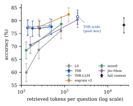
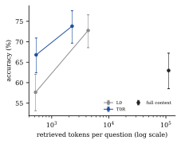
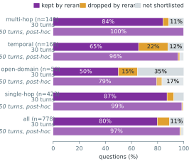

# When Does Selection Replace Extraction? A Pre-Registered Test of Agent Memory with a Typed Decision Model

*Author: Rishabh Sharma, independent researcher.*

## Abstract

Recent work argues that conversational memory does not need LLM extraction when raw history is ranked well
(SmartSearch; Fidelity Before Structure). We test that claim confirmatorily with Jev, TypeSafe's typed decision
model, as the ranker: raw conversation turns reranked by one Jev call (T0R), against an LLM-extraction memory at
matched context. Under a pre-registered plan, on five LoCoMo conversations never used for development, T0R was
non-inferior within a {{plan.margin}}-point margin at a tight budget of about {{h1.tok_t0r}} tokens per question:
{{h1.d}} points by the registered judge (one-sided 95% bound {{h1.lb}}) and {{h1.strict.d}} to {{h1.lenient.d}} by
blind human grading (bounds {{h1.strict.lb}} to {{h1.lenient.lb}}), at {{cost.write.ratio}}× lower write cost, and
robust to a second answer model. Reranking's value depends on how hard the budget cuts the candidate set: over
similarity search it adds {{rerank.locomo.k3}} points at k=3 and {{rerank.locomo.k20}} at k=20 on LoCoMo, and
{{rerank.lme.k3}} and {{rerank.lme.k20}} on {{data.lme.scored}} LongMemEval questions. Jev selected as accurately as
a gpt-4o-mini reranker (non-inferior, bound {{s4.lb}}) at about a third of the latency. At generous budgets,
extraction systems were more accurate, and reranking lowered correct abstention. Plans, code, per-question results
and audit grades are released.

## 1. Introduction

Recent work questions whether conversational memory needs LLM structuring at all. SmartSearch [@derehag2026smartsearch]
retrieves from raw history with a deterministic pipeline and a learned ranking stage, and identifies ranking, not
retrieval, as the bottleneck. Fidelity Before Structure [@an2026fidelity] shows in a controlled comparison that
verbatim chunks beat LLM-extracted artifacts, and that reranking adds little. Both papers state the thesis this
study tests; neither tests it confirmatorily, and they disagree about how much ranking matters.

We test the shared claim under a pre-registered plan, on conversations never used for development: are raw turns
with a single reranking call non-inferior to a strong extraction-based memory at matched context, and how does the
answer depend on the context budget? The ranker is Jev, TypeSafe's typed decision model [@typesafe2026jev], which
answers a fixed-option question with a probability in one short request. The extraction system is engram v2, which
extracts facts with gpt-4o-mini and types, relates and updates them with Jev; it was the most accurate system on our
development conversation and was chosen as the comparator because the test could fail against it.

This is a confirmatory study of an existing idea, not a new architecture. Its contributions:

1. **A pre-registered non-inferiority test** of raw turns plus one Jev rerank (T0R) against LLM-extraction memory,
   on held-out conversations, confirmed on a second answer model and by blind human grading (§5.1, §5.4). At a tight
   budget, T0R is non-inferior within a {{plan.margin}}-point margin; under the worst grading we applied, extraction
   adds at most {{h1.lenient.worst}} points at this budget, at {{cost.write.ratio}}× the write cost.
2. **The budget dependence of reranking**, on LoCoMo and LongMemEval: its gain over similarity search is large when
   the budget keeps three of {{plan.shortlist}} candidates and small at twenty (§5.3). We offer this, labelled as an
   interpretation across different pipelines, as a reconciliation of SmartSearch's and Fidelity's findings (§6).
3. **A typed decision model as the selector.** Jev selected as accurately as a gpt-4o-mini listwise reranker
   (registered test S4: non-inferior, lower bound {{s4.lb}}) at about a third of the latency, and better than a
   multi-call Jev graph walk at matched context (S2) (§5.2, §5.7).
4. **An account of where the result stops**: at generous budgets extraction systems are more accurate; T0R is capped
   by its shortlist, which a recall analysis decomposes by category; and reranking lowers correct abstention
   (§5.6, §5.8, Limitations).

## 2. Related Work

**Raw history against extraction.** SmartSearch [@derehag2026smartsearch] argues that neither LLM structuring at
ingestion nor learned retrieval policies are necessary, and ranks raw history with a CrossEncoder and ColBERT
fusion stage. Fidelity Before Structure [@an2026fidelity] swaps only the stored representation inside one pipeline
and finds verbatim chunks ahead of LLM-extracted artifacts by {{ext.fidelity.locomo}} points on LoCoMo (categories 1–3,
{{ext.fidelity.locomo_q}} questions) and {{ext.fidelity.lme}} on LongMemEval-S ({{ext.fidelity.lme_q}} questions),
with gpt-4o answering and a gpt-4o-mini judge giving binary grades. Nano-Memory [@nanomemory2026]
answers from raw turns with retrieval and generation alone; EMem [@zhou2025emem] builds a strong baseline from
near-verbatim discourse units; @zeng2024structural sweep chunks, triples, facts and summaries and find chunk-based
and mixed stores strongest on LoCoMo; the LongMemEval design study [@wu2025longmemeval] finds round-level storage best
and fact-augmented index keys helpful; and Letta reports {{ext.letta.locomo}}% on LoCoMo for a gpt-4o-mini agent that
stores conversation history in files, with no judge stated [@letta2025filesystem]. Our result agrees with this lineage at tight budgets and is smaller and more cautious than
Fidelity's gap, as expected for an extraction system that keeps source quotes. We extend it with a registered
non-inferiority margin, held-out conversations, a budget analysis and per-category recall.

**Extraction systems.** mem0 [@chhikara2025mem0] extracts facts per message; we test mem0 OSS 2.1.0, and newer mem0
releases report higher, self-reported numbers [@mem02026state]. Graphiti/Zep [@rasmussen2025zep], A-MEM
[@xu2025amem], MemGPT/Letta [@packer2023memgpt], EverMemOS [@evermemos2026] and Memora [@memora2026] structure memory
with LLM calls at write time.

**Typed decisions in memory.** Jev-Mem [@jiang2026jevmem] was the first memory system built on Jev; it uses typed
questions for typing, relations, routing, traversal and stopping over a multi-graph store. The AtMem–Jev article
[@taghia2026atmem] reports that Jev reranking raises ranking metrics. We measure a Jev reranker at the answer level,
against an LLM reranker and against Jev-Mem at matched context.

**Reranking in conversational memory.** SmartSearch finds ranking to be the bottleneck; Fidelity finds reranking
marginal. Training-Free Lexical–Dense Fusion [@lexdense2026] reports an off-the-shelf cross-encoder lowering Hit@1
on conversational queries, and ConvMemory v2 [@convmemory2026] reports gains from a cross-encoder fine-tuned for
conversation. Our budget analysis offers one way these findings fit together (§6).

**Evaluation validity.** Held-out conversation splits of LoCoMo already exist [@yan2025split; @useraware2026]; our
design adds pre-registration and a non-inferiority margin. Same Ranking, Different Winner [@samerank2026] shows that
retrieval credit depends on the stored form; we score shortlist recall on raw turns only. Fidelity reports
judge–human agreement of κ = {{ext.fidelity.kappa}} on {{ext.fidelity.kappa_n}} questions; with mem0's lenient LoCoMo
judge, we found that agreement depended on the system's answer style (§5.4).

## 3. Systems

All systems use gpt-4o-mini to answer, text-embedding-3-small to embed and jev-1.13.0 for every Jev decision.
Figure 1 contrasts the write and read paths of T0R, engram v2 and Jev-Mem.

**T0R.** The write path embeds each turn and stores it as "[date] speaker: text", with no extraction and no LLM
call. The read path takes a {{plan.shortlist}}-turn cosine shortlist and asks Jev, in one request, whether each turn
helps answer the question; turns above {{plan.threshold}} are kept in order of Jev's probability, followed by a
cosine floor of {{plan.floor}} turns. The answer model sees the first k lines.

**L0.** The same store, read in cosine order with no Jev call.

**T0R-LLM.** T0R's store and shortlist, scored by a gpt-4o-mini listwise reranker instead of Jev.

**Full context.** Every turn of the conversation, rendered as T0R renders a line, in the answer prompt.

**engram v2.** An LLM extracts facts from each message with mem0's extraction prompt; Jev then answers typing
questions and relation questions against up to ten candidate facts, and a belief policy closes superseded facts. The
read path is T0R's over facts instead of turns. We use the frozen v2 system (tag `v2-frozen`).

**mem0 2.1.0.** The default `add()` path: one LLM extraction call per message, with the session date as the
observation date; reads are vector search.

**Jev-Mem.** Jev-Mem at commit 81574eb with its default profile and `jev_model` pinned to jev-1.13.0, driven through
its own API. Each turn is a node; each write makes two Jev requests (memory type, relations), and each read routes,
traverses and stops with between two and sixteen Jev requests. Its returned turns are rendered as "[date] speaker:
text" and answered with our prompt; its own prompts, best-of-three selection and judge are not used.

## 4. Study Design

**Pre-registration.** The plan was deposited before any run on the data below
(10.5281/zenodo.22970745, commit b3c5dc5, tag `v3-frozen`). An amendment, with the outcome paragraphs used in §5.1,
was deposited before any primary-test result was seen (10.5281/zenodo.22977848, commit efae0b6, tag `v3-amended`)
[@sharma2026v3plan; @sharma2026v3amend].

**Data.** LoCoMo [@maharana2024locomo] numbers its question categories. We name them
1 multi-hop, 2 temporal, 3 open-domain, 4 single-hop and 5 adversarial,
which matches the dataset's counts over all ten conversations
({{data.locomo.cat1}}, {{data.locomo.cat2}}, {{data.locomo.cat3}}, {{data.locomo.cat4}} and {{data.locomo.cat5}}
questions). The primary data are conv-44, conv-47, conv-48, conv-49 and conv-50, never run by any system before this
study: {{data.fresh.turns}} turns, {{data.fresh.questions}} scored questions ({{data.fresh.multi-hop}} multi-hop,
{{data.fresh.temporal}} temporal, {{data.fresh.open-domain}} open-domain, {{data.fresh.single-hop}} single-hop) and
{{data.fresh.adversarial}} adversarial. conv-30, conv-41, conv-42 and conv-43 ({{data.expl.questions}} scored
questions), held out in an earlier study, give an exploratory replication. Development used conv-26 only.
LongMemEval_S cleaned [@wu2025longmemeval] provides a registered sample of {{data.lme.sample}} questions (user turns
only) and, by amendment, all {{data.lme.all}} questions with user and assistant turns ({{data.lme.scored}} scored,
{{data.lme.abstention}} abstention).

**Stack.** Answers and judgments use gpt-4o-mini at temperature 0 with mem0's LoCoMo answer and judge prompts; the
judge returns CORRECT or WRONG. Tokens are counted with o200k_base over the memory block the answer model sees.

**Token matching.** Every comparison between systems holds context fixed. The comparator runs at k=3, its natural
setting, and T0R is matched to it: from a retrieval-only sweep of T0R over k from one to thirty, the k whose pooled
mean tokens per question is closest to the comparator's, ties going to the larger k. The sweep and the chosen k were
saved before T0R answered at that k.

**Tests.** The primary test H1 asks whether T0R is non-inferior to engram v2: with d the per-question difference in
correctness (T0R minus engram v2), non-inferiority holds if d̄ − 1.645·SE exceeds −{{plan.margin}} points. The margin
is half the rerank's measured effect on the development conversation. The seven secondary tests, under Holm
correction at family-wise 0.05, are exact two-sided McNemar tests except S4, a non-inferiority test with the same
margin: S1 T0R against L0, S2 against Jev-Mem, S3 against mem0 and S4 against T0R-LLM on LoCoMo; S5 against mem0 and
S6 against L0 on the LongMemEval sample; S7 against L0 on the full LongMemEval set. The plan's power analysis put the
probability of passing H1 at {{plan.power.conv26}} if the development difference held.

**Checks.** H1 and S1 were re-answered by Llama 3.3 70B Instruct via OpenRouter from the same contexts and judged
by the same judge; a result is called model-robust only if it holds under both answer models. The author graded
every question on which the judge found exactly one of H1's two answers correct, blind to system and judge label
(§5.4, Appendix C). Shortlist recall measures where the LoCoMo evidence turns fall (§5.6, Appendix D).

**Deviations.** All are recorded in the plan with dates (Appendix B): the amendment; mem0's extraction calls, which
were served through OpenRouter (half of them by Azure) rather than the OpenAI API; runs repeated after rate limits;
a token-counting fix for one LongMemEval haystack; the audit sheet's layout and grading standard; and the replacement
of the title the registered outcome rule selected.

## 5. Results

### 5.1 Primary test (H1, registered)

*Table 1. H1: T0R at k={{h1.k}} ({{h1.tok_t0r}} tokens per question) against engram v2 at k=3 ({{h1.tok_engram}}
tokens), {{data.fresh.questions}} scored questions of the five held-out conversations. The judge row is the
registered test; the human rows replace the judge's labels on the {{audit.graded}} graded discordant questions.
Differences and bounds in points.*

| Grading | T0R | engram v2 | Difference | One-sided 95% bound | Two-sided 95% CI | Non-inferior (margin −{{plan.margin}}) |
|---|---|---|---|---|---|---|
| Judge (registered) | {{h1.t0r}} | {{h1.engram}} | {{h1.d}} | {{h1.lb}} | [{{h1.ci_lo}}, {{h1.ci_hi}}] | yes |
| Human, strict | {{h1.strict.t0r}} | {{h1.strict.engram}} | {{h1.strict.d}} | {{h1.strict.lb}} | [{{h1.strict.ci_lo}}, {{h1.strict.ci_hi}}] | yes |
| Human, lenient | {{h1.lenient.t0r}} | {{h1.lenient.engram}} | {{h1.lenient.d}} | {{h1.lenient.lb}} | [{{h1.lenient.ci_lo}}, {{h1.lenient.ci_hi}}] | yes |

The registered outcome paragraph, filled in:

> Pass. At matched context ({{h1.tok_t0r}} tokens; engram v2 {{h1.tok_engram}}), raw turns with a single rerank
> call were non-inferior to LLM-extraction memory: difference {{h1.d}} points, one-sided 95% lower bound {{h1.lb}},
> above the registered −{{plan.margin}} margin. Whatever accuracy extraction adds at this budget is under
> {{h1.judge.worst}} points, at {{cost.write.ratio}}× the write cost. The rerank closes {{g.value}} of the gap between
> similarity search and extraction. By category, T0R did not trail on multi-hop ({{sys.t0r.k6.multi-hop}} vs
> {{sys.engram.k3.multi-hop}}, n={{data.fresh.multi-hop}}) and trailed on open-domain ({{sys.t0r.k6.open-domain}} vs
> {{sys.engram.k3.open-domain}}, n={{data.fresh.open-domain}}), contrary to what we registered for multi-hop and as we
> registered for open-domain.

The one-sided p-value is {{h1.p}}, and the conversation bootstrap puts the fifth percentile of the difference at
{{h1.boot}} points. {{h1.only_t0r}} questions were answered correctly only by T0R and {{h1.only_engram}} only by
engram v2. Human grading moves the difference to between {{h1.strict.d}} and {{h1.lenient.d}} points and the bound to
between {{h1.strict.lb}} and {{h1.lenient.lb}}; under lenient grading the two-sided interval lies just below zero, so
by that grading engram v2 is more accurate, still inside the margin. We therefore state the result as: non-inferior
within a {{plan.margin}}-point margin under every grading we applied, with extraction adding at most
{{h1.lenient.worst}} points at this budget. The category comparisons are descriptive; the categories are small and
the differences are not tested.

G, the share of the gap between similarity search and extraction that the rerank closes, uses L0 at its own matched
k ({{g.l0_k}}, {{g.l0}} accuracy): at the same token budget, one rerank call closes G = {{g.value}} of the accuracy gap
between cosine retrieval of raw turns (L0, {{g.l0}}) and LLM-extracted memory (engram v2, {{h1.engram}}). The
write-cost ratio uses held-out measurements: engram v2 costs {{cost.write.engram}} per 1,000 turns and T0R
{{cost.write.t0r}} (embeddings only), at list prices.

### 5.2 Secondary tests (S1–S7, registered)

*Table 2. Secondary tests. In each, the comparator runs at k=3 and T0R at its matched k. "Only T0R" and "only other"
count questions answered correctly by one system. S4 is a non-inferiority test (one-sided p); the rest are exact
two-sided McNemar tests. Holm adjustment over S1–S7. LoCoMo tests use {{data.fresh.questions}} questions;
LongMemEval ingestion: user turns for S5–S6, user and assistant turns for S7.*

| Test | Comparison | T0R k | T0R | Other | Only T0R / only other | p | Holm p |
|---|---|---|---|---|---|---|---|
| S1 | T0R vs L0 (LoCoMo) | {{s1.k}} | {{s1.a}} | {{s1.b}} | {{s1.only_a}} / {{s1.only_b}} | {{s1.p}} | {{s1.holm}} |
| S2 | T0R vs Jev-Mem (LoCoMo) | {{s2.k}} | {{s2.a}} | {{s2.b}} | {{s2.only_a}} / {{s2.only_b}} | {{s2.p}} | {{s2.holm}} |
| S3 | T0R vs mem0 (LoCoMo) | {{s3.k}} | {{s3.a}} | {{s3.b}} | {{s3.only_a}} / {{s3.only_b}} | {{s3.p}} | {{s3.holm}} |
| S4 | T0R vs T0R-LLM (LoCoMo, non-inferiority) | {{s4.k}} | {{s4.a}} | {{s4.b}} | {{s4.only_a}} / {{s4.only_b}} | {{s4.p}} | {{s4.holm}} |
| S5 | T0R vs mem0 (LongMemEval, {{s5.n}} knowledge-update) | {{s5.k}} | {{s5.a}} | {{s5.b}} | {{s5.only_a}} / {{s5.only_b}} | {{s5.p}} | {{s5.holm}} |
| S6 | T0R vs L0 (LongMemEval sample, {{s6.n}}) | {{s6.k}} | {{s6.a}} | {{s6.b}} | {{s6.only_a}} / {{s6.only_b}} | {{s6.p}} | {{s6.holm}} |
| S7 | T0R vs L0 (LongMemEval, {{s7.n}}) | {{s7.k}} | {{s7.a}} | {{s7.b}} | {{s7.only_a}} / {{s7.only_b}} | {{s7.p}} | {{s7.holm}} |

S1, S2, S3, S4 and S7 are rejected after Holm correction; S5 and S6 are not. On LoCoMo, T0R was more accurate than
similarity search (S1), Jev-Mem (S2) and mem0 (S3) at matched context, and non-inferior to the LLM reranker (S4:
difference {{s4.d}} points, lower bound {{s4.lb}}). S3 carries a caveat: mem0's extraction was served through
OpenRouter, about half of it by Azure (Appendix G). On the LongMemEval sample, S5 detected no difference between T0R
and mem0 on {{s5.n}} knowledge-update questions, which is too few to establish equivalence, and S6 detected none
between T0R and L0 on {{s6.n}} questions. On the full set, S7 found T0R more accurate than L0 by {{s7.diff}} points.
By the registered rule, LongMemEval holds: S7 favours T0R after Holm correction and S5 does not favour mem0.

### 5.3 The budget dependence of reranking

The rerank's value depends on how many candidates the budget keeps (Figures 2 and 3). On LoCoMo its gain over
similarity search is {{rerank.locomo.k3}} points at k=3 and {{rerank.locomo.k20}} at k=20. On the full LongMemEval
set it is {{rerank.lme.k3}} points at k=3 (S7) and {{rerank.lme.k20}} at k=20. With three of {{plan.shortlist}}
candidates kept, ordering decides which evidence reaches the answer model; with twenty kept, cosine order already
includes most of it. The k=3 gains are registered tests (S1, S7); the k=20 differences are descriptive.

T0R at k=3 is within {{fc.vs.t0r.k3}} points of full context on LoCoMo while reading {{sys.t0r.k3.tok}} tokens per
question instead of {{sys.fc.tok}}. At generous budgets the ordering reverses (Table 3): engram v2 at k=20 reaches
{{sys.engram.k20.acc}}, Jev-Mem at k=40 {{sys.jevmem.k40.acc}}, mem0 at k=20 {{sys.mem0.k20.acc}} and full context
{{sys.fc.acc}}, while T0R stays near {{sys.t0r.k20.acc}} at any k (§5.6).

*Table 3. LoCoMo, five held-out conversations, {{data.fresh.questions}} scored questions: accuracy (%), tokens per
question and accuracy by category.*

| System, setting | Accuracy | Tokens | Multi-hop | Temporal | Open-domain | Single-hop |
|---|---|---|---|---|---|---|
| L0, k=3 | {{sys.l0.k3.acc}} | {{sys.l0.k3.tok}} | {{sys.l0.k3.multi-hop}} | {{sys.l0.k3.temporal}} | {{sys.l0.k3.open-domain}} | {{sys.l0.k3.single-hop}} |
| L0, k=6 | {{sys.l0.k6.acc}} | {{sys.l0.k6.tok}} | {{sys.l0.k6.multi-hop}} | {{sys.l0.k6.temporal}} | {{sys.l0.k6.open-domain}} | {{sys.l0.k6.single-hop}} |
| L0, k=20 | {{sys.l0.k20.acc}} | {{sys.l0.k20.tok}} | {{sys.l0.k20.multi-hop}} | {{sys.l0.k20.temporal}} | {{sys.l0.k20.open-domain}} | {{sys.l0.k20.single-hop}} |
| T0R, k=3 | {{sys.t0r.k3.acc}} | {{sys.t0r.k3.tok}} | {{sys.t0r.k3.multi-hop}} | {{sys.t0r.k3.temporal}} | {{sys.t0r.k3.open-domain}} | {{sys.t0r.k3.single-hop}} |
| T0R, k=6 | {{sys.t0r.k6.acc}} | {{sys.t0r.k6.tok}} | {{sys.t0r.k6.multi-hop}} | {{sys.t0r.k6.temporal}} | {{sys.t0r.k6.open-domain}} | {{sys.t0r.k6.single-hop}} |
| T0R, k=20 | {{sys.t0r.k20.acc}} | {{sys.t0r.k20.tok}} | {{sys.t0r.k20.multi-hop}} | {{sys.t0r.k20.temporal}} | {{sys.t0r.k20.open-domain}} | {{sys.t0r.k20.single-hop}} |
| T0R-LLM, k=3 | {{sys.t0rllm.k3.acc}} | {{sys.t0rllm.k3.tok}} | {{sys.t0rllm.k3.multi-hop}} | {{sys.t0rllm.k3.temporal}} | {{sys.t0rllm.k3.open-domain}} | {{sys.t0rllm.k3.single-hop}} |
| T0R-LLM, k=20 | {{sys.t0rllm.k20.acc}} | {{sys.t0rllm.k20.tok}} | {{sys.t0rllm.k20.multi-hop}} | {{sys.t0rllm.k20.temporal}} | {{sys.t0rllm.k20.open-domain}} | {{sys.t0rllm.k20.single-hop}} |
| engram v2, k=3 | {{sys.engram.k3.acc}} | {{sys.engram.k3.tok}} | {{sys.engram.k3.multi-hop}} | {{sys.engram.k3.temporal}} | {{sys.engram.k3.open-domain}} | {{sys.engram.k3.single-hop}} |
| engram v2, k=20 | {{sys.engram.k20.acc}} | {{sys.engram.k20.tok}} | {{sys.engram.k20.multi-hop}} | {{sys.engram.k20.temporal}} | {{sys.engram.k20.open-domain}} | {{sys.engram.k20.single-hop}} |
| mem0, k=3 | {{sys.mem0.k3.acc}} | {{sys.mem0.k3.tok}} | {{sys.mem0.k3.multi-hop}} | {{sys.mem0.k3.temporal}} | {{sys.mem0.k3.open-domain}} | {{sys.mem0.k3.single-hop}} |
| mem0, k=20 | {{sys.mem0.k20.acc}} | {{sys.mem0.k20.tok}} | {{sys.mem0.k20.multi-hop}} | {{sys.mem0.k20.temporal}} | {{sys.mem0.k20.open-domain}} | {{sys.mem0.k20.single-hop}} |
| Jev-Mem, k=3 | {{sys.jevmem.k3.acc}} | {{sys.jevmem.k3.tok}} | {{sys.jevmem.k3.multi-hop}} | {{sys.jevmem.k3.temporal}} | {{sys.jevmem.k3.open-domain}} | {{sys.jevmem.k3.single-hop}} |
| Jev-Mem, k=40 | {{sys.jevmem.k40.acc}} | {{sys.jevmem.k40.tok}} | {{sys.jevmem.k40.multi-hop}} | {{sys.jevmem.k40.temporal}} | {{sys.jevmem.k40.open-domain}} | {{sys.jevmem.k40.single-hop}} |
| Full context | {{sys.fc.acc}} | {{sys.fc.tok}} | {{sys.fc.multi-hop}} | {{sys.fc.temporal}} | {{sys.fc.open-domain}} | {{sys.fc.single-hop}} |

### 5.4 Robustness: a second answer model and blind human grading

With Llama 3.3 70B Instruct answering from the same contexts, H1 still passes (T0R {{h1.llama.t0r}}, engram v2
{{h1.llama.engram}}, difference {{h1.llama.d}}, one-sided bound {{h1.llama.lb}}) and so does S1 (T0R
{{s1.llama.t0r}}, L0 {{s1.llama.l0}}, p = {{s1.llama.p}}). Both are therefore model-robust by the registered rule.
Of {{sm.answers}} rebuilt contexts, all but {{sm.mismatches}} matched their recorded token counts exactly; the four
come from near-tie reorderings. OpenRouter served Llama through {{sm.n_providers}} providers whose numeric precision
may differ.

The author graded, blind, both answers to each of H1's {{h1.discordant}} judge-discordant questions
({{audit.rows}} rows; one question was left ungraded). Agreement with the judge was {{audit.strict.agree}} under the
strict mapping and {{audit.lenient.agree}} under the lenient one (Appendix C). Many judge-discordant pairs were not
discordant to the human grader: under the strict mapping both answers were correct for
{{audit.strict.human_both_correct}} questions and both wrong for {{audit.strict.human_both_wrong}}. The judge
credited T0R's short answers more readily and engram v2's list-style answers less (agreement on engram v2's answers
{{audit.lenient.agree_engram}} under the lenient mapping, against {{audit.lenient.agree_t0r}} on T0R's), which is why
human grading widens the gap.

### 5.5 Long histories (LongMemEval)

LongMemEval compares T0R with mem0 and L0 only; engram v2 was not run on it, so these results cannot support any
claim that T0R matches LLM-extracted memory on long histories. What they support is narrower: on histories of about
{{data.lme.fc_tokens}} rendered tokens, the rerank still beats similarity search (S7), and no difference from mem0
was detected on knowledge-update questions (S5).

*Table 4. LongMemEval, all {{data.lme.all}} questions, user and assistant turns ingested: accuracy (%) on the
{{data.lme.scored}} non-abstention questions, by question type (n), and the share of the {{data.lme.abstention}}
abstention questions answered by abstaining.*

| System | Accuracy | Tokens | Knowledge update ({{lme.n.knowledge-update}}) | Multi-session ({{lme.n.multi-session}}) | Single-session assistant ({{lme.n.single-session-assistant}}) | Single-session preference ({{lme.n.single-session-preference}}) | Single-session user ({{lme.n.single-session-user}}) | Temporal ({{lme.n.temporal-reasoning}}) | Abstention |
|---|---|---|---|---|---|---|---|---|---|
| L0, k=3 | {{lme.l0.k3.acc}} | {{lme.l0.k3.tok}} | {{lme.l0.k3.knowledge-update}} | {{lme.l0.k3.multi-session}} | {{lme.l0.k3.single-session-assistant}} | {{lme.l0.k3.single-session-preference}} | {{lme.l0.k3.single-session-user}} | {{lme.l0.k3.temporal-reasoning}} | {{lme.abs.l0.k3}} |
| L0, k=20 | {{lme.l0.k20.acc}} | {{lme.l0.k20.tok}} | {{lme.l0.k20.knowledge-update}} | {{lme.l0.k20.multi-session}} | {{lme.l0.k20.single-session-assistant}} | {{lme.l0.k20.single-session-preference}} | {{lme.l0.k20.single-session-user}} | {{lme.l0.k20.temporal-reasoning}} | {{lme.abs.l0.k20}} |
| T0R, k=3 | {{lme.t0r.k3.acc}} | {{lme.t0r.k3.tok}} | {{lme.t0r.k3.knowledge-update}} | {{lme.t0r.k3.multi-session}} | {{lme.t0r.k3.single-session-assistant}} | {{lme.t0r.k3.single-session-preference}} | {{lme.t0r.k3.single-session-user}} | {{lme.t0r.k3.temporal-reasoning}} | {{lme.abs.t0r.k3}} |
| T0R, k=20 | {{lme.t0r.k20.acc}} | {{lme.t0r.k20.tok}} | {{lme.t0r.k20.knowledge-update}} | {{lme.t0r.k20.multi-session}} | {{lme.t0r.k20.single-session-assistant}} | {{lme.t0r.k20.single-session-preference}} | {{lme.t0r.k20.single-session-user}} | {{lme.t0r.k20.temporal-reasoning}} | {{lme.abs.t0r.k20}} |
| Full context | {{lme.fc.acc}} | {{lme.fc.tok}} | {{lme.fc.knowledge-update}} | {{lme.fc.multi-session}} | {{lme.fc.single-session-assistant}} | {{lme.fc.single-session-preference}} | {{lme.fc.single-session-user}} | {{lme.fc.temporal-reasoning}} | {{lme.abs.fc}} |

Full context scored {{lme.fc.acc}} against T0R's {{lme.t0r.k3.acc}} at k=3 ({{lme.fc_vs_t0r.only_t0r}} questions
correct only for T0R and {{lme.fc_vs_t0r.only_fc}} only for full context, p = {{lme.fc_vs_t0r.p}}, descriptive),
reading {{lme.tok.ratio}}× the tokens at {{lme.cost.ratio}}× the cost per question ({{lme.cost.fc}} against
{{lme.cost.t0r}} for reading and answering, judge excluded). It was weakest on temporal and multi-session questions.
On the registered sample (user turns only), T0R scored {{lmes.t0r.k3.acc}} at k=3 and L0 {{lmes.l0.k3.acc}}; mem0
scored {{lmes.mem0.k3.acc}} on the knowledge-update questions at k=3.

### 5.6 Where T0R's accuracy stops

T0R levels off near {{sys.t0r.k20.acc}}: at k=20 it reads only {{sys.t0r.k20.tok}} tokens, because its rerank keeps
only shortlisted turns scored above {{plan.threshold}}. Shortlist recall (exploratory as registered) locates the
loss on all nine held-out conversations ({{rec.all_nine.n}} questions, Figure 4). All evidence turns were in the
{{plan.shortlist}}-turn shortlist for {{rec.all_nine.all}} of questions and at least one for {{rec.all_nine.any}};
among questions with evidence in the shortlist, the rerank kept none of it for {{rec.all_nine.drop}}. About
{{rec.all_nine.miss}} of questions are lost to the shortlist and another {{rec.all_nine.lost}} to the rerank.

The categories differ. Open-domain evidence reaches the shortlist least often ({{rec.open-domain.any}}) and is
dropped most often ({{rec.open-domain.drop}}), consistent with T0R trailing engram v2 on open-domain questions.
Temporal evidence usually reaches the shortlist but is dropped by the rerank for {{rec.temporal.drop}} of questions: a
turn that only establishes when something happened does not look relevant to the question on its own. Multi-hop
questions usually get some evidence into the shortlist ({{rec.multi-hop.any}}) but rarely all of it
({{rec.multi-hop.all}}).

**A wider read path (post-hoc exploratory).** After the registered results were in, we tested one variant once,
outside the Holm family and in its own ledger: T0R-wide takes a {{wide.shortlist}}-turn cosine shortlist, asks Jev about every
shortlisted turn, and keeps the top k by Jev's score with no cut-off, with k={{wide.k}} matched to Jev-Mem at k=40
({{wide.tok}} tokens against {{wide.target}}). It scored {{wide.acc}}, against {{sys.jevmem.k40.acc}} for Jev-Mem at
k=40 and {{sys.engram.k20.acc}} for engram v2 at k=20 ({{sys.engram.k20.tok}} tokens); all-evidence recall rose to
{{wide.rec.all}} and the rerank's losses fell to {{wide.rec.drop}}. This suggests the ceiling comes from T0R's read
path rather than from storing raw turns, a hypothesis for new data, not a finding of this study.

### 5.7 Cost and latency

*Table 5. Cost and latency (exploratory as registered). Write cost per 1,000 turns at list prices, split by LLM, Jev
and embeddings; read cost per query; read latency measured live on a fixed sample of {{plan.latency_sample}} questions at k=3, one query at
a time, including the query-embedding call. Jev-Mem's latency comes from its reads of the same questions, measured
live when they ran ({{lat.jevmem.queries}} reads: two question texts repeat).*

| System | Write $/1k turns | LLM | Jev | Embeddings | Write p50 (s) | Read $/query | Jev calls/query | Read p50 (ms) | Read p90 (ms) |
|---|---|---|---|---|---|---|---|---|---|
| T0R | {{write.t0r.emb}} | – | – | {{write.t0r.emb}} | {{write.t0r.lat}} | {{sys.t0r.k3.read}} | one | {{lat.t0r.p50}} | {{lat.t0r.p90}} |
| L0 | {{write.t0r.emb}} | – | – | {{write.t0r.emb}} | {{write.t0r.lat}} | – | none | {{lat.l0.p50}} | {{lat.l0.p90}} |
| T0R-LLM | {{write.t0r.emb}} | – | – | {{write.t0r.emb}} | {{write.t0r.lat}} | {{sys.t0rllm.k3.read}} | one (no-op) | {{lat.t0rllm.p50}} | {{lat.t0rllm.p90}} |
| engram v2 | {{write.engram.total}} | {{write.engram.llm}} | {{write.engram.jev}} | {{write.engram.emb}} | {{write.engram.lat_lo}}–{{write.engram.lat_hi}} | {{sys.engram.k3.read}} | one | {{lat.engram.p50}} | {{lat.engram.p90}} |
| mem0 | {{write.mem0.total}} | {{write.mem0.llm}} | – | {{write.mem0.emb}} | {{write.mem0.lat_lo}}–{{write.mem0.lat_hi}} | – | none | {{lat.mem0.p50}} | {{lat.mem0.p90}} |
| Jev-Mem | {{write.jevmem.jev}} | – | {{write.jevmem.jev}} | {{write.jevmem.emb}} | {{write.jevmem.lat}} | {{sys.jevmem.k3.read}} | {{jevmem.k3.calls}} | {{lat.jevmem.p50}} | {{lat.jevmem.p90}} |

Jev reads about {{lat.ratio.llm}}× faster than the LLM reranker and {{lat.ratio.jevmem}}× faster than Jev-Mem at
k=3; engram v2 reads as fast as T0R because its read path is the same one request. The write cost is where the
systems differ: extraction makes engram v2 and mem0 thousands of times more expensive to write than T0R, and Jev-Mem's
two Jev requests per turn cost {{write.jevmem.jev}} per 1,000 turns. Jev-Mem at k=40 averaged {{jevmem.k40.calls}}
Jev calls per query (up to {{jevmem.k40.calls_max}}) and {{sys.jevmem.k40.read}} per query. Mem0's read cost is a query
embedding only.

Figure 5 amortises write cost at the benchmark's own ratio ({{fig5.turns_per_question}} turns written per scored
question). At that ratio T0R's total cost per question is {{fig5.t0r.k3.bench}} and engram v2's
{{fig5.engram.k3.bench}}; full context costs {{fig5.fc.bench}}. In a read-heavy use with one turn written per
question, the write cost weighs less: engram v2's total falls to {{fig5.engram.k3.read_heavy}}.

### 5.8 Abstention

*Table 6. Share of LoCoMo adversarial questions ({{data.fresh.adversarial}}, five held-out conversations) answered by
abstaining (exploratory as registered).*

| System | k=3 | k=20 |
|---|---|---|
| L0 | {{adv.l0.k3}} | {{adv.l0.k20}} |
| engram v2 | {{adv.engram.k3}} | {{adv.engram.k20}} |
| mem0 | {{adv.mem0.k3}} | {{adv.mem0.k20}} |
| T0R | {{adv.t0r.k3}} | {{adv.t0r.k20}} |
| T0R-LLM | {{adv.t0rllm.k3}} | {{adv.t0rllm.k20}} |

Reranking lowered correct abstention at k=3, with Jev ({{adv.t0r.k3}}) and with an LLM reranker ({{adv.t0rllm.k3}})
against similarity search ({{adv.l0.k3}}): relevant-looking context makes the answer model less willing to say that
something was not mentioned. The exploratory conversations show the same ({{expl.adv.t0r.k3}} against
{{expl.adv.l0.k3}}), and so does LongMemEval at k=20 ({{lme.abs.t0r.k20}} for T0R against {{lme.abs.l0.k20}} for L0).
Fidelity Before Structure reports that verbatim chunks abstain worse than extracted artifacts; we find that reranking
specifically adds to that.

## 6. Discussion

**A budget reading of two prior findings (interpretation).** SmartSearch finds ranking to be the bottleneck;
Fidelity finds reranking marginal. Our within-study results suggest the difference is the budget: reranking matters
in proportion to how hard truncation cuts the candidate set. In SmartSearch a question has about
{{ext.smartsearch.candidates}} grep candidates on average, of which about {{ext.smartsearch.passages}} passages fit its
{{ext.smartsearch.budget_words}}-word budget, and without ranking only {{ext.smartsearch.norank}}% of gold evidence
survives truncation; our k=3 keeps three of {{plan.shortlist}}. Both show large ranking gains. Fidelity reranks a
top-{{ext.fidelity.pool}} pool to {{ext.fidelity.kept}} with bge-reranker-v2-m3 under a
{{ext.fidelity.cap}}-token cap (gains of {{ext.fidelity.rr_locomo}} points on LoCoMo and {{ext.fidelity.rr_lme}} on
LongMemEval-S), and our k=20 keeps twenty of {{plan.shortlist}}; both show small ones. This is an interpretation across pipelines that differ in retrievers,
rerankers, answer models and judges, supported inside our study by the k=3 to k=20 comparison on two benchmarks, not
a tested claim across papers.

**When extraction is worth it.** At the tight budget of H1, extraction adds little and costs thousands of times more
to write. At generous budgets it is more accurate and more compact: engram v2 at k=20 was the most accurate system
we measured, with fewer tokens than Jev-Mem at k=40. Open-domain and temporal questions are where T0R trailed engram
v2, and where its shortlist and rerank lose the most evidence.

**What a typed decision model contributes.** In this study, speed and cost at equal selection quality, not higher
accuracy: Jev selected as accurately as the gpt-4o-mini reranker (S4) at about a third of the latency, in one
request per question, and one Jev request beat Jev-Mem's multi-request graph walk at matched context (S2). A
typed question returns a probability over fixed options in one short call, which is what a reranker needs.

**Judge leniency and answer style.** mem0's LoCoMo judge is lenient, and in our audit it credited short answers more
readily than list-style ones, so its agreement with human grading differed by system. Memory benchmarks that compare
systems with different answer styles should report judge–human agreement by system.

**Not state of the art.** SmartSearch reports {{ext.smartsearch.locomo}}% on LoCoMo under its own protocol
(gpt-4o-mini answering and judging, binary judgments, all ten conversations and {{ext.smartsearch.questions}}
questions in categories 1–4, {{ext.smartsearch.tokens}} tokens per question); our numbers come from a different protocol and five held-out
conversations and are not comparable to it. Our best result, the post-hoc T0R-wide, is below that figure.

## Limitations

- **Benchmarks.** One benchmark family per setting: LoCoMo, whose dialogues are LLM-generated, and LongMemEval. Five
  primary conversations give {{data.fresh.questions}} questions; categories are small.
- **LongMemEval scope.** engram v2 was not run on LongMemEval, so no claim about extraction on long histories follows
  from this study.
- **Human grading.** The grader is the system's author; the mapping of partial grades was not pre-specified (two are
  reported); one question was ungraded; and only judge-discordant questions were re-graded, so judge errors on
  questions where the judge agreed across systems remain.
- **A closed decision model.** Jev is a closed, versioned model; results hold for jev-1.13.0.
- **mem0 serving.** mem0's extraction calls were served through OpenRouter, about half by Azure, not the OpenAI API
  as registered; only S3 involves mem0.
- **Post-hoc variant.** T0R-wide was designed after the registered results and tested once on the same questions.
- **Absolute accuracy.** Below SmartSearch's reported figures at generous budgets, under a different protocol.
- **Development data.** Every design choice was made on one conversation, conv-26.

## 7. Conclusion

At tight context budgets, raw conversation turns reranked by one call to a typed decision model were non-inferior
within a {{plan.margin}}-point margin to LLM-extracted memory, at thousands of times lower write cost, on held-out
conversations, two answer models and blind human grading. The value of that rerank depends on the budget: large when
three of {{plan.shortlist}} candidates are kept, small when twenty are. Jev selected as accurately as an LLM
reranker at about a third of the latency. At generous budgets extraction systems were more accurate, so the result
is a statement about tight budgets.

## AI Assistance

The code, run orchestration and drafting of this paper were done with Claude Code (Anthropic) under the author's
direction. The author made every methodological decision, approved each stage of the registered plan and did the
human audit.

## Artifacts

Code, plans, per-question answers and judge labels, and the human-audit grades with their key are at
github.com/ris3abh/Engram: tags `v3-frozen`, `v3-amended` and the paper tag; results in `bench/results/v3/`
(per-question files, reports, ledgers, `human_audit/`) and `bench/results/v3_posthoc/`. The plan and its amendment
are deposited at 10.5281/zenodo.22970745 and 10.5281/zenodo.22977848; the earlier engram preprint is
10.5281/zenodo.22941757 [@sharma2026typed].

## References

## Appendix A. Per-conversation results

*Accuracy (%) per conversation, LoCoMo scored categories.*

| System, setting | conv-44 ({{pc.n.conv-44}}) | conv-47 ({{pc.n.conv-47}}) | conv-48 ({{pc.n.conv-48}}) | conv-49 ({{pc.n.conv-49}}) | conv-50 ({{pc.n.conv-50}}) |
|---|---|---|---|---|---|
| T0R, k=3 | {{pc.t0r.k3.conv-44}} | {{pc.t0r.k3.conv-47}} | {{pc.t0r.k3.conv-48}} | {{pc.t0r.k3.conv-49}} | {{pc.t0r.k3.conv-50}} |
| T0R, k=6 | {{pc.t0r.k6.conv-44}} | {{pc.t0r.k6.conv-47}} | {{pc.t0r.k6.conv-48}} | {{pc.t0r.k6.conv-49}} | {{pc.t0r.k6.conv-50}} |
| T0R, k=20 | {{pc.t0r.k20.conv-44}} | {{pc.t0r.k20.conv-47}} | {{pc.t0r.k20.conv-48}} | {{pc.t0r.k20.conv-49}} | {{pc.t0r.k20.conv-50}} |
| L0, k=3 | {{pc.l0.k3.conv-44}} | {{pc.l0.k3.conv-47}} | {{pc.l0.k3.conv-48}} | {{pc.l0.k3.conv-49}} | {{pc.l0.k3.conv-50}} |
| L0, k=20 | {{pc.l0.k20.conv-44}} | {{pc.l0.k20.conv-47}} | {{pc.l0.k20.conv-48}} | {{pc.l0.k20.conv-49}} | {{pc.l0.k20.conv-50}} |
| T0R-LLM, k=3 | {{pc.t0rllm.k3.conv-44}} | {{pc.t0rllm.k3.conv-47}} | {{pc.t0rllm.k3.conv-48}} | {{pc.t0rllm.k3.conv-49}} | {{pc.t0rllm.k3.conv-50}} |
| engram v2, k=3 | {{pc.engram.k3.conv-44}} | {{pc.engram.k3.conv-47}} | {{pc.engram.k3.conv-48}} | {{pc.engram.k3.conv-49}} | {{pc.engram.k3.conv-50}} |
| engram v2, k=20 | {{pc.engram.k20.conv-44}} | {{pc.engram.k20.conv-47}} | {{pc.engram.k20.conv-48}} | {{pc.engram.k20.conv-49}} | {{pc.engram.k20.conv-50}} |
| mem0, k=3 | {{pc.mem0.k3.conv-44}} | {{pc.mem0.k3.conv-47}} | {{pc.mem0.k3.conv-48}} | {{pc.mem0.k3.conv-49}} | {{pc.mem0.k3.conv-50}} |
| mem0, k=20 | {{pc.mem0.k20.conv-44}} | {{pc.mem0.k20.conv-47}} | {{pc.mem0.k20.conv-48}} | {{pc.mem0.k20.conv-49}} | {{pc.mem0.k20.conv-50}} |
| Jev-Mem, k=3 | {{pc.jevmem.k3.conv-44}} | {{pc.jevmem.k3.conv-47}} | {{pc.jevmem.k3.conv-48}} | {{pc.jevmem.k3.conv-49}} | {{pc.jevmem.k3.conv-50}} |
| Jev-Mem, k=40 | {{pc.jevmem.k40.conv-44}} | {{pc.jevmem.k40.conv-47}} | {{pc.jevmem.k40.conv-48}} | {{pc.jevmem.k40.conv-49}} | {{pc.jevmem.k40.conv-50}} |
| Full context | {{pc.fc.conv-44}} | {{pc.fc.conv-47}} | {{pc.fc.conv-48}} | {{pc.fc.conv-49}} | {{pc.fc.conv-50}} |

The exploratory replication on conv-30, conv-41, conv-42 and conv-43 ({{data.expl.questions}} scored questions):
L0 {{expl.l0.k3.acc}} at k=3 and {{expl.l0.k20.acc}} at k=20; T0R {{expl.t0r.k3.acc}} at k=3 and
{{expl.t0r.k20.acc}} at k=20. T0R's matched k against L0 was {{expl.k}}, with {{expl.s1.only_a}} questions correct only for T0R
and {{expl.s1.only_b}} only for L0 (p = {{expl.s1.p}}, exploratory).

## Appendix B. Registered plan and deviations

The plan (its guarded sections in `docs/V3_PLAN.md`, checked by a test that fails on any undated change, fixed the
systems, data, token-matching rule, tests, predictions, human check, run order and budget before any run. Every change
is a dated entry in its Deviations section:

- **2026-09-26, amendment**, deposited before any primary-test result was seen: shortlist recall; LongMemEval on all
  {{data.lme.all}} questions with user and assistant turns and the new test S7; the second answer model; the outcome
  paragraphs and the rule for "LongMemEval holds"; budget caps.
- **2026-09-26, outcome paragraphs revised** before upload, before any primary-test result was seen.
- **2026-09-26, Batch B execution**: mem0's extraction was routed to OpenRouter by a library default (Appendix G);
  runs hit OpenAI's rate limit and were repeated with more retries and a Jev throttle, completed calls replaying
  from a call cache; T0R-LLM also asks Jev one query-relation question per query, a no-op on turns.
- **2026-09-26, mem0 via OpenRouter resolved**: model and serving provider established, billed amount corrected in
  the ledger, guards added before any later run.
- **2026-09-27, human check layout** (record only): each answer on its own row, all {{audit.rows}} rows shuffled
  together, rather than randomising the order within each question.
- **2026-09-27, human check grading standard** (record only): the sheet asked for CORRECT or WRONG; partial grades
  appeared, so two mappings are reported.
- **2026-09-27, paper title** (presentation change): the title the outcome rule selected, "Selection, Not Extraction:
  One Rerank Call Matches LLM-Extracted Memory at a Fraction of the Write Cost", was replaced because it presents a
  published idea as new and its "matches" overstates a non-inferiority result.

Implementation notes not in the Deviations section: one LongMemEval haystack contains the literal text `<|endoftext|>`, which the token
counter refused; counting now treats it as ordinary text, and the affected question was re-run. Two retrieval-only
sweeps were stopped by mistake and re-run from the cache.

## Appendix C. Human audit

**Protocol.** The sheet held every question on which the judge found exactly one of H1's two answers correct
({{h1.discordant}} questions), each answer as its own row ({{audit.rows}} rows), shuffled with seed 0, with the
question and gold answer shown and no system name or judge label. The sheet asked for CORRECT or WRONG; the plan's
notes had listed CORRECT, WRONG or UNCLEAR. The author's grades included partial and hedged labels, and one question
was left ungraded. Two mappings are reported: strict (only grades starting with CORRECT count as correct) and lenient
(partial and hedged-correct grades also count); any grade containing WRONG counts as wrong under both. H1 is
decided by the judge.

| Mapping | Agreement with judge | On T0R's answers | On engram v2's answers | Only T0R right | Only engram v2 right | Both right | Both wrong |
|---|---|---|---|---|---|---|---|
| Strict | {{audit.strict.agree}} | {{audit.strict.agree_t0r}} | {{audit.strict.agree_engram}} | {{audit.strict.human_only_t0r}} | {{audit.strict.human_only_engram}} | {{audit.strict.human_both_correct}} | {{audit.strict.human_both_wrong}} |
| Lenient | {{audit.lenient.agree}} | {{audit.lenient.agree_t0r}} | {{audit.lenient.agree_engram}} | {{audit.lenient.human_only_t0r}} | {{audit.lenient.human_only_engram}} | {{audit.lenient.human_both_correct}} | {{audit.lenient.human_both_wrong}} |

The grades, the key and the analysis are in `bench/results/v3/human_audit/` and `bench/v3_human_audit.py`.

## Appendix D. Shortlist recall

For every scored question of the nine held-out conversations, the {{plan.shortlist}}-turn cosine shortlist (shared by
L0 and T0R) and the turns T0R's rerank keeps were rebuilt from the frozen stores through the call cache. Each turn's
id is its LoCoMo dialogue id, so the question's evidence ids can be located. Reported: the share of questions with
all, and with at least one, evidence turn in the shortlist, and, among questions with an evidence turn in the
shortlist, the share where the rerank keeps none. Recall is scored on raw turns only [@samerank2026]. The five fresh
conversations ({{rec.fresh_five.all}} all-evidence recall, {{rec.fresh_five.drop}} dropped by the rerank) and the
four exploratory ones ({{rec.exploratory_four.all}}, {{rec.exploratory_four.drop}}) agree.

| Category | Questions | All evidence in shortlist | At least one | Rerank keeps none |
|---|---|---|---|---|
| Multi-hop | {{rec.multi-hop.n}} | {{rec.multi-hop.all}} | {{rec.multi-hop.any}} | {{rec.multi-hop.drop}} |
| Temporal | {{rec.temporal.n}} | {{rec.temporal.all}} | {{rec.temporal.any}} | {{rec.temporal.drop}} |
| Open-domain | {{rec.open-domain.n}} | {{rec.open-domain.all}} | {{rec.open-domain.any}} | {{rec.open-domain.drop}} |
| Single-hop | {{rec.single-hop.n}} | {{rec.single-hop.all}} | {{rec.single-hop.any}} | {{rec.single-hop.drop}} |
| All | {{rec.all_nine.n}} | {{rec.all_nine.all}} | {{rec.all_nine.any}} | {{rec.all_nine.drop}} |

## Appendix E. T0R-wide (post-hoc exploratory)

Designed after the registered results were seen, tested once on the {{data.fresh.questions}} questions of the five
held-out conversations, outside the Holm family, in its own ledger ({{wide.spend.openai}} OpenAI and
{{wide.spend.jev}} Jev). Design: T0R's store; a {{wide.shortlist}}-turn cosine shortlist; Jev's relevance question on every
shortlisted turn, thirty per request; the top k by Jev's probability, with no cut-off, floor or expansion; k={{wide.k}}
matched to Jev-Mem at k=40 by the registered rule, saved before answering. Results: accuracy {{wide.acc}} at
{{wide.tok}} tokens (multi-hop {{wide.multi-hop}}, temporal {{wide.temporal}}, open-domain {{wide.open-domain}},
single-hop {{wide.single-hop}}); read cost {{wide.read}} per query; live read latency {{wide.lat50}} ms at p50 and
{{wide.lat90}} ms at p90. With the same recall method on the {{wide.shortlist}}-turn shortlist, all evidence was in the shortlist for
{{wide.rec.all}} of questions and at least one turn for {{wide.rec.any}}, and the top k kept none of the shortlisted
evidence for {{wide.rec.drop}}.

## Appendix F. Prompts and the Jev question

The answer prompt is mem0's LoCoMo answer prompt adapted to one memory list, and the judge is mem0's LoCoMo accuracy
prompt (`bench/locomo_subset.py`, `ANSWER_PROMPT` and `ACCURACY_PROMPT`). LongMemEval questions carry their question
date in the question slot. T0R's rerank asks Jev one yes/no question per shortlisted turn
(`src/engram/decide/questions.py`, `RELEVANT_TO_QUERY`):

- instructions: "Does `memory` help answer `query`?"
- true: "It states or directly implies part of the answer."
- false: "It is off-topic or only shares a keyword."

## Appendix G. The mem0 serving incident

mem0 2.1.0 sends its OpenAI LLM calls to OpenRouter whenever an OpenRouter key is present in the environment,
without warning (`mem0/llms/openai.py`). A key added for the second answer model therefore routed all
{{mem0.or.calls}} of mem0's extraction calls through OpenRouter, which served {{mem0.or.openai}} of them by OpenAI and
{{mem0.or.azure}} by Azure, all as gpt-4o-mini, the registered model. OpenRouter billed {{spend.mem0.billed}}; at
OpenAI list price the same calls cost {{spend.mem0.list}}. S3's difference is far larger than a serving difference
could explain, and S3 is reported with this caveat. Before any later run, mem0 was pinned to the OpenAI endpoint and
the spend guard was extended to OpenRouter. Anyone benchmarking mem0 2.1.0 with an OpenRouter key in their
environment will get routed calls without warning.

## Appendix H. Cost accounting

Every system's gpt-4o-mini, embedding and Jev calls are priced at list price (gpt-4o-mini {{price.mini.in}} and {{price.mini.out}} per million
input and output tokens; Jev {{price.jev}} per million input tokens), so no system looks cheaper because of a discount the
others did not get. Billed amounts are reported separately: the registered ledger records {{spend.openai}} of OpenAI,
{{spend.jev}} of Jev and {{spend.openrouter}} of OpenRouter for the second answer model (at {{plan.llama.in}} and
{{plan.llama.out}} per million input and output tokens), plus mem0's {{spend.mem0.billed}} through OpenRouter.
Write-cost ratios use the held-out measurements; read costs are per query; totals per question state their
reads-per-write assumption (Figure 5).

## Appendix I. Reproduction

Each table and figure is rebuilt from the committed result files, with no API calls:

- numbers: `uv run --extra bench python paper_v3/make_numbers.py`
- figures: `uv run --with matplotlib python paper_v3/figures.py`
- paper: `make -C paper_v3 paper` (renders `main.md` and `main.tex`, builds the PDF, runs `paper_v3/check.py`)
- reports behind the tables: `bench/v3_report.py` (Batches A–C), `bench/v3_human_audit.py`,
  `bench/v3_shortlist_recall.py`, `bench/v3_latency.py`, `bench/v3_second_model.py`, `bench/v3_posthoc.py`

The runs themselves are `bench/run.py` with `--study v3`, `bench/jevmem_run.py` and `bench/v3_batch_c.py`, from tag
`v3-frozen` onward, as recorded in the plan.
